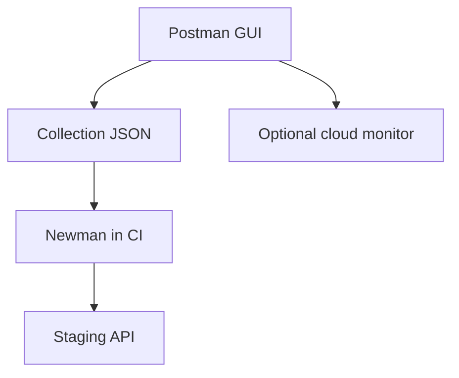

import { ConceptTemplate } from '@/features/kb/components/templates/ConceptTemplate'
import { Callout } from '@/features/kb/components/mdx/Callout'
import { ComparisonTable } from '@/features/kb/components/mdx/ComparisonTable'

export default function Layout({ children }) {
  return (
    <ConceptTemplate title="Postman">
      {children}
    </ConceptTemplate>
  )
}

**Postman** is where many teams first meet their own API: a GUI to send requests, save them as a **collection**, parameterise hosts via **environments**, and add `pm.test` scripts. **Newman** runs those collections in CI. It is not a replacement for Pact or pytest, but it is a legitimate smoke and onboarding tool.

## 1. Deep Dive and Mechanics

**Collection.** A tree of requests plus pre-request and test scripts (JavaScript). Variables use double-curly syntax in the app; keep those strings inside Postman, not in this page's prose.

**Environments.** `baseUrl`, tokens, tenant ids. Never commit production secrets; use vaults or CI-injected env.

**Monitors.** Postman cloud pings a collection on a schedule — cheap synthetics for public APIs.

**Governance.** Workspaces, roles, and (in paid tiers) API definitions. Drift happens when the collection is the only spec and nobody reviews PRs of the exported JSON.

<Callout icon="warning" title="Collections rot like any other source">
If the only copy lives on one laptop, it is not a test suite. Export, review, and run Newman on main.
</Callout>

## 2. Mathematical / Theoretical Foundation

A collection is a scripted path through an HTTP state machine: login → capture token → call resource. Tests are predicates on status and JSON paths.

Newman in CI is a **shallow integration**: real HTTP, real (usually staging) server. It does not isolate, so it inherits environment flakes. Treat results as smoke, not as domain proof.

<ComparisonTable
  headers={['Tool', 'Authoring', 'Best use']}
  rows={[
    ['Postman + Newman', 'GUI + JS tests', 'Smoke, demos, onboarding'],
    ['REST-assured / HTTPX tests', 'Code', 'Versioned, reviewed suites'],
    ['Pact', 'Consumer code', 'Cross-team contracts'],
    ['OpenAPI + schemathesis', 'Spec', 'Schema fuzzing'],
  ]}
/>

## 3. Real-World Implementation

```javascript
// Collection test script on GET /health
pm.test('health is ok', function () {
  pm.response.to.have.status(200);
  const body = pm.response.json();
  pm.expect(body.status).to.eql('ok');
});
```

```bash
npx newman run collections/smoke.json -e env/staging.json --reporters cli,junit
```

Fail the pipeline on Newman's non-zero exit. Publish the JUnit file next to other suites.

## 4. Visualizations



## 5. Interview Prep

**Q: Is Postman enough for API testing?**
**A:** For smoke and human exploration, yes. For domain rules and tenant isolation, you want code review, fixtures, and a real runner.

**Q: Newman versus coded tests?**
**A:** Newman reuses what PM wrote in the GUI — good for adoption, weaker for refactoring and reuse. Many teams graduate collections into pytest or REST-assured.

**Q: How do you handle auth?**
**A:** Pre-request script fetches a token into a variable, or CI injects a short-lived secret. Do not paste a personal refresh token into the shared environment.

## 6. Production Use Cases

- **Public API smoke** after deploy (health, a documented happy path).
- **Partner sandboxes** where PM is the shared playground.
- **Support** reproducing a customer request from a saved collection.

<Callout icon="tip" title="One collection per audience">
A 400-request junk drawer helps nobody. Split smoke, admin, and partner examples.
</Callout>
