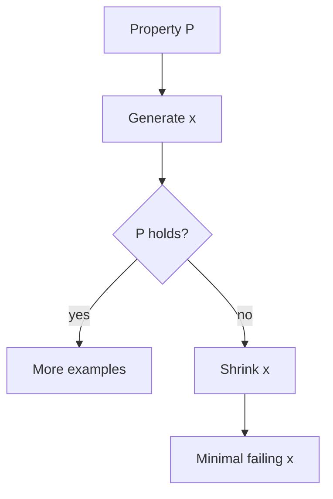

import { ConceptTemplate } from '@/features/kb/components/templates/ConceptTemplate'
import { Callout } from '@/features/kb/components/mdx/Callout'
import { ComparisonTable } from '@/features/kb/components/mdx/ComparisonTable'

export default function Layout({ children }) {
  return (
    <ConceptTemplate title="Property-Based Testing">
      {children}
    </ConceptTemplate>
  )
}

**Property-based testing** (QuickCheck, Hypothesis, fast-check) flips example-based tests: you write a *property* that should hold for a large class of inputs, and the library generates candidates until it finds a counterexample. Then it **shrinks** toward a small failing input you can actually debug.

## 1. Deep Dive and Mechanics

**Properties.** Round-trip: decode(encode(x)) equals x. Idempotence: f(f(x)) equals f(x). Oracle: your function matches a slow reference. Metamorphic: sorting a permutation does not change the multiset.

**Generators.** Built-ins for ints, lists, unicode; custom ones for your domain (an "order" that always has at least one line). Bad generators waste runs on invalid junk or never reach the interesting corner.

**Shrinking.** When a 200-element list fails, the framework searches a smaller list that still fails. That search is why PBT is usable.

**Budgets.** You set a number of examples (100, 1000). CI should seed the RNG so a failure reproduces.

<Callout icon="tip" title="A property is a theorem sketch">
If you cannot name the invariant in one sentence, you are not ready to generate. Write two examples first, then generalise.
</Callout>

## 2. Mathematical / Theoretical Foundation

A property is a predicate P on a type T. The tester samples from a distribution μ on T and looks for x with ¬P(x). This is **randomised falsification**, not a proof. Coverage of T depends on μ and on how you filter.

**Shrinking** is a search on a well-founded order (size). Hypothesis uses an internal IR so shrinking is more systematic than naive "delete an element."

**Stateful PBT** (Hypothesis rule-based, ScalaCheck commands) generates sequences of API calls against a model — a lightweight model checker.

<ComparisonTable
  headers={['Style', 'You supply', 'It finds']}
  rows={[
    ['Example test', 'A few hand cases', 'Only those cases'],
    ['Property test', 'Invariant + generator', 'Shrunk counterexamples'],
    ['Fuzzing', 'Bytes + crash oracle', 'Memory and parse bugs'],
    ['Model check', 'Full spec', 'Exhaustive on a small state'],
  ]}
/>

## 3. Real-World Implementation

```python
from hypothesis import given, strategies as st

@given(st.lists(st.integers()))
def test_sort_is_idempotent_and_ordered(xs):
    ys = sorted(xs)
    assert ys == sorted(ys)
    assert all(a <= b for a, b in zip(ys, ys[1:]))
    assert sorted(ys) == ys
```

Add `assert sorted(xs) == sorted(xs)`-style multiset equality if you need permutation safety. Keep the generator biased toward empty and singleton lists — Hypothesis already tries those.

## 4. Visualizations



## 5. Interview Prep

**Q: When does PBT beat example tests?**
**A:** Encoders, parsers, schedulers, anything with an obvious invariant and a large input space.

**Q: Why did it miss a bug I can write by hand?**
**A:** The generator never produced that shape, or you filtered it away. Custom strategies are the job.

**Q: Is 100 examples enough?**
**A:** For CI, yes if shrinking works and you re-run with a seed on failure. For crypto or parsers, raise the budget or use targeted fuzzing.

## 6. Production Use Cases

- **Serialisers** between services (JSON, protobuf wrappers).
- **Money and calendar** libraries where off-by-one is cheap to generate and expensive in prod.
- **Query planners** checked against a naive interpreter.

<Callout icon="warning" title="Do not generate secrets or hit live IO">
PBT will call your function thousands of times. Keep it pure or against an in-memory fake. Generating real emails to a vendor will go badly.
</Callout>
