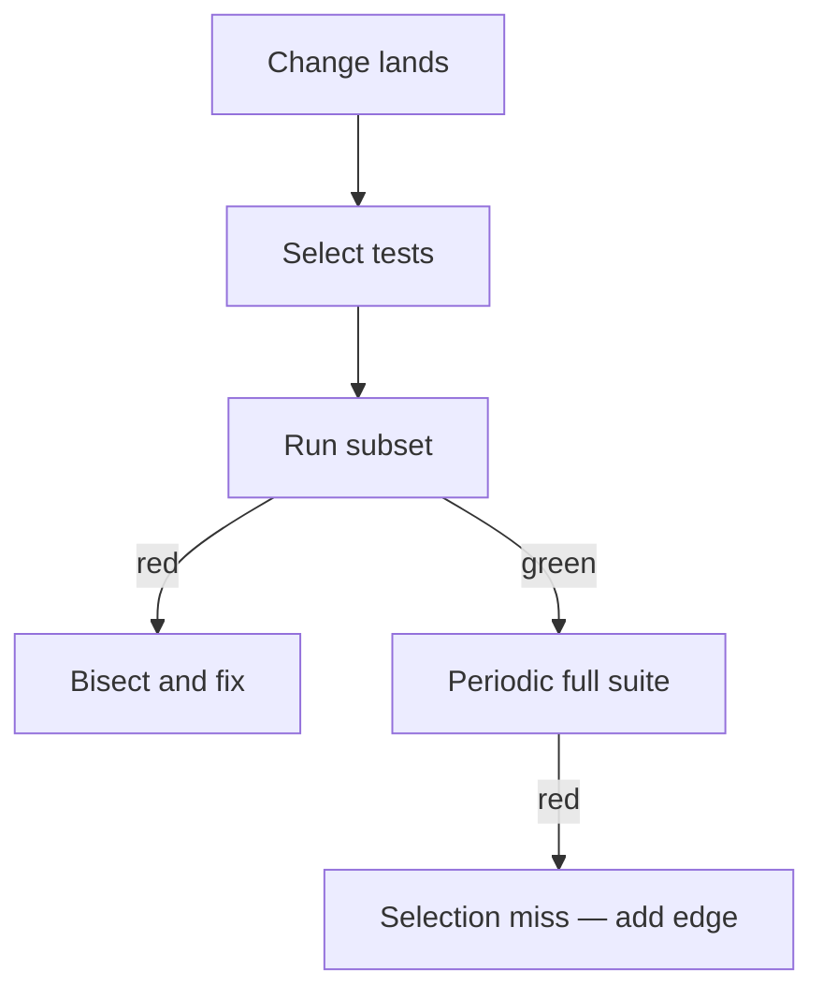

import { ConceptTemplate } from '@/features/kb/components/templates/ConceptTemplate'
import { Callout } from '@/features/kb/components/mdx/Callout'
import { ComparisonTable } from '@/features/kb/components/mdx/ComparisonTable'

export default function Layout({ children }) {
  return (
    <ConceptTemplate title="Regression Testing">
      {children}
    </ConceptTemplate>
  )
}

**Regression testing** is the discipline of asking "what old promise did we break?" after every meaningful change. A regression is not a new feature bug; it is a capability that used to hold and no longer does. The suite is a memory of those promises.

## 1. Deep Dive and Mechanics

**The suite.** Units, integrations, a few E2E, plus any bug that escaped once and now has a pinned test. Adding a regression test for every production incident is how the suite earns its keep.

**Selection.** Running everything on every commit does not scale. Techniques: changed-file graphs, test impact analysis, risk tags (`@billing`), and a merge-queue full run on main.

**Quarantine.** A known flake is worse than a missing test because it trains the team to click rerun. Quarantine with an owner and an expiry, or delete.

**Oracle.** The previous green run is the implicit oracle. When product *intends* to change behaviour, update the test in the same PR so the memory stays honest.

<Callout icon="tip" title="Every escaped bug pays rent">
The cheapest regression test is the one that encodes last quarter's outage. If you cannot write it, you do not understand the bug.
</Callout>

## 2. Mathematical / Theoretical Foundation

Let P be the set of behaviours customers rely on. A change c maps P to P'. Regression seeks any p in P that is not in P' and was not deliberately removed.

**RTS (regression test selection)** computes a subset T' of T that can fail if c is faulty, using a safe over-approximation of dependencies. Unsafe selection is faster and can miss faults — measure residual misses.

**Minimisation** drops redundant tests that cover the same statements. **Prioritisation** orders tests to fail fast (coverage of recent diffs first).

<ComparisonTable
  headers={['Strategy', 'Speed', 'Miss risk']}
  rows={[
    ['Run all', 'Slow', 'Lowest'],
    ['Safe RTS', 'Medium', 'Low if graph is sound'],
    ['Heuristic tags', 'Fast', 'Medium — depends on hygiene'],
    ['Nightly only', 'Free on PR', 'High for same-day breaks'],
  ]}
/>

## 3. Real-World Implementation

```yaml
# GitHub Actions: full regression on main, impact on PRs
name: regression
on:
  pull_request:
  push:
    branches: [main]
jobs:
  tests:
    runs-on: ubuntu-latest
    steps:
      - uses: actions/checkout@v4
      - run: npm ci
      - name: PR impact
        if: github.event_name == 'pull_request'
        run: npm test -- --changedSince=origin/main
      - name: Full
        if: github.ref == 'refs/heads/main'
        run: npm test
```

`--changedSince` is a heuristic. Keep a scheduled full run.

## 4. Visualizations



## 5. Interview Prep

**Q: What is a regression?**
**A:** A behaviour that was correct, still required, and is now wrong. New-feature gaps are not regressions until they have shipped once.

**Q: How do you keep the suite from becoming a junkyard?**
**A:** Ownership, flake SLOs, deleting tests that never failed and never document a rule, and folding duplicates into one example.

**Q: Manual regression checklists — still valid?**
**A:** For exploratory and visual judgement. For anything you will run every week, automate or admit you will skip it.

## 6. Production Use Cases

- **Release trains** in banks and health: mapped regression packs per risk tier.
- **Monorepo CI** with affected-target graphs (Nx, Bazel) as RTS.
- **Hotfix follow-up**: emergency sanity now, full regression before the next business day.

<Callout icon="warning" title="Passing regression is not product-market fit">
It only says you did not break the remembered promises. Unremembered promises still burn customers.
</Callout>
