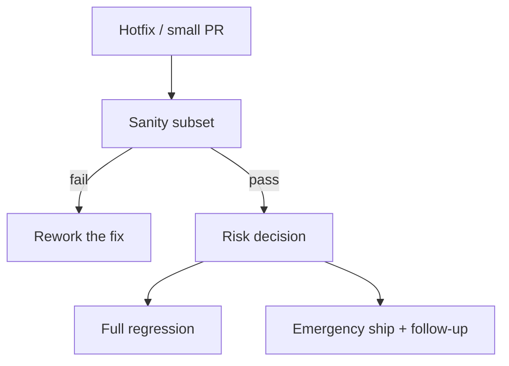

import { ConceptTemplate } from '@/features/kb/components/templates/ConceptTemplate'
import { Callout } from '@/features/kb/components/mdx/Callout'
import { ComparisonTable } from '@/features/kb/components/mdx/ComparisonTable'

export default function Layout({ children }) {
  return (
    <ConceptTemplate title="Sanity Testing">
      {children}
    </ConceptTemplate>
  )
}

**Sanity testing** is a narrow confidence check after a small change: the bug fix appears to work, the new toggle flips, the migration did not brick login. It is not a tour of the product. If sanity fails, a full regression would have been wasted time.

## 1. Deep Dive and Mechanics

**Trigger.** A hotfix, a config change, a data backfill, or a build that only touched one module. You pick cases adjacent to the change, plus one "still boots" check.

**Depth.** Slightly deeper than smoke on a tiny surface. You might place an order with the new coupon code, not just load the home page.

**Who.** Often a human on a staging box for an emergency, or a tagged automated subset (`@sanity`) that CI runs on hotfix branches.

**Relation to regression.** Sanity is a filter in front of regression, or a substitute when you cannot afford the full suite before a Sev-1 patch (with an explicit follow-up).

<Callout icon="info" title="Sanity is a hypothesis test">
The hypothesis is "this change did what we think and did not obviously explode." Reject quickly; do not confuse rejection with a complete proof.
</Callout>

## 2. Mathematical / Theoretical Foundation

Change-impact analysis: let D be the dependency cone of the edited files. Sanity samples tests whose coverage intersects D. Formal test-selection research (RTS — regression test selection) computes a safer over-approximation of D from a dependency graph.

Sanity that is purely human-chosen is a **heuristic subset**. It has high chance of catching the intended fix and a lower chance of catching distant regressions — that residual is why you still schedule regression.

<ComparisonTable
  headers={['', 'Smoke', 'Sanity', 'Regression']}
  rows={[
    ['Breadth', 'Whole system, shallow', 'Changed area, shallow', 'Whole system, deep'],
    ['Trigger', 'Every artefact', 'A specific change', 'Release or main'],
    ['Goal', 'Build is alive', 'Change looks right', 'Old behaviour holds'],
    ['Skip if red', 'Everything', 'Full regression', 'Release'],
  ]}
/>

## 3. Real-World Implementation

```javascript
// Playwright: npm run test -- --grep @sanity
import { test, expect } from '@playwright/test';

test('sanity @sanity: coupon from ticket 1842 applies', async ({ page }) => {
  await page.goto('/cart');
  await page.getByLabel('Coupon').fill('SAVE10');
  await page.getByRole('button', { name: 'Apply' }).click();
  await expect(page.getByTestId('discount')).toHaveText('10%');
});
```

Tag the handful of cases that map to the incident. Delete or retag them when the incident is closed so the sanity set does not become a junk drawer.

## 4. Visualizations



## 5. Interview Prep

**Q: Is sanity the same as smoke?**
**A:** No. Smoke is "can we proceed to test this build at all?" Sanity is "does this particular change seem to work?" Interviewers listen for that distinction.

**Q: Can sanity replace regression for a Friday hotfix?**
**A:** Only with an explicit risk acceptance and a scheduled full run. Sanity is not a license to skip the cone of impact forever.

**Q: How do you choose sanity cases?**
**A:** Walk the call graph and the user journey that failed. Add one orthogonal "still can sign in" case. Stop.

## 6. Production Use Cases

- **Sev-1 patches** where waiting 40 minutes is worse than a documented residual risk.
- **Feature-flag flips** in production: sanity the flagged path on a small cohort.
- **Schema migrations** on staging: sanity the two queries that used the old columns.

<Callout icon="warning" title="Do not rename the whole suite to sanity">
If it takes 25 minutes, it is regression wearing a shorter word. Names that lie train people to skip the real smoke.
</Callout>
