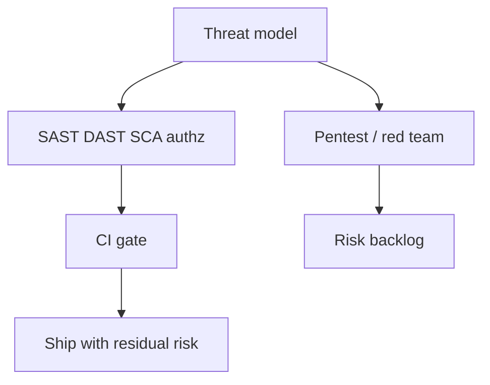

import { ConceptTemplate } from '@/features/kb/components/templates/ConceptTemplate'
import { Callout } from '@/features/kb/components/mdx/Callout'
import { ComparisonTable } from '@/features/kb/components/mdx/ComparisonTable'

export default function Layout({ children }) {
  return (
    <ConceptTemplate title="Security Testing">
      {children}
    </ConceptTemplate>
  )
}

**Security testing** treats the system as a target: can an unauthenticated caller reach an admin route, can a tenant read another tenant's row, do secrets leak in logs? Functional tests assume a cooperative user. Security tests assume an adversary.

## 1. Deep Dive and Mechanics

**Layers.** SAST reads source for dangerous sinks. DAST drives the running app from outside. SCA looks at dependency CVEs. IAST and runtime sensors sit in between. Secrets scanners watch the repo and images.

**Authn and authz.** The highest-value automated tests are often ordinary API tests with the wrong token, no token, or another tenant's id. These are cheap and they catch the bugs that scanners miss.

**Threat modelling.** STRIDE or a simpler "who can hurt us" session decides what to test. A scanner without a model produces noise.

**Humans.** Penetration tests and red teams chain issues. Automation finds known classes; people find business-logic bypasses.

<Callout icon="warning" title="Stay inside authorisation">
Security testing of systems you do not own, or beyond an agreed scope, is illegal. Production tests belong in a written program with rules of engagement.
</Callout>

## 2. Mathematical / Theoretical Foundation

Security properties are often **hyperproperties** or 2-safety: noninterference says that secret inputs should not be observable in public outputs. Tests approximate this with two runs that differ only in a secret and should look alike on the public channel.

**Access control** is a relation allow(subject, action, resource). Tests sample that relation: allow the happy case, deny the cross-tenant case.

**Attack surface** grows with reachable endpoints × trust boundaries. Reducing surface (auth required, no debug routes) beats adding tests.

<ComparisonTable
  headers={['Method', 'Sees', 'Misses']}
  rows={[
    ['SAST', 'Source sinks', 'Runtime config, authz bugs'],
    ['DAST', 'Exposed HTTP', 'Dead code, deep state'],
    ['SCA', 'Known CVEs', 'Your own logic'],
    ['Authz tests', 'Tenant isolation', 'Novel exploit chains'],
    ['Pentest', 'Chained impact', 'Complete coverage'],
  ]}
/>

## 3. Real-World Implementation

```python
def test_user_cannot_read_other_tenant_invoice(client, user_a, invoice_b):
    client.force_login(user_a)
    response = client.get(f'/invoices/{invoice_b.id}')
    assert response.status_code in (403, 404)
    assert b'amount' not in response.content
```

Put these next to the happy-path API tests. A 200 on a foreign id is a Sev-1, not a polish item.

## 4. Visualizations



## 5. Interview Prep

**Q: SAST versus DAST?**
**A:** SAST has source and can be early; it does not see the running config. DAST sees the deployed app and misses what is not reachable.

**Q: What security test should every API team write first?**
**A:** Cross-tenant read and write with a valid but wrong identity. IDOR-class bugs dominate real incidents.

**Q: How do you handle a critical CVE in a transitive dependency?**
**A:** Upgrade or patch, compensate if you cannot, and track the exception with an expiry. "We will get to it" is not a control.

## 6. Production Use Cases

- **Required SAST/SCA** on every PR in regulated orgs.
- **DAST** against staging on a nightly crawl.
- **Authz suites** as a merge blocker for any service that stores tenant data.

<Callout icon="tip" title="Test the deny">
A 200 test never proves isolation. The valuable assert is 403 or 404 and an empty body when the caller is the wrong subject.
</Callout>
