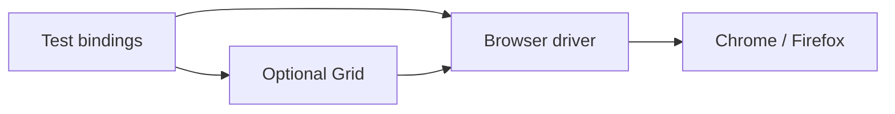

import { ConceptTemplate } from '@/features/kb/components/templates/ConceptTemplate'
import { Callout } from '@/features/kb/components/mdx/Callout'
import { ComparisonTable } from '@/features/kb/components/mdx/ComparisonTable'

export default function Layout({ children }) {
  return (
    <ConceptTemplate title="Selenium">
      {children}
    </ConceptTemplate>
  )
}

**Selenium** is both a protocol and a family of clients. **WebDriver** is the W3C standard: a local or remote process speaks HTTP to a browser driver (chromedriver, geckodriver). Selenium Grid fans that out across machines. Playwright did not make WebDriver wrong; it made a newer protocol more pleasant for many web apps.

## 1. Deep Dive and Mechanics

**Client → driver → browser.** Your Java/Python/C# test sends commands (find, click, screenshot). The driver implements them in that browser. Mismatched driver/browser versions are the classic Monday failure.

**Waits.** Selenium does not auto-wait like Playwright. You write explicit waits (`WebDriverWait` + expected conditions) or you sleep and flake.

**Grid.** Hub (or the Selenium 4 Grid) routes sessions to nodes with capabilities (browser, version, platform). Cloud vendors (BrowserStack, Sauce) speak the same protocol.

**Selenium 4.** BiDi and CDP hooks, better Grid, relative locators. The stack is not frozen in 2014.

<Callout icon="warning" title="Implicit waits plus explicit waits">
Mixing both creates confusing timeouts. Pick explicit waits and a reasonable default page-load strategy.
</Callout>

## 2. Mathematical / Theoretical Foundation

WebDriver is a **remote procedure** API: each call is a round trip. Latency × number of commands dominates. Page objects exist to cut duplication, not to hide 40 round trips behind one method name — that method will still be slow.

Capability matching on a Grid is constraint satisfaction: requested browserName, version, platformName versus node inventory.

<ComparisonTable
  headers={['Layer', 'Job', 'You maintain']}
  rows={[
    ['Bindings', 'Language API', 'Selenium package'],
    ['Driver', 'Browser-specific', 'Version pin'],
    ['Grid / cloud', 'Where it runs', 'Capacity and secrets'],
    ['Your suite', 'Waits and selectors', 'Almost everything that flakes'],
  ]}
/>

## 3. Real-World Implementation

```python
from selenium.webdriver.common.by import By
from selenium.webdriver.support.ui import WebDriverWait
from selenium.webdriver.support import expected_conditions as EC

def test_heading(driver):
    driver.get('https://staging.example.com')
    heading = WebDriverWait(driver, 10).until(
        EC.visibility_of_element_located((By.ROLE, 'heading'))  # prefer By.CSS or accessibility helpers
    )
    assert 'Catalog' in heading.text
```

Prefer official expected conditions and a fixture that quits the driver even on failure.

## 4. Visualizations



## 5. Interview Prep

**Q: Selenium versus Playwright?**
**A:** Selenium: any language, Grid ecosystem, standards. Playwright: better defaults (wait, trace, multi-engine from one API). Migration is a product decision, not a moral one.

**Q: What is a Page Object?**
**A:** A class that hides locators and offers domain actions (`login_as`). It does not remove the need for waits.

**Q: Why did CI fail with session not created?**
**A:** Usually driver/browser skew, Grid capacity, or a missing binary in the image.

## 6. Production Use Cases

- **Polyglot orgs** that must write tests in Java or C#.
- **Existing Grid farms** and vendor clouds already paid for.
- **Appium** (mobile) which reuses the WebDriver mindset.

<Callout icon="tip" title="Pin browser and driver in the image">
"Latest Chrome" on a floating tag is how Friday's suite dies on Monday. Pin SHA or major version.
</Callout>
