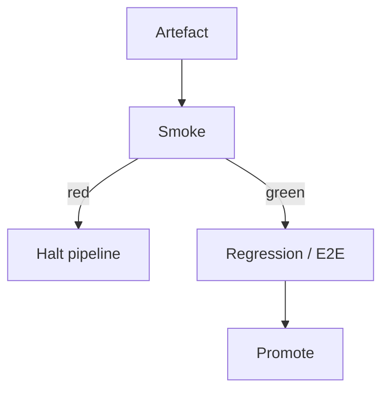

import { ConceptTemplate } from '@/features/kb/components/templates/ConceptTemplate'
import { Callout } from '@/features/kb/components/mdx/Callout'
import { ComparisonTable } from '@/features/kb/components/mdx/ComparisonTable'

export default function Layout({ children }) {
  return (
    <ConceptTemplate title="Smoke Testing">
      {children}
    </ConceptTemplate>
  )
}

**Smoke testing** is a shallow, wide check: does the build boot, serve health, accept a login, and render the home surface? The name comes from hardware — power on and see if it smokes. In software it is a **build verification test** (BVT): fail fast before you spend an hour on regression.

## 1. Deep Dive and Mechanics

**When.** After a CI artefact is produced, after a deploy to staging, and as the first probe after production promote. Some teams run the same smoke from outside the cluster against the live URL.

**What.** Five to twenty cases. Health endpoints, static assets, a read path, a write path, auth. No combinatorial edge cases.

**Where.** Prefer hitting the real deployed environment over a developer's laptop. The question is "this artefact in this config," not "the code can compile."

**Automation.** Smoke must be boring and green. If a smoke test needs a 30-second sleep, it is the wrong test for this layer.

<Callout icon="warning" title="A red smoke means stop the line">
Do not debug a 2-hour regression while smoke is red. The build or the environment is not a candidate.
</Callout>

## 2. Mathematical / Theoretical Foundation

Smoke is a **cheap filter** in a sequential testing pipeline. Let C_deep be the cost of the full suite and p_broken be the probability the artefact cannot even boot. Expected savings ≈ p_broken × C_deep minus the small cost of smoke.

It is a **soundness** check of liveness properties (the process serves requests), not of functional completeness. Formal liveness: eventually a successful HTTP 200 on /health and /login.

<ComparisonTable
  headers={['Kind', 'Depth', 'Question']}
  rows={[
    ['Smoke', 'Shallow, wide', 'Is this build alive?'],
    ['Sanity', 'Shallow, narrow', 'Did this change look plausible?'],
    ['Regression', 'Deep, wide', 'Did anything old break?'],
    ['Acceptance', 'Deep, story-scoped', 'Is the story done?'],
  ]}
/>

## 3. Real-World Implementation

```javascript
import { test, expect } from '@playwright/test';

test('smoke: site serves and auth works', async ({ page, request }) => {
  const health = await request.get('/health');
  expect(health.ok()).toBeTruthy();
  await page.goto('/');
  await expect(page.getByRole('heading', { name: 'Catalog' })).toBeVisible();
  await page.getByLabel('Email').fill('smoke@example.com');
  await page.getByRole('button', { name: 'Sign in' }).click();
  await expect(page.getByText('Dashboard')).toBeVisible();
});
```

Point this file at staging and production with environment URLs. Keep credentials in a secret store, rotated, and scoped to smoke users.

## 4. Visualizations



## 5. Interview Prep

**Q: Smoke versus sanity?**
**A:** Smoke is "does the build run at all?" Sanity is "does this specific fix appear to work?" Smoke is broad and shallow; sanity is narrow and slightly deeper.

**Q: Should smoke run in production?**
**A:** Synthetic probes after deploy are common. Keep them read-mostly or use clearly marked test accounts so you do not pollute billing.

**Q: How many smoke tests?**
**A:** Enough that a downed API or a missing env var fails, few enough to finish in a couple of minutes.

## 6. Production Use Cases

- **Post-deploy gate** in blue-green or canary before shifting 100 percent of traffic.
- **On-call synthetics** every minute on /health and a cheap authenticated read.
- **Hotfix pipeline** that refuses to ship if smoke is red.

<Callout icon="tip" title="Same smoke, every environment">
Drift between "CI smoke" and "prod smoke" is how you learn about a missing env var only after customers do.
</Callout>
