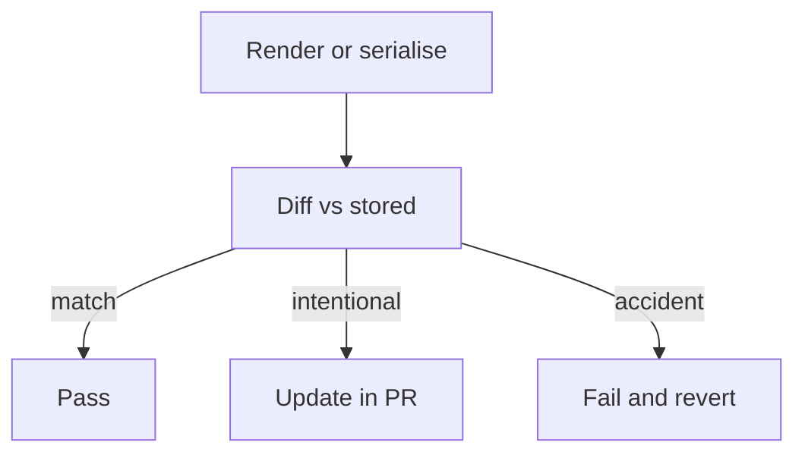

import { ConceptTemplate } from '@/features/kb/components/templates/ConceptTemplate'
import { Callout } from '@/features/kb/components/mdx/Callout'
import { ComparisonTable } from '@/features/kb/components/mdx/ComparisonTable'

export default function Layout({ children }) {
  return (
    <ConceptTemplate title="Snapshot Testing">
      {children}
    </ConceptTemplate>
  )
}

**Snapshot testing** captures the serialised form of a component, AST, or API payload on first run, then diffs later runs against that file. Jest made this famous for React trees. It is a review tool: the human must accept the new snapshot when the change is intentional.

## 1. Deep Dive and Mechanics

**Write once.** First run writes a `.snap` (or inline snapshot). Later runs compare. A mismatch fails with a diff.

**What to snapshot.** Small, stable output: a pure component with fixed props, a formatter, a GraphQL pretty-print. Not live clocks, random ids, or full page HTML from a flaky CMS.

**Review.** A 400-line snapshot that updates in every PR is not a test; it is a permission slip to click "update." Keep snapshots tiny or stop.

**Inline versus file.** Inline snapshots sit next to the assertion and review well. File snapshots hide in `__snapshots__` and rot.

<Callout icon="warning" title="Never update snapshots with a blind flag">
`--updateSnapshot` on a dirty tree will bless bugs. Update one file at a time and read the diff like production code.
</Callout>

## 2. Mathematical / Theoretical Foundation

A snapshot is an **oracle by example**: expected = serialise(f(x0)) stored at time t0. The test is equality of strings (or structured trees) at t1.

It is complete for accidental change of the serialised form and silent on whether that form was ever correct. The first write can encode a bug forever.

Hashing the snapshot (some visual tools) trades readable diffs for collision risk; for text, keep the raw serialisation.

<ComparisonTable
  headers={['Style', 'Strength', 'Failure mode']}
  rows={[
    ['Field asserts', 'Intent is obvious', 'Tedious for trees'],
    ['File snapshot', 'Cheap for large output', 'Rubber-stamp updates'],
    ['Inline snapshot', 'Review beside the test', 'Noisy PRs if huge'],
    ['Visual screenshot', 'Pixels', 'Theme and font flake'],
  ]}
/>

## 3. Real-World Implementation

```javascript
import { render } from '@testing-library/react';
import { PriceTag } from './PriceTag';

test('price tag markup', () => {
  const { container } = render(<PriceTag amount={1099} currency="USD" />);
  expect(container.firstChild).toMatchInlineSnapshot(`
    <span class="price">
      $10.99
    </span>
  `);
});
```

Normalise whitespace and strip unstable attributes (hashes in CSS modules) before compare.

## 4. Visualizations



## 5. Interview Prep

**Q: When are snapshots a bad idea?**
**A:** When the output changes for reasons you do not care about (time, ids, store order) or when nobody reads the updates.

**Q: Snapshot versus explicit assert?**
**A:** Explicit for money, auth, and legal strings. Snapshot for bulky but rarely meaningful markup.

**Q: How do you snapshot an API?**
**A:** You can, but a contract test or a schema is usually clearer. Snapshots of JSON tend to encode field order and extra noise.

## 6. Production Use Cases

- **Design-system components** with a small, stable DOM.
- **Codegen and compiler fixtures** (expected IR or SQL).
- **Error message catalogues** that must not drift unnoticed.

<Callout icon="tip" title="One concept per snapshot">
A snapshot of an entire page encodes routing, i18n, and a banner experiment. Split until a failure names the component.
</Callout>
