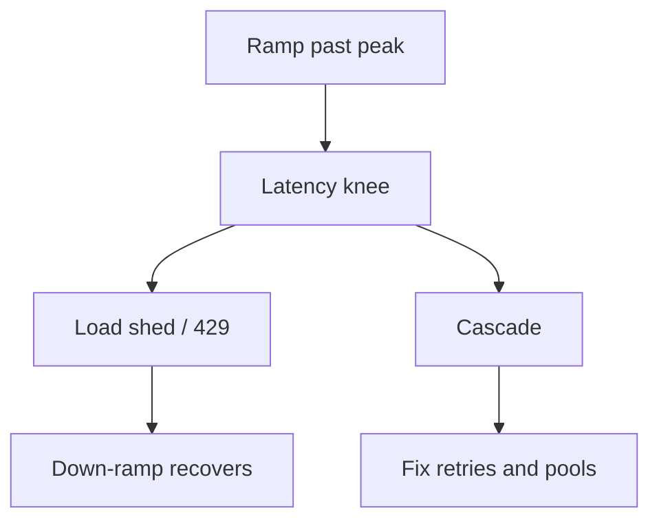

import { ConceptTemplate } from '@/features/kb/components/templates/ConceptTemplate'
import { Callout } from '@/features/kb/components/mdx/Callout'
import { ComparisonTable } from '@/features/kb/components/mdx/ComparisonTable'

export default function Layout({ children }) {
  return (
    <ConceptTemplate title="Stress Testing">
      {children}
    </ConceptTemplate>
  )
}

**Stress testing** keeps adding load (or subtracting resources) after the load-test plateau. You are not trying to meet an SLO. You are trying to watch the crash: which queue fills, which timeout storms, whether the process OOMs, and whether a load-shedder saves the core path.

## 1. Deep Dive and Mechanics

**How you stress.** Ramp RPS past the knee; shrink CPU or memory; kill replicas; add latency on a dependency; fill the disk. Traffic is only one axis.

**What you want to see.** HTTP 429 or a degraded read-only mode is a success of design. A thundering retry loop that takes the database with it is a failure of design.

**Recovery.** After you back off, does the system return to green without a bounce? Stress includes the down-ramp.

**Safety.** Never stress a shared production database "to see." Use an isolated cell with the same topology.

<Callout icon="error" title="Retries without jitter are a stress amplifier">
When you finally hit the limit, clients retry in sync and finish the victim. Cap retries and add jitter before you celebrate a "resilient" client.
</Callout>

## 2. Mathematical / Theoretical Foundation

**Knee of the curve.** Throughput rises with offered load until saturation, then may fall (thrashing, GC, lock convoy). Stress maps that curve.

**Failure amplification.** If each failed request causes r retries, offered load can jump by about r at the worst moment. Circuit breakers cap that multiplier.

**Graceful degradation** is a liveness property for a subset of features: checkout may 503 while catalog still serves from cache. Stress tests should assert that subset explicitly.

<ComparisonTable
  headers={['Test', 'Stop condition', 'Success looks like']}
  rows={[
    ['Load', 'Planned peak held', 'SLO still green'],
    ['Stress', 'Break or resource floor', 'Known mode, core path shed'],
    ['Soak', 'Time elapsed', 'No leak, stable p99'],
    ['Chaos', 'Injected fault', 'Blast radius contained'],
  ]}
/>

## 3. Real-World Implementation

```javascript
import http from 'k6/http';

export const options = {
  stages: [
    { duration: '2m', target: 100 },
    { duration: '2m', target: 400 },
    { duration: '2m', target: 800 },
    { duration: '2m', target: 0 },
  ],
};

export default function () {
  http.get('https://lab.example.com/api/checkout/quote');
}
```

Watch error class, not only error rate: 503 with a Retry-After is different from connection reset. Graph DB connections beside RPS.

## 4. Visualizations



## 5. Interview Prep

**Q: What is a good outcome of a stress test?**
**A:** A measured capacity number, a documented failure mode, and evidence that non-critical work is shed first.

**Q: How is stress different from soak?**
**A:** Stress is intensity. Soak is duration at a realistic (often high) load to find leaks.

**Q: Should stress run in CI?**
**A:** Usually nightly or pre-event, not on every PR. It is expensive and environment-sensitive.

## 6. Production Use Cases

- **Pre-launch** of a new region or cluster size.
- **Game-day** rehearsals for ticket drops and election nights.
- **Validating a new load-shedder** or queue back-pressure change.

<Callout icon="tip" title="Write the failure story down">
If the only artefact is a Grafana screenshot in Slack, the next on-call will restress from scratch. Store the curve and the mode in the runbook.
</Callout>
