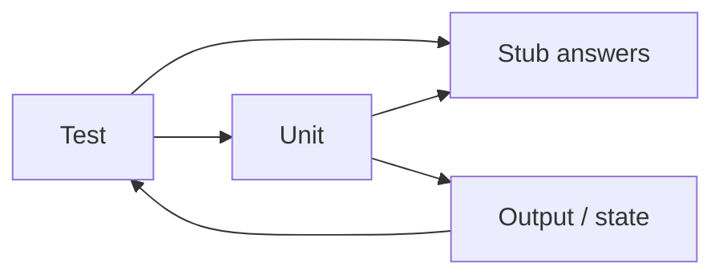

import { ConceptTemplate } from '@/features/kb/components/templates/ConceptTemplate'
import { Callout } from '@/features/kb/components/mdx/Callout'
import { ComparisonTable } from '@/features/kb/components/mdx/ComparisonTable'

export default function Layout({ children }) {
  return (
    <ConceptTemplate title="Stubs">
      {children}
    </ConceptTemplate>
  )
}

A **stub** is a test double that returns programmed answers and does little else. The test's oracle is the *unit's* output or state, not the conversation with the stub. If you start `verify`-ing call counts, you have grown a spy or a mock.

## 1. Deep Dive and Mechanics

**Canned world.** "Rates.lookup returns 0.2." "UserRepo.find returns null." The stub is a fixture in function form.

**No brain.** A stub should not implement real policy. If it starts computing tax, it is becoming a fake — which may be better.

**Error paths.** Stubs are the easiest way to force a 404, a timeout error, or a malformed payload into the unit.

**Shared stubs.** A project-wide stub that returns a full user graph will tempt every test to depend on leftover fields. Prefer local, tiny stubs.

<Callout icon="info" title="Stubs hide I/O, not design">
If you need seven stubs to construct the unit, the constructor is telling you about coupling. Listen before you add an eighth.
</Callout>

## 2. Mathematical / Theoretical Foundation

A stub is a **partial function** from arguments to return values, defined only on the cases the test will hit. Underspecified arguments should throw so you notice an unexpected call (a light spy behaviour).

State-based testing (classic TDD) uses stubs for queries and asserts postconditions. Interaction-based testing uses mocks for commands. Queries want stubs; commands want spies or fakes.

<ComparisonTable
  headers={['Double', 'Answers', 'Asserts interactions']}
  rows={[
    ['Stub', 'Yes, canned', 'No'],
    ['Mock', 'Sometimes', 'Yes, up front'],
    ['Spy', 'Optional', 'Yes, after'],
    ['Fake', 'Via real-ish logic', 'Usually no'],
  ]}
/>

## 3. Real-World Implementation

```python
class RateStub:
    def __init__(self, rate):
        self._rate = rate
    def lookup(self, sku):
        return self._rate

def test_tax_added_to_subtotal():
    cart = Cart(rates=RateStub(0.1))
    cart.add(price=100)
    assert cart.total() == 110
```

The stub does not care that `lookup` was called twice. If you need that, you are testing a cache — write that test explicitly.

## 4. Visualizations



## 5. Interview Prep

**Q: Stub versus mock in one sentence?**
**A:** Stubs supply data; mocks check conversations.

**Q: Can a stub also record calls?**
**A:** Then it is a spy. The names exist so you do not accidentally over-assert.

**Q: When is a stub the wrong tool?**
**A:** When the collaborator has rich invariants (a ledger). Use a fake or an integration so the invariants stay true.

## 6. Production Use Cases

- **Clock and config** lookups in domain tests.
- **Feature-flag** readers returning true or false per scenario.
- **HTTP clients** returning a stored JSON body for mapper tests (the mapper, not the HTTP stack).

<Callout icon="tip" title="Name the world, not the mechanism">
`sold_out_inventory` as a stub factory reads better than `mock_inventory_returns_zero`. The test is about the business case.
</Callout>
