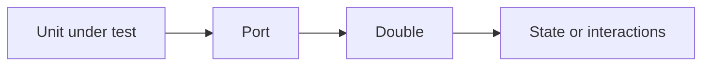

import { ConceptTemplate } from '@/features/kb/components/templates/ConceptTemplate'
import { Callout } from '@/features/kb/components/mdx/Callout'
import { ComparisonTable } from '@/features/kb/components/mdx/ComparisonTable'

export default function Layout({ children }) {
  return (
    <ConceptTemplate title="Test Doubles">
      {children}
    </ConceptTemplate>
  )
}

**Test doubles** (Gerard Meszaros) are objects that replace a real collaborator in a test. The word "mock" is often used for the whole family; that sloppiness causes design fights. Use the precise type: dummy, stub, spy, mock, or fake.

## 1. Deep Dive and Mechanics

**Dummy.** Passed but never used (a required constructor arg).

**Stub.** Returns canned data. No interaction asserts.

**Spy.** Records calls; you assert "sendMail was called once" after acting.

**Mock.** Pre-programmed expectations; unexpected calls fail. Interaction-heavy.

**Fake.** A working, simpler implementation (in-memory repository). Preferred when the protocol is rich.

**The port.** Doubles require a seam: an interface you own. You cannot usefully double a static `Date.now` without wrapping it.

<Callout icon="tip" title="Prefer fakes for stateful protocols">
A mock of a repository that has save, find, list, and delete will rot on every extra method. An in-memory map stays boring.
</Callout>

## 2. Mathematical / Theoretical Foundation

A collaborator is a function (or object) C. A double C' should agree with C on the **observations the unit is allowed to make**. That is a simulation or bisimulation on a subset of the interface.

Over-specified mocks encode a particular call graph — an implementation, not a spec. The test then fails on a harmless refactor (the **mock-over-specification** problem).

<ComparisonTable
  headers={['Double', 'Behaviour', 'Typical assert']}
  rows={[
    ['Dummy', 'Unused', 'None'],
    ['Stub', 'Canned return', 'State of the unit'],
    ['Spy', 'Records calls', 'Call count / args after'],
    ['Mock', 'Expected calls', 'Interactions were exact'],
    ['Fake', 'Real-ish logic', 'State of the fake'],
  ]}
/>

## 3. Real-World Implementation

```typescript
class InMemoryOrders implements OrderPort {
  private rows = new Map<string, Order>();
  save(order: Order) { this.rows.set(order.id, order); }
  find(id: string) { return this.rows.get(id) ?? null; }
}

test('place order stores a submitted order', () => {
  const orders = new InMemoryOrders();
  const svc = new Checkout(orders);
  svc.place('o1', 20);
  expect(orders.find('o1')?.status).toBe('submitted');
});
```

This is a fake. A mock would have asserted `save` was called with a particular object shape and would break if you also wrote an audit row.

## 4. Visualizations



## 5. Interview Prep

**Q: Mock versus stub?**
**A:** A stub only supplies values. A mock asserts conversations. If you never `verify`, you had a stub with extra API.

**Q: Why do people say mocks are bad?**
**A:** Because they mock types they do not own (HTTP clients, ORMs) and lock tests to incidental call order. Mock your ports; fake or integrate the rest.

**Q: Dummy versus null?**
**A:** A dummy is an object that satisfies a type. Null may crash. Prefer a dummy or a simple stub.

## 6. Production Use Cases

- **Unit tests** of domain services with fakes for stores and stubs for clocks.
- **UI tests** that stub the network so the story is about rendering.
- **Contract tests** that use a mock provider generated from a pact.

<Callout icon="warning" title="Do not double the thing you are testing">
If half the class is mocked, you are testing the mock framework. Extract a smaller unit or write an integration.
</Callout>
