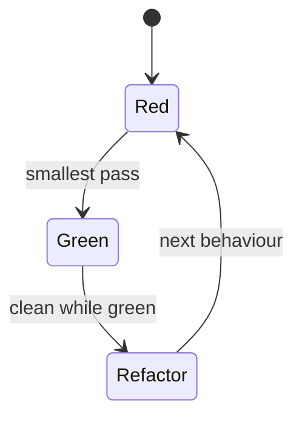

import { ConceptTemplate } from '@/features/kb/components/templates/ConceptTemplate'
import { Callout } from '@/features/kb/components/mdx/Callout'
import { ComparisonTable } from '@/features/kb/components/mdx/ComparisonTable'

export default function Layout({ children }) {
  return (
    <ConceptTemplate title="Test-Driven Development (TDD)">
      {children}
    </ConceptTemplate>
  )
}

**Test-driven development** is a tight loop: Red (a failing test that states the next behaviour), Green (the dullest code that passes), Refactor (clean design while green). Kent Beck's point was design feedback, not a coverage trophy. If you write tests after a sprawling module, you did test-after development.

## 1. Deep Dive and Mechanics

**Red.** The test must fail for the right reason — missing behaviour, not a typo in the test. Watching red proves the test can fail.

**Green.** Hard-coding the expected value is legal. Triangulate with a second example before you generalise. YAGNI: no extra branch until a test demands it.

**Refactor.** Duplication, names, and seams. Tests stay green. If you need a new behaviour, leave the refactor and start a new red.

**Outside-in versus classic.** Classic TDD grows from units. London/outside-in starts at the acceptance test and mocks neighbors inward. Both are TDD; they differ on when you invent interfaces.

<Callout icon="warning" title="Skipping red is not TDD">
A test written after the code that is already green never proved it could catch the bug. At least break the implementation once.
</Callout>

## 2. Mathematical / Theoretical Foundation

Think of the specification as a sequence of examples e1, e2, … that tighten a hypothesis H about the program. Each red/green step is a **refinement**: the program class shrinks toward H.

TDD does not prove correctness. It produces an executable regression suite whose examples *are* the design conversation. Formal refinement (Z, Event-B) is the mathematical cousin; TDD is the lightweight one.

Feedback latency matters: a loop that takes 10 minutes is not TDD. The unit of work must stay in-process and fast.

<ComparisonTable
  headers={['Practice', 'When tests are written', 'Design effect']}
  rows={[
    ['TDD', 'Before the behaviour', 'Forces seams and small steps'],
    ['Test-after', 'After a chunk', 'Can ossify a bad API'],
    ['ATDD / BDD', 'Before the story', 'Aligns on outcomes'],
    ['No automated tests', 'Never', 'Fear of change'],
  ]}
/>

## 3. Real-World Implementation

```python
def test_empty_cart_total_is_zero():
    assert Cart().total() == 0

def test_single_line_is_qty_times_price():
    cart = Cart()
    cart.add(sku='sku', qty=2, price=50)
    assert cart.total() == 100
```

First implementation of `total` can return 0, then 100, then a real sum. The third test (two lines) forces the loop. That is triangulation.

## 4. Visualizations



## 5. Interview Prep

**Q: Does TDD slow teams down?**
**A:** It slows the first hour and speeds the third month. The honest cost is learning to design testable units. The saving is debugging and fearless refactors.

**Q: What should you not TDD?**
**A:** Exploratory spikes, throwaway prototypes, and most CSS tweaks. Also anything you cannot run fast in isolation — extract a seam first.

**Q: TDD versus BDD?**
**A:** TDD is a programmer micro-loop. BDD is a shared language for examples at the story level. They compose: BDD outside, TDD inside.

## 6. Production Use Cases

- **Domain-rich services** (pricing, eligibility) where examples *are* the spec.
- **Legacy rescue**: characterisation tests first (not TDD), then TDD on new seams.
- **Katas and pairing** to teach a team the rhythm before applying it to a service.

<Callout icon="tip" title="One behaviour per cycle">
A 40-line test that invents a feature is a design session in the wrong window. Split until red is a single sentence.
</Callout>
