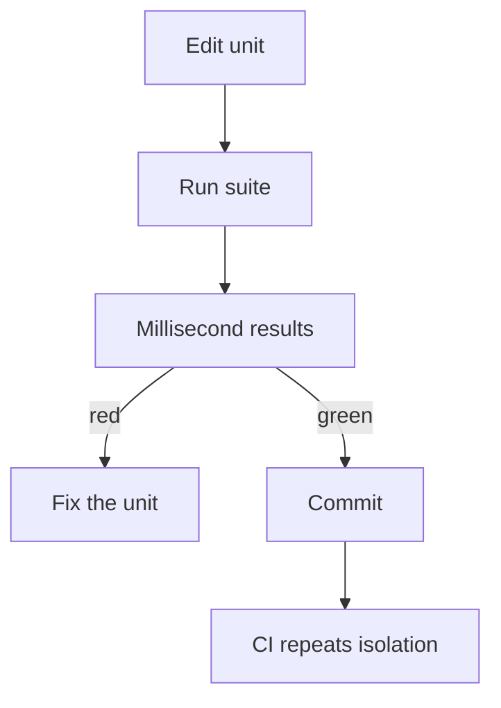

import { ConceptTemplate } from '@/features/kb/components/templates/ConceptTemplate'
import { Callout } from '@/features/kb/components/mdx/Callout'
import { ComparisonTable } from '@/features/kb/components/mdx/ComparisonTable'

export default function Layout({ children }) {
  return (
    <ConceptTemplate title="Unit Testing">
      {children}
    </ConceptTemplate>
  )
}

**Unit testing** is the base of the test pyramid: exercise one function, method, or class with collaborators replaced by doubles. A good unit test is fast, deterministic, and names a single behavioural claim. Thousands can run on every save; that is the point.

## 1. Deep Dive and Mechanics

**The unit.** In OO code the unit is usually a class method plus its private helpers. In functional code it is a pure function. If the test must start a database, it is no longer a unit test.

**AAA.** Arrange state and inputs, Act by calling the unit, Assert one observable outcome. Extra asserts are allowed when they describe the same claim, not when they smuggle in a second scenario.

**Isolation.** Replace I/O, clocks, and other teams' services with stubs, fakes, or mocks. Isolation buys speed and determinism. It also means passing unit tests say nothing about wiring.

**Granularity.** Test behaviour through the public API. Reaching into private fields couples the suite to incidental structure and makes refactoring expensive.

<Callout icon="tip" title="Coverage is a flashlight, not a score">
Line coverage near 80 percent on domain logic is useful. Chasing 100 percent on getters and generated code produces tests that never fail for the right reason.
</Callout>

## 2. Mathematical / Theoretical Foundation

A unit with n independent boolean flags has 2^n interesting combinations. Exhaustive testing is impossible; you sample the specification: happy path, boundary, and a few error cases.

**Coverage metrics** are projections of that space:

- Statement coverage: each statement executed at least once.
- Branch coverage: each boolean outcome taken.
- Path coverage: each control-flow path — exponential, rarely required.

Passing tests are a **soundness** claim only for the sampled points. They never prove the program for all inputs. Mutation testing (a sibling topic) estimates whether the sample would notice a fault.

<ComparisonTable
  headers={['Property', 'Unit test', 'Not a unit test']}
  rows={[
    ['Scope', 'One unit, doubles for I/O', 'Real database or HTTP'],
    ['Runtime', 'Milliseconds', 'Seconds to minutes'],
    ['Failure meaning', 'Logic or contract of that unit', 'Environment, data, or wiring'],
    ['Good signal', 'Edge cases and domain rules', 'Pixel-perfect UI or SQL syntax'],
  ]}
/>

## 3. Real-World Implementation

```javascript
function calculateTotal(subtotal, taxRate) {
  if (subtotal < 0) throw new Error('subtotal');
  return Math.round((subtotal * (1 + taxRate)) * 100) / 100;
}

test('applies tax and rounds to cents', () => {
  const subtotal = 100;
  const taxRate = 0.1;
  const total = calculateTotal(subtotal, taxRate);
  expect(total).toBe(110);
});
```

Keep the arrange block local. Shared mutable fixtures across unit tests are how order dependence sneaks in.

## 4. Visualizations



## 5. Interview Prep

**Q: What makes a test a unit test?**
**A:** It fails only when that unit is wrong, runs without the network or a real datastore, and finishes fast enough to sit on a save hook.

**Q: Why not mock everything?**
**A:** Mocks encode a guessed protocol. Over-mocking asserts the implementation, not the outcome, and the suite goes green while the real collaborator changed.

**Q: How do you unit-test a function that calls a clock or UUID generator?**
**A:** Inject those as parameters or ports so the test can pass a fixed instant and a deterministic id.

## 6. Production Use Cases

- **Domain services** in billing, pricing, and entitlement — the rules that must not drift.
- **Pure parsers and mappers** sitting between APIs and the model.
- **CI required checks** that must finish in minutes on every pull request.

<Callout icon="warning" title="Green units, broken product">
A suite of isolated greens can still ship a system that cannot talk to its database. Pair units with a thin integration layer; do not treat the pyramid as unit-only.
</Callout>
