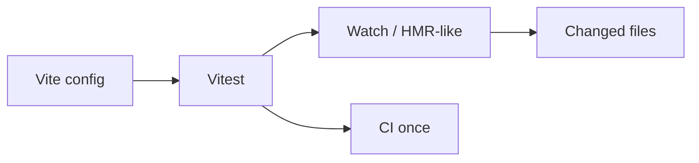

import { ConceptTemplate } from '@/features/kb/components/templates/ConceptTemplate'
import { Callout } from '@/features/kb/components/mdx/Callout'
import { ComparisonTable } from '@/features/kb/components/mdx/ComparisonTable'

export default function Layout({ children }) {
  return (
    <ConceptTemplate title="Vitest">
      {children}
    </ConceptTemplate>
  )
}

**Vitest** is the test runner for the Vite era. It reuses Vite's transform pipeline, so the same aliases, JSX, and TypeScript config that serve the app also run the tests. The API is deliberately Jest-like (`describe`, `it`, `expect`, `vi.fn`) so migrations are mostly mechanical.

## 1. Deep Dive and Mechanics

**Same pipeline.** Vite plugins apply in tests. You do not maintain a second Babel config that drifts from the app.

**Threads and forks.** Vitest can run in threads (faster) or forks (closer to Jest isolation). Isolate mode exists when files fight over globals.

**`vi`.** The mock namespace: `vi.fn`, `vi.useFakeTimers`, `vi.mock`. Not `jest.*`, though a compatibility alias exists.

**Browser mode.** Vitest can run in a real browser for components that jsdom cannot host. That is still not a full E2E replacement.

<Callout icon="tip" title="One config to rule them">
If a test fails to resolve a path the app can resolve, you forked config. Point Vitest at the same `vite.config` and delete the extra aliases.
</Callout>

## 2. Mathematical / Theoretical Foundation

Transform cost dominates JS test time. Sharing Vite's graph and cache makes incremental watch close to O(changed modules) rather than O(repo) Babel.

Isolation trade-off: threads share a process — faster, weaker isolation. Forks restore process isolation at a RAM cost. Choose based on whether your tests mutate module state.

<ComparisonTable
  headers={['Topic', 'Vitest', 'Jest']}
  rows={[
    ['Transform', 'Vite / esbuild / Rollup plugins', 'babel-jest / ts-jest'],
    ['ESM', 'Native', 'Improving, historically awkward'],
    ['Mocks', 'vi.*', 'jest.*'],
    ['Default home', 'Vite, Vue, modern React', 'CRA, older React'],
  ]}
/>

## 3. Real-World Implementation

```typescript
import { describe, it, expect, vi } from 'vitest';

describe('cart total', () => {
  it('sums lines', () => {
    expect(total([{ price: 10, qty: 2 }])).toBe(20);
  });

  it('uses a fixed clock', () => {
    vi.setSystemTime(new Date('2026-01-01T00:00:00Z'));
    expect(isExpired('2025-12-31T00:00:00Z')).toBe(true);
    vi.useRealTimers();
  });
});
```

Keep `environment` as jsdom for component tests and prefer explicit imports from vitest over globals.

## 4. Visualizations



## 5. Interview Prep

**Q: Why migrate from Jest?**
**A:** ESM, shared Vite config, and watch speed. Not because Jest is "wrong."

**Q: Are Jest snapshots compatible?**
**A:** Vitest supports snapshots with very similar APIs. Diff tooling is close enough for a migration PR.

**Q: Threads versus forks?**
**A:** Threads first. Switch to forks if you see cross-file contamination or native addon issues.

## 6. Production Use Cases

- **Vite + React/Vue/Svelte** unit and component tests.
- **Library packages** published as ESM.
- **In-source tests** (`import.meta.vitest`) for tiny functions — use sparingly so production bundles stay clean.

<Callout icon="warning" title="Do not mix two runners forever">
A repo with Jest for some packages and Vitest for others doubles CI and tribal knowledge. Pick a date and finish the move.
</Callout>
