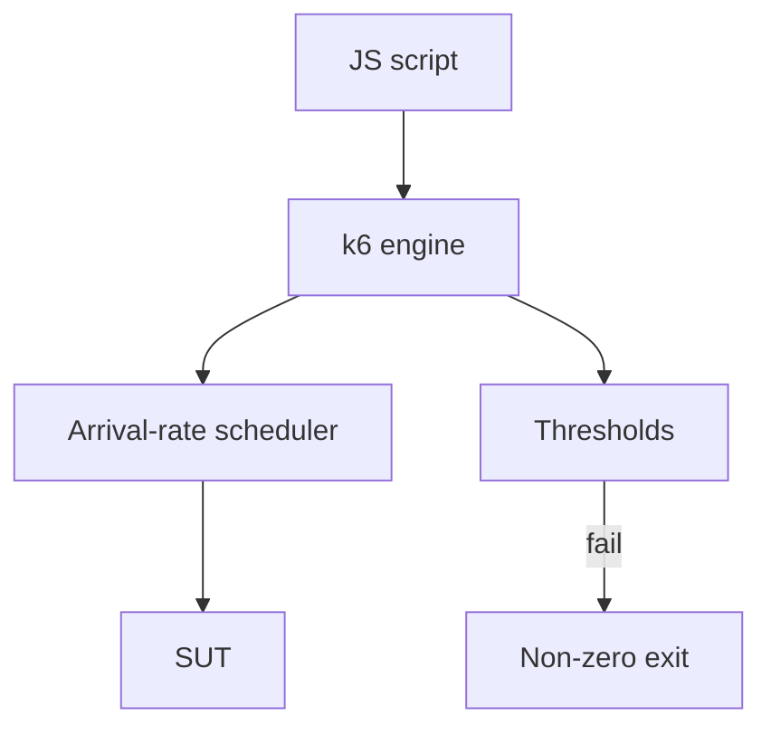

import { ConceptTemplate } from '@/features/kb/components/templates/ConceptTemplate'
import { Callout } from '@/features/kb/components/mdx/Callout'
import { ComparisonTable } from '@/features/kb/components/mdx/ComparisonTable'

export default function Layout({ children }) {
  return (
    <ConceptTemplate title="k6">
      {children}
    </ConceptTemplate>
  )
}

**k6** (Grafana) treats load tests as versioned JavaScript. You export `options` (VUs, stages, executors, thresholds) and a default function that is the VU loop. Failures are first-class: if `p(99)` exceeds a budget, the process exits non-zero and CI goes red.

## 1. Deep Dive and Mechanics

**Executors.** `constant-vus` is closed. `constant-arrival-rate` and `ramping-arrival-rate` are open — k6 will try to start iterations at a set rate and tell you if it ran out of preallocated VUs.

**Thresholds.** Expressions on built-in metrics (`http_req_duration`, `http_req_failed`) or custom `Trend`/`Rate`/`Counter`. This is the SLO gate.

**Outputs.** Cloud (Grafana Cloud k6), Prometheus remote write, JSON, or the end-of-test summary. Pair with traces from the SUT.

**xk6.** Extensions for protocols beyond HTTP (Kafka, SQL) when you must. Stay on HTTP first.

<Callout icon="tip" title="Preallocate VUs for open models">
An arrival-rate test that starves for VUs silently under-loads the SUT. Set `preAllocatedVUs` from Little's Law plus a margin, then watch `dropped_iterations`.
</Callout>

## 2. Mathematical / Theoretical Foundation

Open executor: desired start rate λ. Required VUs ≈ λ × iteration duration. If iteration time grows, you need more VUs or you drop iterations — k6 reports that; treat drops as a failed test.

Thresholds are predicates on aggregated samples. A 30-second test's p99 is a noisy estimator; hold the plateau long enough for the quantile to settle.

<ComparisonTable
  headers={['Executor', 'Loop type', 'Use']}
  rows={[
    ['constant-vus', 'Closed', 'Simple soak'],
    ['ramping-vus', 'Closed', 'Warm-up'],
    ['constant-arrival-rate', 'Open', 'Steady RPS SLO'],
    ['ramping-arrival-rate', 'Open', 'Peak profile'],
  ]}
/>

## 3. Real-World Implementation

```javascript
import http from 'k6/http';
import { check, sleep } from 'k6';

export const options = {
  scenarios: {
    catalog: {
      executor: 'constant-arrival-rate',
      rate: 100,
      timeUnit: '1s',
      duration: '5m',
      preAllocatedVUs: 200,
    },
  },
  thresholds: {
    http_req_failed: ['rate<0.01'],
    http_req_duration: ['p(99)<300'],
  },
};

export default function () {
  const res = http.get('https://staging.example.com/api/catalog');
  check(res, { status200: (r) => r.status === 200 });
  sleep(0.1);
}
```

Put this file next to the service and run it in a nightly workflow, not on every unit-test PR unless it is cheap.

## 4. Visualizations



## 5. Interview Prep

**Q: Why k6 over JMeter?**
**A:** As-code reviews, thresholds as the gate, and open-loop executors without a GUI. JMeter still wins on some protocols and existing plans.

**Q: What does a dropped iteration mean?**
**A:** The scheduler wanted to start a VU iteration and had no free VU. You under-provisioned or the SUT got so slow that VUs never returned.

**Q: Can k6 replace E2E?**
**A:** No. It is a load and protocol tool. It can script HTTP login, not a full accessibility tree.

## 6. Production Use Cases

- **CI SLO gates** on a handful of critical routes.
- **Pre-event** peak profiles stored in git.
- **Kubernetes** jobs that run k6 against a preview environment.

<Callout icon="warning" title="Do not load-test the shared staging database on a whim">
k6 makes it easy to type `rate: 2000`. Agree on a window, a cell, and a rollback with the owners first.
</Callout>
