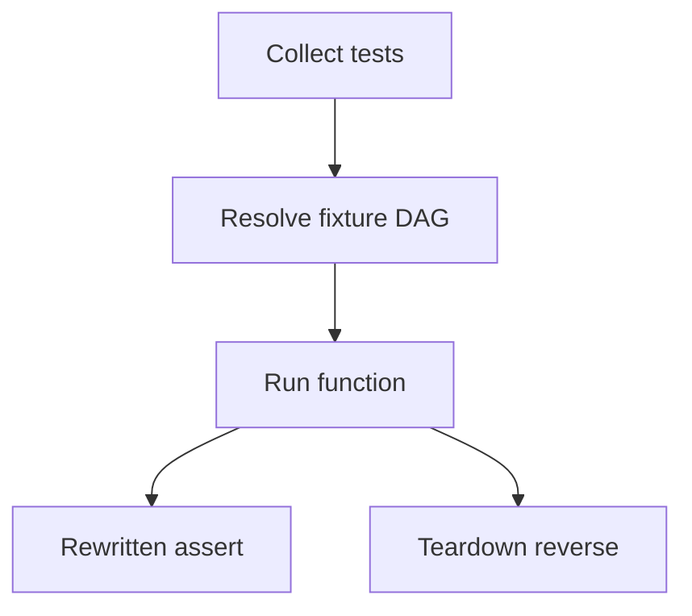

import { ConceptTemplate } from '@/features/kb/components/templates/ConceptTemplate'
import { Callout } from '@/features/kb/components/mdx/Callout'
import { ComparisonTable } from '@/features/kb/components/mdx/ComparisonTable'

export default function Layout({ children }) {
  return (
    <ConceptTemplate title="pytest">
      {children}
    </ConceptTemplate>
  )
}

**pytest** made Python testing feel like Python. Tests are functions, not `TestCase` subclasses. `assert` is rewritten so failures show both sides. Fixtures inject setup by parameter name. Plugins cover Django, asyncio, coverage, random order, and Hypothesis.

## 1. Deep Dive and Mechanics

**Assert rewrite.** pytest rewrites the AST of test modules so `assert a == b` dumps diffs. You do not memorise `assertEqual`.

**Fixtures.** Dependency injection via names. `conftest.py` shares them down the directory tree. Scopes: function, class, module, package, session.

**Parametrize.** One test body, many inputs. Combine with Hypothesis for properties, or keep tables for documented examples.

**Collection.** Files `test_*.py` or `*_test.py`, functions `test_*`. Markers (`@pytest.mark.slow`) select shards.

<Callout icon="tip" title="conftest is a public API">
A 400-line root conftest is an unowned framework. Split by package and keep fixtures discoverable.
</Callout>

## 2. Mathematical / Theoretical Foundation

Fixture resolution is a DAG: each requested name is a node; pytest topological-sorts setup and reverses teardown. Cycles error at collection.

Parametrize is a Cartesian product unless you use `zip` or explicit tuples. Accidental products explode runtime — count the cases.

Assert introspection is a source transform, not a new bytecode VM. It must stay in sync with Python versions; that is why pytest tracks CPython closely.

<ComparisonTable
  headers={['Feature', 'pytest', 'unittest']}
  rows={[
    ['Test shape', 'Functions', 'TestCase methods'],
    ['Asserts', 'Native assert', 'assertEqual family'],
    ['Setup', 'Fixtures', 'setUp / setUpClass'],
    ['Plugins', 'pytest-* ecosystem', 'Limited'],
  ]}
/>

## 3. Real-World Implementation

```python
import pytest

@pytest.fixture
def client(app):
    return app.test_client()

@pytest.mark.parametrize('cents,expected', [(1099, '$10.99'), (0, '$0.00')])
def test_format_money(cents, expected):
    assert format_money(cents) == expected

def test_health(client):
    response = client.get('/health')
    assert response.status_code == 200
```

Add `pytest.ini` with `addopts = -ra --strict-markers` so typos in markers fail collection.

## 4. Visualizations



## 5. Interview Prep

**Q: Why not unittest?**
**A:** You can; pytest can run unittest tests. New code prefers pytest because fixtures and assert rewrite remove boilerplate.

**Q: How do you isolate a database?**
**A:** Session-scoped engine, function-scoped transaction with rollback, or Testcontainers. Never a shared module-level connection without a rollback.

**Q: What does `yield` in a fixture mean?**
**A:** Setup before yield, teardown after — even if the test failed.

## 6. Production Use Cases

- **Django/Flask/FastAPI** apps with official or community plugins.
- **Data and ML** pipelines that need parametrize over golden files.
- **CLI tools** using `tmp_path` and `capsys`.

<Callout icon="warning" title="Do not import pytest in production modules">
`import pytest` in `src/` is a layering bug. Markers and fixtures stay in `tests/`.
</Callout>
