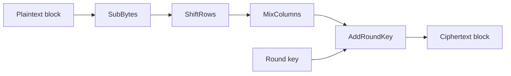

import { ConceptTemplate } from '@/features/kb/components/templates/ConceptTemplate'
import { Callout } from '@/features/kb/components/mdx/Callout'
import { ComparisonTable } from '@/features/kb/components/mdx/ComparisonTable'

export default function Layout({ children }) {
  return (
    <ConceptTemplate title="Advanced Encryption Standard (AES)">
      {children}
    </ConceptTemplate>
  )
}

**AES** is a symmetric block cipher: the same secret key encrypts and decrypts. It won the NIST contest in 2001 as Rijndael and replaced aging 56-bit DES. You almost never call the raw block function yourself. You use an authenticated mode such as GCM through a reviewed library.

## 1. Deep Dive and Mechanics

AES works on a 4-by-4 byte state. A key schedule expands the master key into round keys. Each round except the last applies SubBytes, ShiftRows, MixColumns, and AddRoundKey. Round counts are 10, 12, or 14 for 128, 192, and 256-bit keys.

**Modes matter more than the S-box.** Electronic Codebook repeats identical ciphertext for identical blocks. CBC hides patterns but needs a random IV and padding. GCM turns AES into a counter stream and adds a GHASH authentication tag so tampering is detected.

**Implementation traps.** Reuse of a GCM nonce with the same key is catastrophic. ECB is never acceptable for data at rest. Home-grown padding oracles appear when you decrypt then check integrity in the wrong order.

<Callout icon="warning" title="Never roll your own AES">
Call a maintained library and an AEAD mode. The hard bugs are nonce reuse, padding oracles, and side channels, not the S-box math.
</Callout>

## 2. Mathematical / Theoretical Foundation

AES is a substitution-permutation network over GF(2^8). Confusion comes from the nonlinear S-box. Diffusion comes from ShiftRows and MixColumns. Security claims are empirical: no practical break of full AES-128 is known. Grover search would square-root the key space, which is why long-lived systems prefer AES-256.

<ComparisonTable
  headers={['Mode', 'Auth tag', 'Parallel encrypt', 'Use today']}
  rows={[
    ['ECB', 'No', 'Yes', 'Never for real data'],
    ['CBC', 'No', 'Decrypt only', 'Legacy only'],
    ['CTR', 'No', 'Yes', 'Only inside AEAD'],
    ['GCM', 'Yes', 'Yes', 'Default for TLS and disks'],
  ]}
/>

## 3. Real-World Implementation

```python
from cryptography.hazmat.primitives.ciphers.aead import AESGCM
import os

key = AESGCM.generate_key(bit_length=256)
aes = AESGCM(key)
nonce = os.urandom(12)
token = aes.encrypt(nonce, b'secret payload', b'aad-context')
plain = aes.decrypt(nonce, token, b'aad-context')
```

Store the nonce beside the ciphertext. Never increment a counter in an ad-hoc way across processes without a uniqueness scheme.

## 4. Visualizations



## 5. Interview Prep

**Q: Why is ECB unsafe even with AES-256?**
**A:** Identical blocks encrypt to identical ciphertext, so structure leaks. Key length does not fix that.

**Q: AES-GCM vs AES-CBC-then-HMAC?**
**A:** GCM is one-pass AEAD and parallel. Encrypt-then-MAC with CBC is older, sequential, and easy to get in the wrong order.

**Q: What happens if a GCM nonce repeats?**
**A:** The keystream repeats and GHASH can leak the authentication key. Treat nonce uniqueness as a hard invariant.

## 6. Production Use Cases

- **TLS 1.3** record protection with AES-GCM or AES-CCM.
- **Full-disk and volume encryption** (BitLocker, FileVault, LUKS).
- **Application envelopes** for tokens and field-level encryption in databases.

<Callout icon="tip" title="Prefer 256-bit keys for long-lived archives">
AES-128 is still strong against classical attacks. AES-256 is the conservative choice when data must stay secret for decades.
</Callout>
