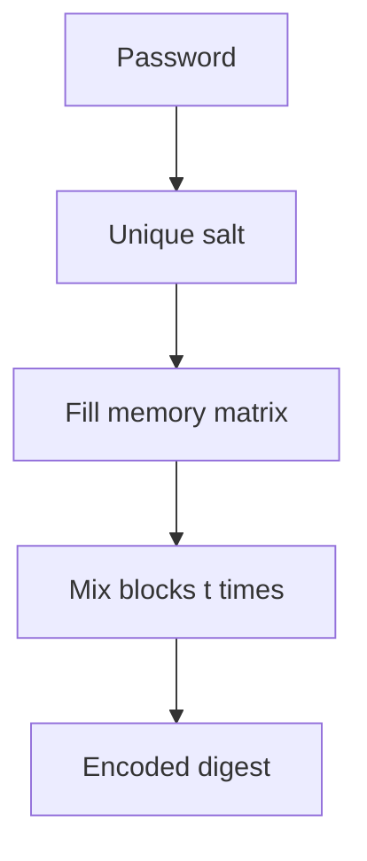

import { ConceptTemplate } from '@/features/kb/components/templates/ConceptTemplate'
import { Callout } from '@/features/kb/components/mdx/Callout'
import { ComparisonTable } from '@/features/kb/components/mdx/ComparisonTable'

export default function Layout({ children }) {
  return (
    <ConceptTemplate title="Argon2">
      {children}
    </ConceptTemplate>
  )
}

**Argon2** won the Password Hashing Competition in 2015. It is designed so that guessing a password costs a lot of RAM and time, which blunts GPU and ASIC farms that crush SHA-256 loops. **Argon2id** is the usual production variant: hybrid data-independent and data-dependent memory access.

## 1. Deep Dive and Mechanics

You configure three knobs: **memory** (m), **time/iterations** (t), and **parallelism** (p). The algorithm fills a large memory matrix, then mixes it so an attacker who wants to try millions of guesses must either provision that RAM per guess or thrash to disk.

**Variants.** Argon2d is data-dependent and stronger against GPU cracking but theoretically more exposed to side channels. Argon2i is data-independent and better on that axis. Argon2id mixes both and is the RFC 9106 recommendation for password hashing.

**Parameters are a product decision.** Pick m and t so a legitimate login stays under your latency budget on production hardware, then lock those values in the stored string so you can raise them later.

<Callout icon="info" title="Store the full encoded hash">
A good library string embeds algorithm, version, m, t, p, salt, and digest. Verification then needs no extra columns.
</Callout>

## 2. Mathematical / Theoretical Foundation

Password hashing is not collision resistance. The goal is a **one-way, salted, parameterized KDF** whose cost function is memory-hard. The theoretical aim is that the best parallel attack still pays roughly the same memory-time product as the defender. That is a different game from SHA-256, which is cheap and highly parallel.

<ComparisonTable
  headers={['KDF', 'Memory-hard', 'Default role', 'Watch-out']}
  rows={[
    ['Argon2id', 'Yes', 'New password stores', 'Tune m and t per host'],
    ['scrypt', 'Yes', 'Legacy / some wallets', 'Older parameter culture'],
    ['bcrypt', 'Partial', 'Huge installed base', '72-byte password cap'],
    ['PBKDF2-HMAC-SHA256', 'No', 'FIPS boxes', 'Needs huge iteration counts'],
  ]}
/>

## 3. Real-World Implementation

```python
from argon2 import PasswordHasher

ph = PasswordHasher(time_cost=3, memory_cost=65536, parallelism=4)
stored = ph.hash('correct-horse-battery')
ph.verify(stored, 'correct-horse-battery')
```

On verify failure, raise a generic auth error. Do not distinguish unknown user from bad password in the API response.

## 4. Visualizations



## 5. Interview Prep

**Q: Why not hash passwords with SHA-256?**
**A:** SHA-256 is fast. Attackers hash billions of guesses per second. Password KDFs exist to make each guess expensive.

**Q: Argon2id vs bcrypt?**
**A:** Argon2id is memory-hard and has no 72-byte truncation. bcrypt is fine for existing stores; new systems should pick Argon2id.

**Q: What do you do when you raise memory_cost?**
**A:** Rehash on successful login. Keep verifying the old encoded parameters until every active user has a new string.

## 6. Production Use Cases

- **Web and API password vaults** with per-user salts.
- **Disk and backup passphrases** when you wrap a data key.
- **Secret stretching** before you feed a low-entropy secret into a KMS envelope.

<Callout icon="tip" title="Benchmark on the real login box">
Laptop numbers lie. Measure p95 hash time on the smallest production instance you will actually run.
</Callout>
