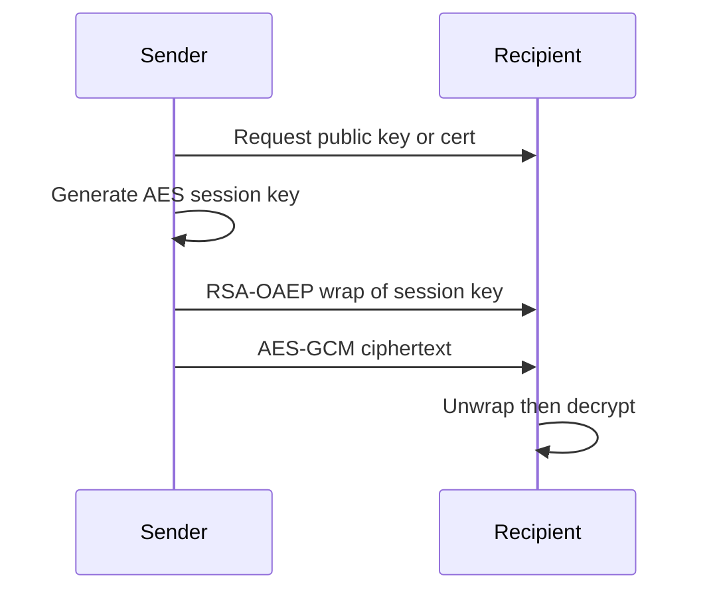

import { ConceptTemplate } from '@/features/kb/components/templates/ConceptTemplate'
import { Callout } from '@/features/kb/components/mdx/Callout'
import { ComparisonTable } from '@/features/kb/components/mdx/ComparisonTable'

export default function Layout({ children }) {
  return (
    <ConceptTemplate title="Asymmetric Encryption">
      {children}
    </ConceptTemplate>
  )
}

**Asymmetric encryption** uses a key pair. The public key can be shared. The private key stays secret. Anyone can encrypt to you; only you can decrypt. Digital signatures flip the direction: only you can sign, anyone can verify. Real systems mix both with symmetric bulk encryption because public-key ops are slow.

## 1. Deep Dive and Mechanics

Classic RSA encryption raises a message to the public exponent modulo n. Modern practice wraps a random AES key with RSA-OAEP or, more often, uses **ECDH to agree a shared secret** and then AES-GCM. Pure encrypt-this-file-with-RSA is a smell except for tiny key-wrapping payloads.

**Trust is the hard part.** A public key without a binding to an identity is just a number. Certificates, TOFU, and out-of-band fingerprints exist to answer whether this key really belongs to Alice.

**Forward secrecy.** Static RSA key-transport means a stolen private key decrypts old recordings. Ephemeral Diffie-Hellman, as in TLS 1.3, agrees a fresh secret so yesterday's ciphertext stays sealed.

<Callout icon="warning" title="Do not encrypt large blobs with RSA">
RSA message length is bounded by the modulus minus padding. Encrypt a symmetric key, then encrypt the file with AES-GCM.
</Callout>

## 2. Mathematical / Theoretical Foundation

Security rests on trapdoor functions: easy to compute, hard to invert without a secret. RSA uses factoring and the RSA problem. Diffie-Hellman and ECC use discrete logs in carefully chosen groups. Padding such as OAEP or PSS is not cosmetic; raw RSA is malleable and leaking.

<ComparisonTable
  headers={['Job', 'Asymmetric primitive', 'Symmetric partner']}
  rows={[
    ['Confidentiality', 'RSA-OAEP or ECDH', 'AES-GCM'],
    ['Integrity and authorship', 'RSA-PSS or ECDSA', 'Hash of the message'],
    ['Key agreement', 'ECDHE', 'HKDF then AEAD'],
    ['Identity binding', 'X.509 or SSH TOFU', 'None by itself'],
  ]}
/>

## 3. Real-World Implementation

```python
from cryptography.hazmat.primitives.asymmetric import rsa, padding
from cryptography.hazmat.primitives import hashes

priv = rsa.generate_private_key(public_exponent=65537, key_size=2048)
pub = priv.public_key()
wrapped = pub.encrypt(
    b'session-key-32-bytes-go-here!!',
    padding.OAEP(mgf=padding.MGF1(hashes.SHA256()), algorithm=hashes.SHA256(), label=None),
)
plain = priv.decrypt(
    wrapped,
    padding.OAEP(mgf=padding.MGF1(hashes.SHA256()), algorithm=hashes.SHA256(), label=None),
)
```

Prefer library high-level hybrid helpers when they exist. Hand-rolled hybrids miss AAD and key-derivation details.

## 4. Visualizations



## 5. Interview Prep

**Q: Why is TLS not just RSA encryption?**
**A:** TLS agrees keys, authenticates the server, and then uses symmetric AEAD for records. RSA is one possible piece, and TLS 1.3 dropped static RSA key transport.

**Q: Public encrypt versus private sign?**
**A:** Opposite directions and different paddings. Never reuse one RSA key for both jobs.

**Q: What does forward secrecy buy you?**
**A:** Compromise of today's private key should not decrypt yesterday's recorded sessions.

## 6. Production Use Cases

- **TLS and SSH** session setup.
- **S/MIME and age-style** file sealing.
- **Key wrapping** inside KMS and envelope encryption.

<Callout icon="tip" title="Separate encryption keys from signing keys">
Different algorithms, different paddings, different compromise stories. Issue two keys.
</Callout>
