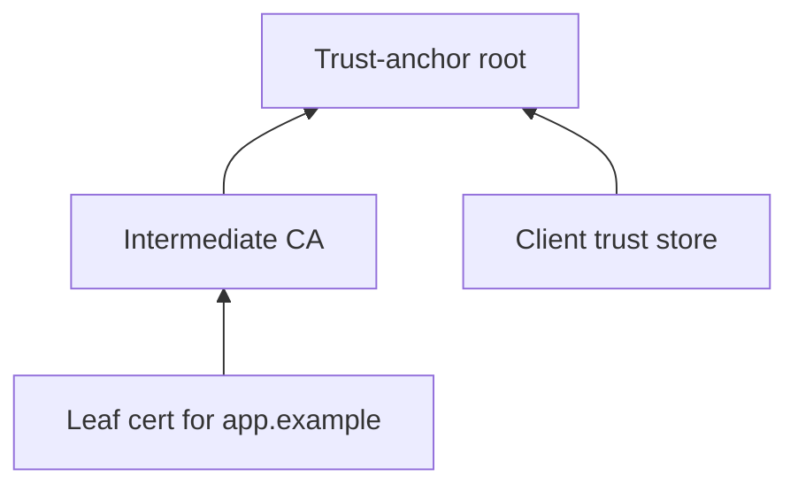

import { ConceptTemplate } from '@/features/kb/components/templates/ConceptTemplate'
import { Callout } from '@/features/kb/components/mdx/Callout'
import { ComparisonTable } from '@/features/kb/components/mdx/ComparisonTable'

export default function Layout({ children }) {
  return (
    <ConceptTemplate title="Certificates">
      {children}
    </ConceptTemplate>
  )
}

A **certificate** is a signed statement: this public key belongs to this name, until this date, under these usages. On the web that name is a DNS name. The signature comes from a Certification Authority that browsers or your private PKI already trust. Without certificates, every client would have to pin every server key by hand.

## 1. Deep Dive and Mechanics

An X.509 v3 certificate carries subject, subject public key, issuer, validity window, serial, and extensions: SAN, key usage, EKU, AIA, CRL/OCSP pointers. Browsers match the hostname against SAN, check the time window, walk the chain to a trust anchor, and check revocation when they can.

**Chain building.** The leaf is signed by an intermediate. The intermediate is signed by a root in the trust store. Name constraints and path-length constraints stop a rogue intermediate from minting arbitrary names.

**Lifecycle.** Issue, deploy, renew before expiry, revoke on compromise. Short-lived certs (hours to days) shrink the revocation problem. ACME automates the web PKI loop.

<Callout icon="warning" title="Hostname mismatch is a hard fail">
A perfectly valid cert for the wrong name is an impersonation. Always verify SAN against the name you intended to reach.
</Callout>

## 2. Mathematical / Theoretical Foundation

A cert is a signature over a TBSCertificate encoding. Verification is public-key signature verification plus a policy: allowed roots, required EKUs, name constraints. The crypto proves the issuer attested the binding. It does not prove the issuer did good identity checks. That is a process problem (CABF baseline requirements, your RA).

<ComparisonTable
  headers={['Field', 'Job', 'Common failure']}
  rows={[
    ['SAN', 'Names the cert covers', 'Missing name, only CN set'],
    ['EKU', 'TLS server vs code sign vs email', 'Wrong purpose accepted'],
    ['Validity', 'Not-before / not-after', 'Clock skew, forgotten renew'],
    ['AKI / SKI', 'Chain building hints', 'Broken intermediate chain'],
  ]}
/>

## 3. Real-World Implementation

```bash
openssl x509 -in leaf.pem -noout -text -certopt no_pubkey,no_sigdump
openssl verify -CAfile roots.pem -untrusted intermediates.pem leaf.pem
```

In application code, use the platform TLS stack and its default trust store unless you are pinning a private CA. Do not parse X.509 with regex.

## 4. Visualizations



## 5. Interview Prep

**Q: Why do we still have intermediates?**
**A:** Roots stay offline. Intermediates sign daily issuance. Compromise of an intermediate is painful; compromise of a root is catastrophic.

**Q: Cert pinning vs public CA?**
**A:** Pinning shrinks the trusted set (good for mobile apps talking to your API). It also makes rotation and incident response harder. Public CA plus Certificate Transparency is the web default.

**Q: What is a leaf versus a CA cert?**
**A:** Basic Constraints CA=true marks issuers. Clients must reject a leaf that tries to sign other certs.

## 6. Production Use Cases

- **HTTPS** server identity on the public internet.
- **mTLS** service-to-service identity in a mesh.
- **Code signing and document signing** with a different EKU.

<Callout icon="tip" title="Automate renewal at 60 percent of lifetime">
Humans forget 90-day certs. ACME or your internal issuer API should renew unattended and fail the deploy if the new chain does not verify.
</Callout>
