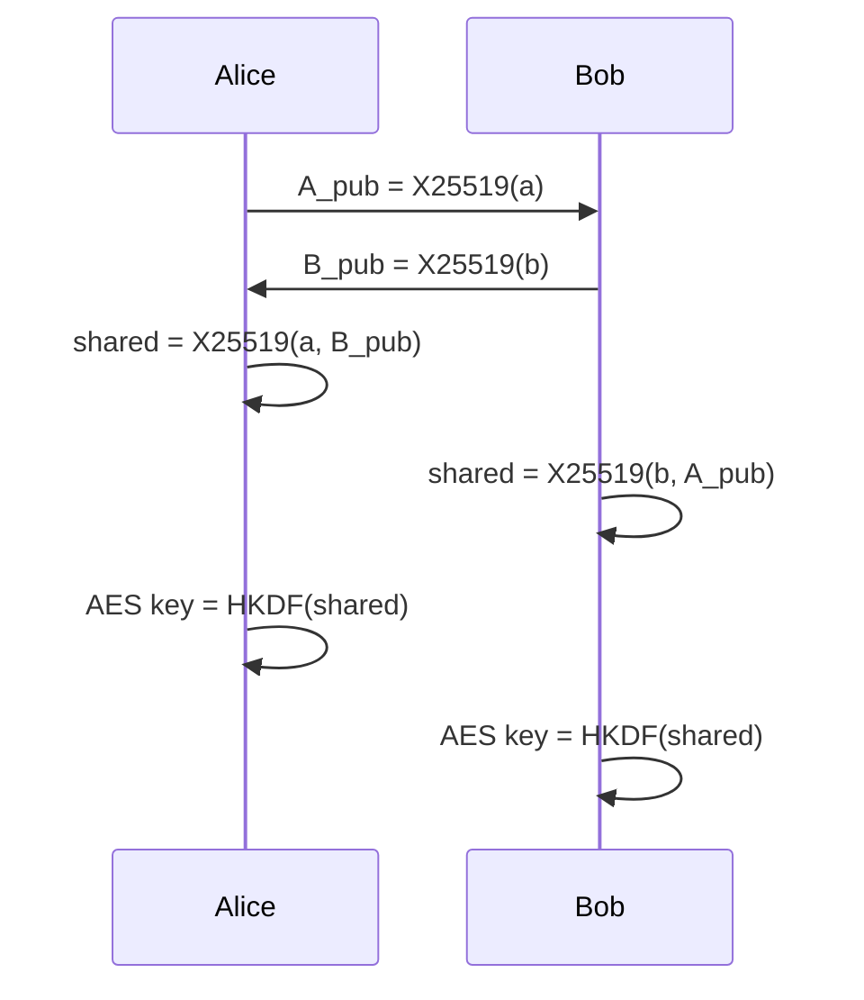

import { ConceptTemplate } from '@/features/kb/components/templates/ConceptTemplate'
import { Callout } from '@/features/kb/components/mdx/Callout'
import { ComparisonTable } from '@/features/kb/components/mdx/ComparisonTable'

export default function Layout({ children }) {
  return (
    <ConceptTemplate title="Diffie-Hellman">
      {children}
    </ConceptTemplate>
  )
}

**Diffie-Hellman (DH)** is key agreement, not encryption. Two parties pick private scalars, publish public group elements, and both compute the same shared secret. An eavesdropper who sees only the public values cannot cheaply recover that secret if the group is well chosen. **ECDHE** is the elliptic-curve, ephemeral form used in TLS 1.3.

## 1. Deep Dive and Mechanics

Classic finite-field DH: agree on a prime p and generator g. Alice sends g^a mod p. Bob sends g^b mod p. Shared secret is g^(ab) mod p. Elliptic-curve DH replaces exponentiation with scalar multiplication on a curve such as X25519.

**Ephemeral versus static.** Ephemeral keys (the E in ECDHE) are generated per session and discarded. That is forward secrecy. Static DH keys persist and need authentication, or you have an unauthenticated agreement and a MITM can run DH twice.

**Authentication is separate.** DH alone does not name anyone. TLS binds DH to a certificate signature so you agree a secret with the owner of that name.

<Callout icon="warning" title="Safe groups only">
Tiny primes, non-safe primes, or reused broken parameters (historical export DH, Logjam-class groups) collapse the discrete-log hardness. Use named modern groups.
</Callout>

## 2. Mathematical / Theoretical Foundation

Hardness is the Computational Diffie-Hellman problem, which sits on the discrete logarithm problem in the group. CDH does not automatically give you a key you can feed to AES; you still run a KDF (HKDF) on the shared secret. Finite-field DH needs large primes (2048+ bits). ECDH on 256-bit curves gives similar classical strength with smaller messages.

<ComparisonTable
  headers={['Variant', 'Group', 'Forward secrecy', 'Where you see it']}
  rows={[
    ['Static FF-DH', 'Mod p', 'No', 'Legacy IPsec'],
    ['DHE', 'Mod p ephemeral', 'Yes', 'Older TLS'],
    ['ECDHE P-256', 'NIST prime curve', 'Yes', 'TLS, JWT ECDH-ES'],
    ['X25519', 'Montgomery curve', 'Yes', 'TLS 1.3, SSH, Signal'],
  ]}
/>

## 3. Real-World Implementation

```python
from cryptography.hazmat.primitives.asymmetric import x25519
from cryptography.hazmat.primitives.kdf.hkdf import HKDF
from cryptography.hazmat.primitives import hashes

alice = x25519.X25519PrivateKey.generate()
bob = x25519.X25519PrivateKey.generate()
shared = alice.exchange(bob.public_key())
key = HKDF(algorithm=hashes.SHA256(), length=32, salt=None, info=b'tls-like').derive(shared)
```

Never use the raw DH secret as an AES key. Always extract-and-expand with a KDF and a transcript-bound info string.

## 4. Visualizations



## 5. Interview Prep

**Q: DH versus RSA key transport?**
**A:** RSA transport encrypts a premaster to the server cert key. DH agrees a new secret. Ephemeral DH gives forward secrecy; static RSA transport does not.

**Q: Why HKDF after DH?**
**A:** The shared field element is not uniform key material and is not bound to the handshake transcript until you derive with context.

**Q: What is a MITM against anonymous DH?**
**A:** The network runs DH with Alice and DH with Bob, then decrypts and re-encrypts. Signatures or a pre-shared identity stop that.

## 6. Production Use Cases

- **TLS 1.3** and QUIC handshake key schedule.
- **Signal / Double Ratchet** root key updates.
- **SSH** key exchange (curve25519-sha256).

<Callout icon="tip" title="Prefer X25519 unless you are in a NIST-only box">
It is fast, has simpler APIs, and avoids many ECC implementation foot-guns. FIPS environments often require P-256 instead.
</Callout>
