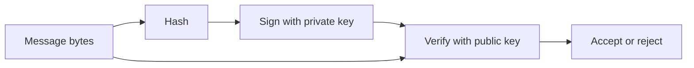

import { ConceptTemplate } from '@/features/kb/components/templates/ConceptTemplate'
import { Callout } from '@/features/kb/components/mdx/Callout'
import { ComparisonTable } from '@/features/kb/components/mdx/ComparisonTable'

export default function Layout({ children }) {
  return (
    <ConceptTemplate title="Digital Signatures">
      {children}
    </ConceptTemplate>
  )
}

A **digital signature** is not encryption. The signer hashes a message and applies a private-key operation. Anyone with the public key can verify that that exact digest was attested and that the bits were not altered. Non-repudiation in the legal sense is a policy overlay; the crypto only proves key possession at signing time.

## 1. Deep Dive and Mechanics

Pipeline: canonicalize the bytes, hash them, sign the digest with RSA-PSS, ECDSA, Ed25519, or a post-quantum scheme. Verification recomputes the hash and runs the public-key check. If the hash does not match, the signature is invalid even if the math on a different digest would pass.

**What is signed matters.** Sign the transcript, the artifact digest, or a structured statement (JWT payload). Signing "whatever bytes I was handed" without a type prefix invites cross-protocol surprises.

**Keys and padding.** Raw RSA PKCS#1 v1.5 signatures have a long history of implementation bugs. PSS and Ed25519 are the modern defaults. Do not use one key for both signing and decryption.

<Callout icon="error" title="Never verify then parse untrusted structure carelessly">
Check the signature over the exact bytes you will parse. Canonicalization bugs (XML DSig, JSON key reordering) are classic bypasses.
</Callout>

## 2. Mathematical / Theoretical Foundation

EUF-CMA (existential unforgeability under chosen-message attack) is the usual goal: an adversary who can obtain signatures on messages they choose still cannot produce a valid signature on a new message. Hash-then-sign reduces that to the hash being collision-resistant and the trapdoor scheme being sound. Deterministic Ed25519 avoids the catastrophic nonce reuse that wrecked some ECDSA deployments.

<ComparisonTable
  headers={['Scheme', 'Digest', 'Notes']}
  rows={[
    ['RSA-PSS', 'SHA-256', 'Flexible key size, larger sigs'],
    ['ECDSA P-256', 'SHA-256', 'Needs good nonce generation'],
    ['Ed25519', 'Internal SHA-512', 'Det. signatures, small keys'],
    ['Dilithium / ML-DSA', 'SHAKE', 'Post-quantum signatures'],
  ]}
/>

## 3. Real-World Implementation

```python
from cryptography.hazmat.primitives.asymmetric.ed25519 import Ed25519PrivateKey

key = Ed25519PrivateKey.generate()
msg = b'artifact-sha256:deadbeef'
sig = key.sign(msg)
key.public_key().verify(sig, msg)
```

Verify before you trust the artifact. On failure, do not fallback to "unsigned is ok" in production paths.

## 4. Visualizations



## 5. Interview Prep

**Q: Is a signature confidential?**
**A:** No. It is public verifiability. Combine with encryption if the payload must stay secret.

**Q: Why hash first?**
**A:** Public-key schemes operate on small field elements. A collision-resistant hash compresses arbitrary messages and prevents some algebraic tricks.

**Q: HMAC versus digital signature?**
**A:** HMAC needs a shared secret (symmetric). Signatures are transferable: a third party can verify without learning a shared key.

## 6. Production Use Cases

- **TLS certificates** (issuer signs the leaf).
- **Software update** pipelines (cosign, Sigstore, OS package managers).
- **JWT and document** signing when a verifier is not the signer.

<Callout icon="tip" title="Bind a purpose string into what you sign">
Prefix the message with a context label so a signature meant for "email" cannot be replayed as "payment".
</Callout>
