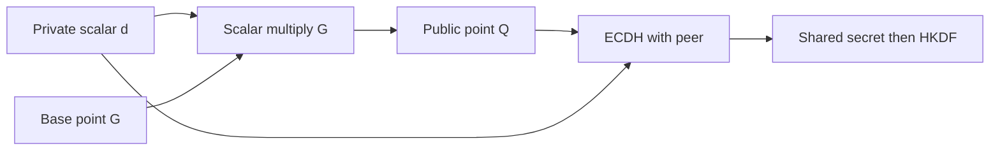

import { ConceptTemplate } from '@/features/kb/components/templates/ConceptTemplate'
import { Callout } from '@/features/kb/components/mdx/Callout'
import { ComparisonTable } from '@/features/kb/components/mdx/ComparisonTable'

export default function Layout({ children }) {
  return (
    <ConceptTemplate title="Elliptic Curve Cryptography (ECC)">
      {children}
    </ConceptTemplate>
  )
}

**ECC** builds public-key schemes on the group of points of an elliptic curve over a finite field. A 256-bit curve roughly matches a 3072-bit RSA modulus for classical security, which is why phones, IoT, and TLS prefer it. You use ECC through ECDH, ECDSA, or Ed25519, not by adding points by hand.

## 1. Deep Dive and Mechanics

A private key is a scalar. The public key is that scalar times a standard base point. ECDH multiplies your scalar by the peer public point to get a shared point. ECDSA signs a hash with a per-message nonce. Ed25519 (Edwards curve) wraps this in a safer, deterministic API.

**Curve choice is a compatibility and safety choice.** P-256 is the FIPS default. X25519 / Ed25519 are preferred in greenfield systems. Brainpool and obscure curves add complexity. Super-singular or tiny curves are a red flag.

**Implementation hazards.** Invalid-curve attacks, missing point validation, and ECDSA nonce reuse have all produced real breaks. Use a library that refuses off-curve points.

<Callout icon="warning" title="Validate peer public keys">
If the API lets you import raw coordinates, the library must check the point is on the curve and not the identity. Skip that and DH secrets become attacker-controlled.
</Callout>

## 2. Mathematical / Theoretical Foundation

The group law is geometric chord-and-tangent, implemented with field arithmetic. Security is the elliptic-curve discrete log problem. Not every curve is hard: the order must have a large prime factor, the embedding degree must resist MOV-style transfers, and the twist should be strong. Named curves published by CFRG and NIST already encode those checks.

<ComparisonTable
  headers={['Curve / API', 'Job', 'Typical bit security']}
  rows={[
    ['P-256 + ECDSA/ECDH', 'FIPS TLS, JWT', '128-class'],
    ['P-384', 'Higher assurance US gov', '192-class'],
    ['X25519', 'Key agreement', '128-class'],
    ['Ed25519', 'Signatures', '128-class'],
  ]}
/>

## 3. Real-World Implementation

```python
from cryptography.hazmat.primitives.asymmetric import ec
from cryptography.hazmat.primitives import hashes

key = ec.generate_private_key(ec.SECP256R1())
sig = key.sign(b'hello', ec.ECDSA(hashes.SHA256()))
key.public_key().verify(sig, b'hello', ec.ECDSA(hashes.SHA256()))
```

Prefer Ed25519 when you control both ends. Use P-256 when a partner or a FIPS module requires it.

## 4. Visualizations



## 5. Interview Prep

**Q: Why is ECC smaller than RSA?**
**A:** The best generic attacks on well-chosen curves are close to sqrt of the group order. Factoring has sub-exponential algorithms, so RSA needs much larger numbers for the same classical security level.

**Q: ECDSA nonce reuse — what breaks?**
**A:** Two signatures with the same nonce leak the private key via algebra. Ed25519 is deterministic to avoid that class of bug.

**Q: Is ECC quantum-safe?**
**A:** No. Shor's algorithm breaks ECC and RSA. Plan a PQC migration for long-lived confidentiality.

## 6. Production Use Cases

- **TLS 1.3** ECDHE and certificate signatures.
- **Mobile and smart-card** identity where RSA-4096 is too slow.
- **Blockchain and COSE/JOSE** signing ecosystems.

<Callout icon="tip" title="Treat curve IDs as part of the protocol">
A peer that suddenly offers a toy curve is not being clever. Negotiate a small allowlist.
</Callout>
