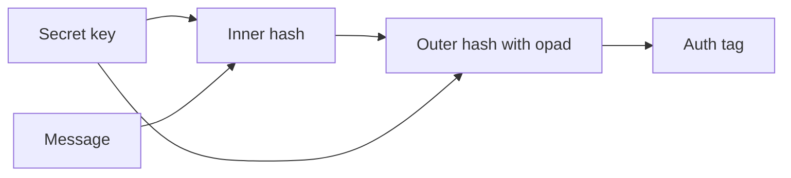

import { ConceptTemplate } from '@/features/kb/components/templates/ConceptTemplate'
import { Callout } from '@/features/kb/components/mdx/Callout'
import { ComparisonTable } from '@/features/kb/components/mdx/ComparisonTable'

export default function Layout({ children }) {
  return (
    <ConceptTemplate title="HMAC">
      {children}
    </ConceptTemplate>
  )
}

**HMAC** (Hash-based Message Authentication Code) mixes a secret key with a hash function so that anyone who does not know the key cannot forge a tag. It is the workhorse of API tokens, webhook signatures, and HKDF. It is not a digital signature: verifiers must hold the same secret, so they can also forge tags.

## 1. Deep Dive and Mechanics

HMAC is defined as H((k xor opad) || H((k xor ipad) || message)). The nested construction survived length-extension attacks that wreck naive key||message hashes with Merkle-Damgard functions such as SHA-256.

**Compare tags in constant time.** A byte-by-byte early exit lets attackers recover the tag. Use the language's dedicated compare.

**Key hygiene.** Generate keys with a CSPRNG. Do not use a password as an HMAC key without a KDF. Rotate keys and include a key id in the message so verifiers can try the right one.

<Callout icon="info" title="HMAC authenticates, it does not encrypt">
A tagged plaintext is still readable. For confidentiality plus integrity use AEAD, or encrypt then HMAC with separate keys.
</Callout>

## 2. Mathematical / Theoretical Foundation

HMAC is proven secure if the compression function of H is a PRF (or under weaker related assumptions). Length-extension resistance is the practical reason we do not use SHA-256(key || msg). SHA-3 and BLAKE2 have dedicated MAC modes, but HMAC-SHA-256 remains the interoperability default.

<ComparisonTable
  headers={['Construction', 'Shared secret', 'Transferable verify', 'Use']}
  rows={[
    ['HMAC', 'Yes', 'No', 'APIs, cookies, HKDF'],
    ['AES-GCM tag', 'Yes (enc key)', 'No', 'AEAD records'],
    ['Ed25519', 'No', 'Yes', 'Public verify'],
    ['SHA-256 alone', 'No', 'n/a', 'Integrity vs random corruption only'],
  ]}
/>

## 3. Real-World Implementation

```python
import hmac
import hashlib
import secrets

key = secrets.token_bytes(32)
msg = b'id=42&exp=1893456000'
tag = hmac.new(key, msg, hashlib.sha256).digest()
ok = hmac.compare_digest(tag, hmac.new(key, msg, hashlib.sha256).digest())
```

Sign a canonical encoding (sorted query string, or a length-prefixed blob). Do not concatenate fields without delimiters.

## 4. Visualizations



## 5. Interview Prep

**Q: Why not SHA-256(key || message)?**
**A:** Merkle-Damgard length extension lets an attacker append data and compute a new hash without the key. HMAC's nested pad kills that.

**Q: HMAC vs JWT asymmetric alg?**
**A:** HS256 is HMAC: every verifier is a potential forger. RS256/EdDSA lets you publish a verify key.

**Q: How long should the key be?**
**A:** At least the hash output size (32 bytes for SHA-256), from a CSPRNG.

## 6. Production Use Cases

- **Webhook and callback** signing (Stripe-style).
- **Session cookies** and CSRF tokens when you already have a server secret.
- **HKDF** extract/expand in TLS and Signal.

<Callout icon="tip" title="Put a key id next to the tag">
Rotation without downtime means the verifier can select k1 or k2. Silent dual-key windows beat a flag day.
</Callout>
