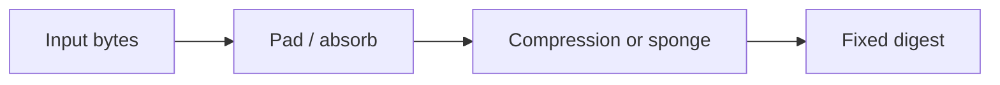

import { ConceptTemplate } from '@/features/kb/components/templates/ConceptTemplate'
import { Callout } from '@/features/kb/components/mdx/Callout'
import { ComparisonTable } from '@/features/kb/components/mdx/ComparisonTable'

export default function Layout({ children }) {
  return (
    <ConceptTemplate title="Hashing">
      {children}
    </ConceptTemplate>
  )
}

A **cryptographic hash** maps arbitrary bytes to a fixed digest. It should be easy to compute, hard to invert, and hard to find two inputs with the same output. Hashes detect accidental or malicious change. They are not encryption, and they are not a password KDF by themselves.

## 1. Deep Dive and Mechanics

You feed a stream of bytes into a compression function. Merkle-Damgard designs (SHA-256) pad the message and iterate a block cipher-like function. Sponge designs (SHA-3, SHAKE) absorb then squeeze. The digest is a commitment to those exact bytes.

**What hashing does not do.** It does not hide the input if the input is guessable (passwords, short IDs). It does not bind a key unless you use HMAC or a keyed mode. It does not prove who created the file unless you also sign.

**Truncation.** Shortening a digest reduces collision work. Do not truncate below the security level you claim.

<Callout icon="warning" title="MD5 and SHA-1 are retired for security">
Both have practical collisions. Keep them only for talking to fossils, and never for signatures or integrity of untrusted data.
</Callout>

## 2. Mathematical / Theoretical Foundation

Three classical properties: preimage resistance, second-preimage resistance, and collision resistance. Birthday bound says a 256-bit hash has about 128-bit collision strength. Length extension is an extra Merkle-Damgard foot-gun: given H(m) you may compute H(m || pad || extra) without m. Sponges and HMAC avoid that.

<ComparisonTable
  headers={['Function', 'Output', 'Status']}
  rows={[
    ['MD5', '128 bit', 'Broken collisions'],
    ['SHA-1', '160 bit', 'Broken collisions'],
    ['SHA-256', '256 bit', 'Standard workhorse'],
    ['SHA-3-256 / SHAKE', '256+ bit', 'Sponge alternative'],
  ]}
/>

## 3. Real-World Implementation

```python
import hashlib

digest = hashlib.sha256(b'artifact-bytes').hexdigest()
```

For files, hash in streaming chunks so you do not load the whole blob. Compare published checksums with a constant-time compare if the digest is a secret; for public checksums a normal compare is fine.

## 4. Visualizations



## 5. Interview Prep

**Q: Hash versus encryption?**
**A:** Encryption is reversible with a key. A hash is one-way and keyless. Different jobs.

**Q: Why do we hash before signing?**
**A:** Public-key ops are small-input. A collision-resistant hash compresses the document and is part of the EUF-CMA story.

**Q: Can I store passwords as SHA-256?**
**A:** No. Use Argon2id, scrypt, or bcrypt with a unique salt. Fast hashes lose to GPU guessing.

## 6. Production Use Cases

- **Artifact integrity** (container layers, packages, backups).
- **Content addressing** (git, IPFS-style stores).
- **Building block** for HMAC, HKDF, Merkle trees, and signatures.

<Callout icon="tip" title="Always name the algorithm next to the digest">
A bare hex string ages badly. Store sha256: and the hex so migrators and verifiers do not guess.
</Callout>
