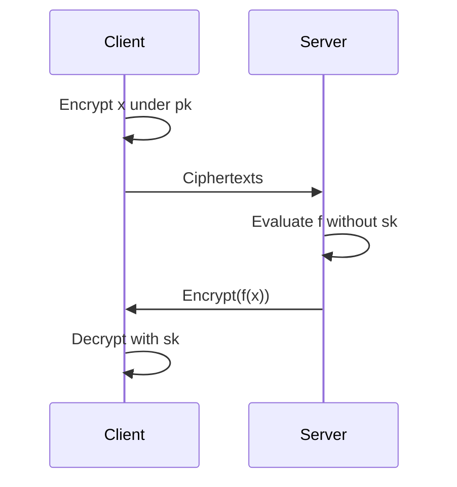

import { ConceptTemplate } from '@/features/kb/components/templates/ConceptTemplate'
import { Callout } from '@/features/kb/components/mdx/Callout'
import { ComparisonTable } from '@/features/kb/components/mdx/ComparisonTable'

export default function Layout({ children }) {
  return (
    <ConceptTemplate title="Homomorphic Encryption">
      {children}
    </ConceptTemplate>
  )
}

**Homomorphic encryption (HE)** lets someone compute on encrypted values and return an encrypted result that decrypts to the function of the plaintexts. The server never sees the data in the clear. Partially homomorphic schemes support one operation (addition or multiplication). Fully homomorphic encryption (FHE) supports both, hence arbitrary circuits, at a steep cost.

## 1. Deep Dive and Mechanics

A typical FHE loop: encrypt under a public key, send ciphertexts, evaluate gates or arithmetic, optionally refresh via bootstrapping when noise grows, and decrypt on the client. Noise is the central engineering object. Each operation adds noise; bootstrapping resets it by homomorphically decrypting.

**Schemes you will hear.** Paillier adds. ElGamal multiplies. BFV/BGV do modular arithmetic. CKKS does approximate real arithmetic for ML. TFHE/FHEW bootstrap quickly for boolean circuits.

**Not a drop-in TLS replacement.** Ciphertexts are huge, circuits must be known up front or expressed as a program, and side channels plus access patterns still leak. HE is for narrow, high-value compute-on-blind-data jobs.

<Callout icon="info" title="HE hides values, not traffic shape">
If the server sees you queried "the record at index 17", encryption of the payload does not hide that index. Combine with ORAM or batching if access pattern is sensitive.
</Callout>

## 2. Mathematical / Theoretical Foundation

Modern FHE is lattice-based, usually Learning With Errors. Ciphertexts are noisy ring elements. Correctness holds while noise stays below a modulus threshold. Security reduces to lattice problems believed hard even for quantum computers (with parameter care). CKKS drops exactness for scale-invariant approximate arithmetic, which matches neural-net inference.

<ComparisonTable
  headers={['Scheme class', 'Operations', 'Typical fit']}
  rows={[
    ['Paillier', 'Add', 'Simple tallies'],
    ['BFV / BGV', 'Exact add and mul', 'Integer circuits'],
    ['CKKS', 'Approx add and mul', 'Encrypted ML scores'],
    ['TFHE', 'Boolean + fast bootstrap', 'Small encrypted FSM'],
  ]}
/>

## 3. Real-World Implementation

```python
# Sketch: client encrypts features, server evaluates a linear model, client decrypts.
# Use a maintained HE library (Microsoft SEAL, OpenFHE, tfhe-rs) rather than raw lattices.

def encrypted_dot(enc_x, enc_w, he_add, he_mul, enc_bias):
    acc = enc_bias
    for x_i, w_i in zip(enc_x, enc_w):
        acc = he_add(acc, he_mul(x_i, w_i))
    return acc
```

The real work is parameter selection (poly degree, moduli chain) so the circuit depth fits before bootstrap.

## 4. Visualizations



## 5. Interview Prep

**Q: FHE vs secure enclaves?**
**A:** Enclaves trust hardware and a vendor attestation story. FHE trusts math and parameters. Enclaves are faster; FHE has a smaller trusted computing base.

**Q: FHE vs MPC?**
**A:** MPC splits trust across parties who interact. FHE can be non-interactive after setup: one server evaluates. Hybrids exist.

**Q: Why is CKKS popular for ML?**
**A:** Neural nets tolerate approximate arithmetic. Exact BFV pays more for that workload.

## 6. Production Use Cases

- **Privacy-preserving analytics** on encrypted medical or financial features.
- **Encrypted scoring** where a vendor hosts the model.
- **Research and government** pilots; still niche at internet scale.

<Callout icon="tip" title="Start with the circuit, then pick a scheme">
If you only need sums, Paillier or even a simple additive MAC may suffice. FHE is for when the function is rich and the server is untrusted.
</Callout>
