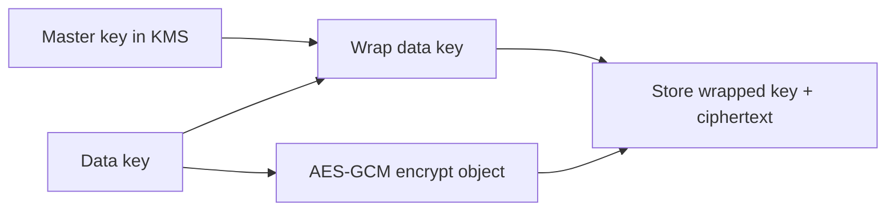

import { ConceptTemplate } from '@/features/kb/components/templates/ConceptTemplate'
import { Callout } from '@/features/kb/components/mdx/Callout'
import { ComparisonTable } from '@/features/kb/components/mdx/ComparisonTable'

export default function Layout({ children }) {
  return (
    <ConceptTemplate title="Key Management">
      {children}
    </ConceptTemplate>
  )
}

**Key management** is why most crypto fails in production. Algorithms are standardized. Keys get checked into git, copied onto laptops, never rotated, and logged in plaintext. A key-management system (KMS, HSM, or vault) generates keys, enforces who can use them, and keeps raw key bytes out of application disks.

## 1. Deep Dive and Mechanics

Lifecycle: generate in a trusted module, assign an id and purpose, distribute or wrap for use, rotate on a schedule or after incident, revoke, then destroy. **Envelope encryption** is the usual cloud pattern: a KMS master key wraps data keys; data keys encrypt objects; you store the wrapped data key beside the ciphertext.

**Separation of duties.** The app can call Decrypt or GenerateDataKey. It cannot export the master key. IAM policies plus audit logs answer who used which key when.

**Rotation.** Changing a master key does not rewrite the world if you use envelopes: new data keys are wrapped with the new master; old ciphertexts still unwrap until you re-encrypt. Application-level keys (JWT HMAC, webhook secrets) need dual-key windows.

<Callout icon="error" title="A key in source control is already compromised">
Rotate it. Scan history. Treat every copy (CI logs, AMIs, crash dumps) as leaked. Prevention is pre-commit secret scanning plus a vault.
</Callout>

## 2. Mathematical / Theoretical Foundation

Kerckhoffs's principle: the system should remain safe if everything but the key is public. Key entropy must match the algorithm (256-bit AES keys from a CSPRNG, not from a passphrase without a KDF). Compromise-resilience is about **cryptoperiods** and **forward secrecy**: limit how much ciphertext one key protects and how long that key lives.

<ComparisonTable
  headers={['Store', 'Exportable key', 'Typical use']}
  rows={[
    ['HSM', 'No', 'Roots, CAs, payment keys'],
    ['Cloud KMS', 'Rarely', 'Envelope masters'],
    ['Vault / PKCS11', 'Policy-gated', 'App secrets'],
    ['Env var on VM', 'Yes', 'Last resort, rotate often'],
  ]}
/>

## 3. Real-World Implementation

```python
# Envelope pattern with a KMS-shaped client
def encrypt_field(kms, plaintext: bytes) -> tuple[str, bytes, bytes]:
    data_key, wrapped = kms.generate_data_key(key_id='alias/app-cmk')
    nonce, blob = aes_gcm_encrypt(data_key, plaintext)
    wipe(data_key)
    return wrapped, nonce, blob
```

Wipe is best-effort in managed languages. Prefer libraries that keep data keys in the KMS or in an enclave when the threat model demands it.

## 4. Visualizations



## 5. Interview Prep

**Q: Why not one AES key for the whole database?**
**A:** Blast radius and rotation pain. Per-object or per-tenant data keys plus a master wrap limit the damage of a single leak.

**Q: KMS versus storing keys in the app?**
**A:** KMS gives access control, audit, hardware backing, and rotation APIs. The app still must authenticate to KMS.

**Q: What do you rotate after a laptop with prod creds is stolen?**
**A:** The creds, every secret those creds could read, and any data keys those secrets could unwrap — then review logs.

## 6. Production Use Cases

- **S3 / GCS / Azure** server-side encryption with customer-managed keys.
- **Field-level** encryption in payments and health apps.
- **Code-signing and TLS** keys in an HSM.

<Callout icon="tip" title="Give every key a purpose and an owner">
Signing keys, wrapping keys, and telemetry HMAC keys should never be interchangeable. Purpose binding stops confused-deputy use.
</Callout>
