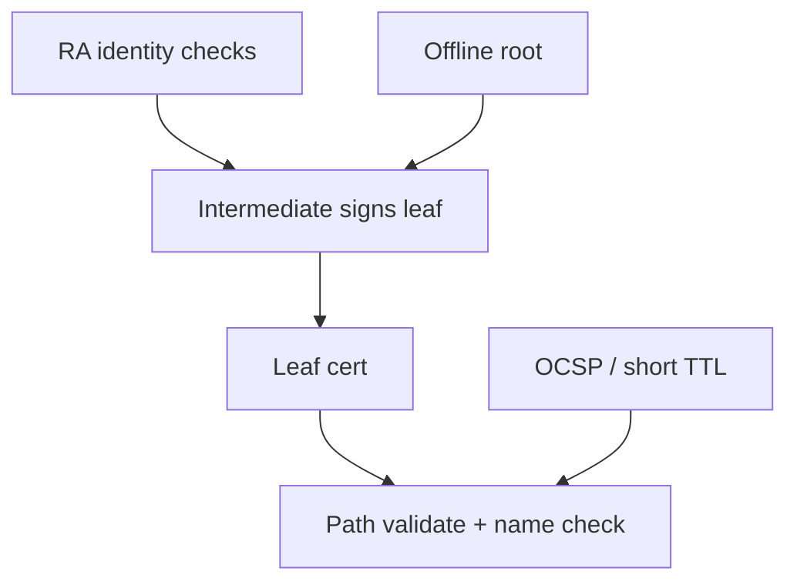

import { ConceptTemplate } from '@/features/kb/components/templates/ConceptTemplate'
import { Callout } from '@/features/kb/components/mdx/Callout'
import { ComparisonTable } from '@/features/kb/components/mdx/ComparisonTable'

export default function Layout({ children }) {
  return (
    <ConceptTemplate title="Public Key Infrastructure (PKI)">
      {children}
    </ConceptTemplate>
  )
}

**PKI** is the operational system around public keys: who is allowed to issue, how identity is checked, how clients find trust anchors, and how a leaked key is retired. X.509 certificates are the usual artifact. The hard parts are registration authority processes, revocation, and surviving a compromised intermediate.

## 1. Deep Dive and Mechanics

Roles: **root CA** (offline, trust anchor), **intermediate CA** (online issuer), **registration authority** (identity checks), **leaf** (server, client, or code). Clients ship a trust store. They build a path from leaf to a trusted root, check names, usages, and policy OIDs.

**Public web PKI** adds Certificate Transparency logs, CAA DNS records, and CABF rules. **Private PKI** (your company CA, SPIFFE) uses the same math with your own roots and automated issuers (cert-manager, AWS PCA, Venafi).

**Revocation.** CRLs scale poorly. OCSP stapling pushes status onto the server. Short-lived certificates (hours) make revocation less critical because the leaf dies soon anyway.

<Callout icon="warning" title="A private root in every developer trust store is a fleet problem">
Treat internal roots like production secrets. Distribute them with device management, not wiki attachments.
</Callout>

## 2. Mathematical / Theoretical Foundation

PKI is a tree (sometimes a forest) of signature verifications plus a name constraint policy. Path validation is specified in RFC 5280 and is famously easy to implement wrong (missing CA bit checks, accepting v1 intermediates, ignoring name constraints). That is why you use the platform verifier.

<ComparisonTable
  headers={['Model', 'Trust anchors', 'Revocation story']}
  rows={[
    ['Web PKI', 'Browser / OS roots', 'CT + OCSP + short life'],
    ['Enterprise CA', 'Company root', 'CRL / OCSP / MDM wipe'],
    ['mTLS mesh', 'Mesh issuer', 'Workload SVID rotation'],
    ['TOFU / pin', 'First key seen', 'Manual rotation'],
  ]}
/>

## 3. Real-World Implementation

```bash
openssl crl2pkcs7 -nocrl -certfile chain.pem | openssl pkcs7 -print_certs -noout
# Issue via ACME or your internal API; do not keep the root key on the CA VM.
```

In Kubernetes, cert-manager plus an external issuer keeps private keys in a CSI driver or HSM, not in a Secret that every pod can read.

## 4. Visualizations



## 5. Interview Prep

**Q: Why not one self-signed cert per service forever?**
**A:** No scalable identity, no revocation, no rotation story, and every client must pin every peer. PKI amortizes trust into a small set of anchors.

**Q: What does Certificate Transparency add?**
**A:** Public append-only logs of issued certs so domain owners can spot unauthorized issuance.

**Q: How does mTLS PKI differ from public HTTPS?**
**A:** Both ends present certs. Names are SPIFFE IDs or internal DNS. Roots are yours. Rotation is frequent and automated.

## 6. Production Use Cases

- **Public HTTPS** via Let's Encrypt or a commercial CA.
- **Internal HTTPS and VPN** device certs.
- **Service mesh** workload identities.

<Callout icon="tip" title="Keep the root air-gapped">
Ceremony-sign a few intermediates, then power the root down. If the online intermediate burns, you can replace it without replacing every client trust store.
</Callout>
