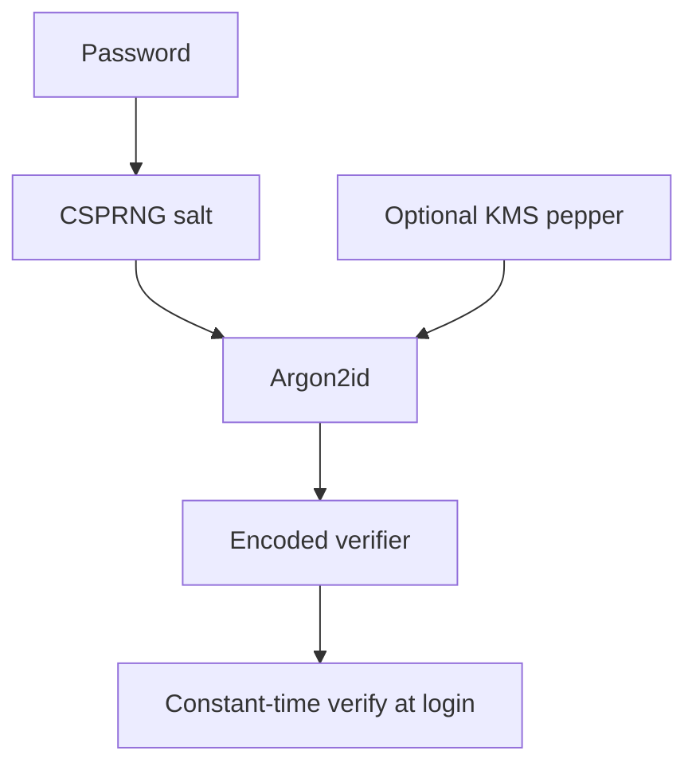

import { ConceptTemplate } from '@/features/kb/components/templates/ConceptTemplate'
import { Callout } from '@/features/kb/components/mdx/Callout'
import { ComparisonTable } from '@/features/kb/components/mdx/ComparisonTable'

export default function Layout({ children }) {
  return (
    <ConceptTemplate title="Password Hashing">
      {children}
    </ConceptTemplate>
  )
}

**Password hashing** turns a user secret into a stored verifier that is expensive to guess and useless across sites. You never store plaintext. You never store a fast hash of the password alone. You store a unique salt plus a memory-hard or iterated digest, then compare in constant time at login.

## 1. Deep Dive and Mechanics

At registration: generate a CSPRNG salt, run Argon2id (or bcrypt/scrypt), store the encoded string. At login: load that string, run the same KDF, compare. On success, optionally **rehash** if your parameters have increased.

**Threat model.** Attackers steal the table and run offline guesses. Salts stop rainbow tables and force per-user work. Slow KDFs cap guesses per second. A unique pepper (server-side secret in a KMS) adds a second factor if the DB leaks without the app secret.

**UX still matters.** Rate-limit online guesses. Offer a password manager-friendly long secret. Do not silently truncate.

<Callout icon="error" title="SHA-256 of a password is not password hashing">
Fast hashes plus a stolen table equal a race the defender loses. Use a password KDF.
</Callout>

## 2. Mathematical / Theoretical Foundation

A password has maybe 20-40 bits of real entropy. A 256-bit hash does not add entropy; it only hides the exact string. The defense is **work factor**: each guess costs memory-time so the expected cost of searching the password distribution exceeds the value of the account. That is economics, not collision resistance.

<ComparisonTable
  headers={['Method', 'Salt', 'Cost knob', 'Use']}
  rows={[
    ['Argon2id', 'Yes', 'm, t, p', 'New stores'],
    ['bcrypt', 'Yes', 'cost 10-14', 'Existing stores'],
    ['scrypt', 'Yes', 'N, r, p', 'Some wallets'],
    ['SHA-256(password)', 'Often no', 'None', 'Never'],
  ]}
/>

## 3. Real-World Implementation

```python
from argon2 import PasswordHasher
from argon2.exceptions import VerifyMismatchError

ph = PasswordHasher()

def register(pw: str) -> str:
    return ph.hash(pw)

def login(stored: str, pw: str) -> bool:
    try:
        ph.verify(stored, pw)
        return True
    except VerifyMismatchError:
        return False
```

## 4. Visualizations



## 5. Interview Prep

**Q: Salt versus pepper?**
**A:** Salt is unique per user and stored with the hash. Pepper is a global secret stored elsewhere so a DB-only leak is incomplete.

**Q: Why rehash on login?**
**A:** You cannot decrypt old verifiers. When you raise cost, you upgrade the hash the next time the user presents the password.

**Q: Can I encrypt passwords so I can email them back?**
**A:** No. That means you can read them. Reset via a one-time token instead.

## 6. Production Use Cases

- **Human login** for apps and VPNs.
- **Passphrase wrapping** of local data keys.
- **Migration** from legacy SHA-1 stores via on-login upgrade.

<Callout icon="tip" title="Fail closed on verifier parse errors">
A corrupt hash string is not "let them in". Log a security event and force a reset.
</Callout>
