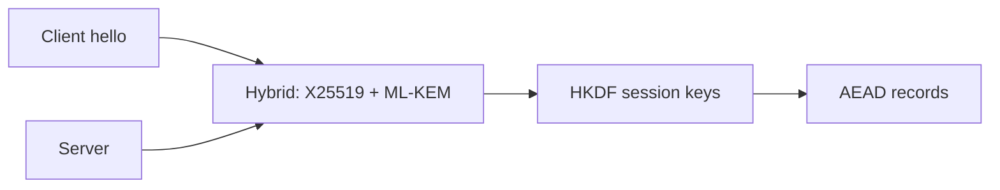

import { ConceptTemplate } from '@/features/kb/components/templates/ConceptTemplate'
import { Callout } from '@/features/kb/components/mdx/Callout'
import { ComparisonTable } from '@/features/kb/components/mdx/ComparisonTable'

export default function Layout({ children }) {
  return (
    <ConceptTemplate title="Post-Quantum Cryptography">
      {children}
    </ConceptTemplate>
  )
}

**Post-quantum cryptography (PQC)** replaces primitives that Shor's algorithm would break (RSA, DH, ECC) with schemes believed hard for both classical and quantum machines. NIST has standardized **ML-KEM** (Kyber) for key encapsulation and **ML-DSA** (Dilithium) for signatures, plus SLH-DSA (SPHINCS+) as a conservative hash-based signature.

## 1. Deep Dive and Mechanics

Harvest-now-decrypt-later is the urgent threat: an adversary records TLS today and waits for a large quantum computer. Confidentiality must migrate first. Signatures can wait longer unless your artifacts must verify for decades without re-signing.

**Hybrid handshakes.** TLS deployments often combine X25519 with ML-KEM so the session is safe if either algorithm holds. That hedges against a surprise cryptanalytic break of a new lattice scheme.

**Engineering costs.** Public keys and ciphertexts are larger (kilobytes, not 32 bytes). Implementation quality and side channels are still maturing. Do not invent your own Kyber.

<Callout icon="info" title="AES-256 and SHA-384 already have a quantum story">
Grover weakens symmetric primitives by about half the key bits. Double the key / digest if you need margin. The emergency is public-key, not AES.
</Callout>

## 2. Mathematical / Theoretical Foundation

ML-KEM security is tied to Module-LWE on lattices. ML-DSA is Module-SIS / Fiat-Shamir with aborts. SPHINCS+ uses only hash functions and huge signatures. Code-based (Classic McEliece) has large public keys and a long history. Security proofs are reductions to average-case lattice problems; parameters are chosen with quantum-aware cost models.

<ComparisonTable
  headers={['Role', 'Broken by Shor', 'PQC stand-in']}
  rows={[
    ['Key agreement', 'ECDHE / RSA KEM', 'ML-KEM, often hybrid'],
    ['Signatures', 'ECDSA / RSA-PSS', 'ML-DSA or SLH-DSA'],
    ['Symmetric bulk', 'AES-128 ( Grover )', 'AES-256'],
    ['Hashing', 'SHA-256 still ok', 'SHA-384 / SHA-512 if paranoid'],
  ]}
/>

## 3. Real-World Implementation

```python
# Conceptual hybrid encapsulate: classical ECDH plus a PQC KEM, then HKDF-combine.
def hybrid_shared(ecdh_secret: bytes, mlkem_shared: bytes) -> bytes:
    return hkdf_sha256(ikm=ecdh_secret + mlkem_shared, info=b'tls13-hybrid')
```

Use a library that tracks NIST OIDs (OpenSSL 3.5+, boringssl experiments, liboqs). Pin algorithm IDs in protocols so peers cannot silently downgrade.

## 4. Visualizations



## 5. Interview Prep

**Q: Why hybrid instead of PQC-only?**
**A:** New schemes may have classical breaks. Hybrid remains safe if either half holds. Cost is extra bytes.

**Q: Does Grover kill AES-128 tomorrow?**
**A:** A cryptographically relevant quantum computer large enough for Grover on AES is a different (and still speculative) machine than one that runs Shor on RSA. Still, long-lived secrets should use AES-256.

**Q: What should I migrate first?**
**A:** Recorded confidentiality: VPN, TLS, disk backup wrapping. Then certificates and code signing as ecosystems support it.

## 6. Production Use Cases

- **Browser and CDN** hybrid TLS experiments.
- **National and financial** systems with decade-long secrecy requirements.
- **Firmware signing** roadmaps toward ML-DSA or hash-based signatures.

<Callout icon="tip" title="Inventory every place you terminate public-key crypto">
You cannot migrate what you cannot find: TLS libraries, JWTs, S/MIME, SSH CAs, firmware, and vendor appliances.
</Callout>
