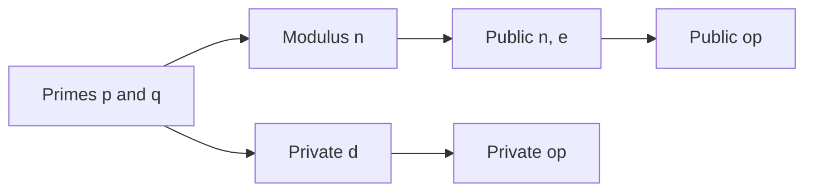

import { ConceptTemplate } from '@/features/kb/components/templates/ConceptTemplate'
import { Callout } from '@/features/kb/components/mdx/Callout'
import { ComparisonTable } from '@/features/kb/components/mdx/ComparisonTable'

export default function Layout({ children }) {
  return (
    <ConceptTemplate title="RSA">
      {children}
    </ConceptTemplate>
  )
}

**RSA** publishes a modulus n = p q and a public exponent e (usually 65537). The private exponent d inverts e modulo phi(n). Encryption and signatures are modular exponentiation with padding. Raw RSA is unsafe. Modern use is **RSA-OAEP** for wrapping small secrets and **RSA-PSS** for signatures, at 2048 bits or larger.

## 1. Deep Dive and Mechanics

Keygen picks two large primes, builds n, and computes d. Private operations use the Chinese Remainder Theorem with p and q for speed. Public operations are fast because e is small.

**Padding is the product.** OAEP adds randomness and hashing so the same plaintext does not wrap to the same ciphertext and so algebraic relations do not survive. PSS does the same job for signatures. PKCS#1 v1.5 encryption is deprecated; v1.5 signatures persist but PSS is preferred.

**TLS 1.3 dropped static RSA key transport.** Servers still present RSA certificates for signatures. New designs prefer ECDSA/Ed25519 and, soon, ML-DSA.

<Callout icon="warning" title="Do not implement RSA from a textbook">
Textbook RSA is deterministic and malleable. Use a library OAEP/PSS API and a 2048-bit or 3072-bit modulus.
</Callout>

## 2. Mathematical / Theoretical Foundation

Correctness is e d ≡ 1 (mod lcm(p-1, q-1)). Security is related to factoring n and to the RSA problem (eth roots mod n). There is no proof they are equivalent in all cases. Quantum computers running Shor break both. Classically, 2048-bit n is the current floor; 3072-bit matches 128-bit symmetric more honestly.

<ComparisonTable
  headers={['Mode', 'Job', 'Status']}
  rows={[
    ['Raw / textbook', 'None', 'Broken in practice'],
    ['PKCS#1 v1.5 enc', 'Key wrap', 'Avoid'],
    ['RSA-OAEP', 'Key wrap', 'OK if you must'],
    ['RSA-PSS', 'Signatures', 'OK, large keys'],
  ]}
/>

## 3. Real-World Implementation

```python
from cryptography.hazmat.primitives.asymmetric import rsa, padding
from cryptography.hazmat.primitives import hashes

key = rsa.generate_private_key(public_exponent=65537, key_size=2048)
sig = key.sign(b'artifact', padding.PSS(mgf=padding.MGF1(hashes.SHA256()), salt_length=padding.PSS.MAX_LENGTH), hashes.SHA256())
key.public_key().verify(sig, b'artifact', padding.PSS(mgf=padding.MGF1(hashes.SHA256()), salt_length=padding.PSS.MAX_LENGTH), hashes.SHA256())
```

## 4. Visualizations



## 5. Interview Prep

**Q: Why is e = 65537 common?**
**A:** It is a prime with a low Hamming weight, so verification is fast, and it avoids tiny-e disasters like e = 3 without OAEP.

**Q: RSA vs ECC?**
**A:** Same jobs, bigger RSA keys and slower private ops. ECC is preferred unless a standard or HSM forces RSA.

**Q: Can I encrypt a file with RSA?**
**A:** Only a tiny blob. Hybrid: wrap an AES key with OAEP, encrypt the file with AES-GCM.

## 6. Production Use Cases

- **Legacy TLS certificates** that still sign with RSA.
- **JWT RS256** in enterprise identity.
- **HSM-backed** payment and document signing.

<Callout icon="tip" title="Plan an ECC or PQC exit">
RSA-2048 will limp along, but new protocols should not add more of it. Inventory now.
</Callout>
