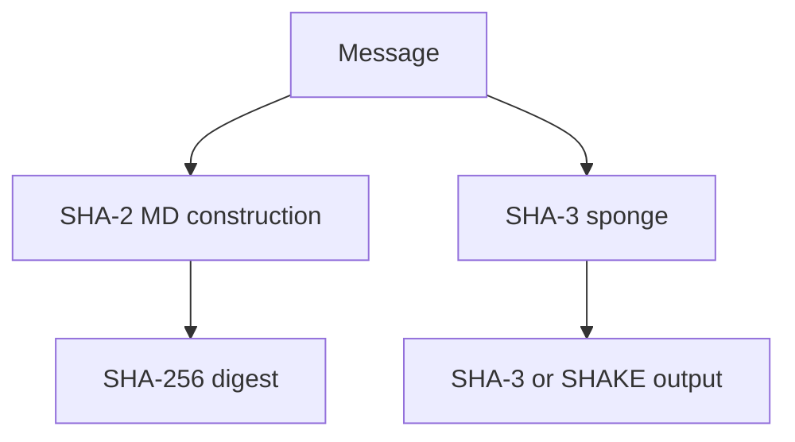

import { ConceptTemplate } from '@/features/kb/components/templates/ConceptTemplate'
import { Callout } from '@/features/kb/components/mdx/Callout'
import { ComparisonTable } from '@/features/kb/components/mdx/ComparisonTable'

export default function Layout({ children }) {
  return (
    <ConceptTemplate title="SHA Family">
      {children}
    </ConceptTemplate>
  )
}

The **SHA family** is NIST's lineup of cryptographic hash functions. **SHA-1** is retired. **SHA-2** (SHA-256, SHA-384, SHA-512) is the internet default. **SHA-3** is a different sponge construction standardized as a backup and as SHAKE extendable-output functions. Pick SHA-256 unless a standard names something else.

## 1. Deep Dive and Mechanics

SHA-256 processes 512-bit blocks with 64 rounds of a compression function. SHA-512 uses 1024-bit blocks and 64-bit words; it is often faster on 64-bit CPUs even if you then truncate to 256 bits (SHA-512/256). SHA-3-256 uses Keccak: absorb into a state, squeeze a digest. SHAKE128/256 output arbitrary length.

**Protocol names.** TLS 1.3's HKDF uses SHA-256 or SHA-384. Git historically used SHA-1 and is migrating. Bitcoin uses double SHA-256. None of that makes SHA-1 acceptable in new signatures.

<Callout icon="error" title="SHA-1 collisions are practical">
Chosen-prefix collisions have been demonstrated. Do not accept SHA-1 signatures or certs. Do not use SHA-1 for new integrity checks of untrusted data.
</Callout>

## 2. Mathematical / Theoretical Foundation

SHA-2 is Merkle-Damgard and inherits length-extension: given H(m) an attacker can compute H(m || pad || x) without m. That is why HMAC exists. SHA-3's sponge is not length-extendable in that way. Collision security is about half the digest length (birthday bound). Preimage security is close to the full digest length.

<ComparisonTable
  headers={['Member', 'Bits', 'Use today']}
  rows={[
    ['SHA-1', '160', 'Compat only, never security'],
    ['SHA-256', '256', 'Default'],
    ['SHA-384 / SHA-512', '384 / 512', 'TLS 1.3, high margin'],
    ['SHA-3-256 / SHAKE256', '256+', 'XOFs, backup primitive'],
  ]}
/>

## 3. Real-World Implementation

```python
import hashlib

def sha256_hex(data: bytes) -> str:
    return hashlib.sha256(data).hexdigest()

def shake256_bytes(data: bytes, n: int) -> bytes:
    return hashlib.shake_256(data).digest(n)
```

For password storage, do not use any SHA member alone. Wrap a password KDF instead.

## 4. Visualizations



## 5. Interview Prep

**Q: SHA-256 vs SHA-3-256?**
**A:** Different designs, similar security targets. SHA-256 wins on interoperability and hardware. SHA-3 is the conservative alternative and SHAKE is handy as an XOF.

**Q: Why does HMAC-SHA-256 exist if SHA-256 is a hash?**
**A:** A hash is not a MAC. HMAC adds a key and stops length extension.

**Q: Is SHA-512/256 better than SHA-256?**
**A:** Same collision strength, sometimes faster on 64-bit hosts, and it avoids length-extension onto a raw SHA-256 value in some constructions. Still use HMAC when you need a MAC.

## 6. Production Use Cases

- **TLS, JWT, git-like** content addressing.
- **Firmware images** and package checksums.
- **HKDF** inside key schedules.

<Callout icon="tip" title="Say SHA-256, not SHA-2, in APIs">
SHA-2 is a family. Protocols need an exact OID or name so both ends match.
</Callout>
