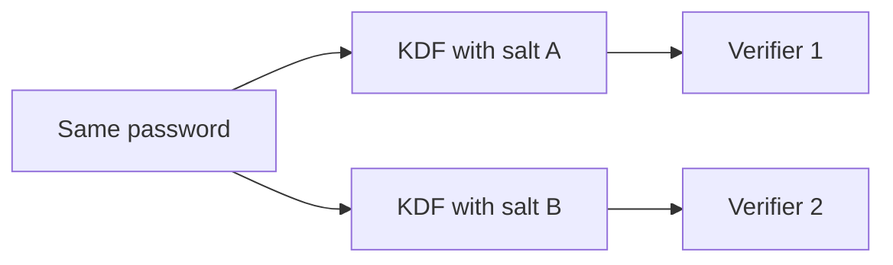

import { ConceptTemplate } from '@/features/kb/components/templates/ConceptTemplate'
import { Callout } from '@/features/kb/components/mdx/Callout'
import { ComparisonTable } from '@/features/kb/components/mdx/ComparisonTable'

export default function Layout({ children }) {
  return (
    <ConceptTemplate title="Salting">
      {children}
    </ConceptTemplate>
  )
}

A **salt** is a unique, non-secret random value mixed into a password hash. Two users with the same password must not share a verifier. Attackers cannot build one rainbow table that covers your whole database. Salts do not make a weak password strong; they stop bulk precomputation and identical-hash clustering.

## 1. Deep Dive and Mechanics

Generate at least 16 bytes from a CSPRNG per registration or password change. Feed salt and password into Argon2id / bcrypt / scrypt. Store both (usually in one encoded string). At verify, read the salt back; never ask the user for it.

**Salt is not a pepper.** Salts live next to the hash. Peppers live in a KMS. Salts must be unique; they need not be secret. Reusing one global salt is a common bug that restores rainbow-table economics.

**Do not invent encoding.** Library strings already include algorithm, salt, parameters, and digest.

<Callout icon="warning" title="Username is a bad salt">
Usernames repeat across sites and get renamed. Use CSPRNG bytes. Uniqueness matters more than cleverness.
</Callout>

## 2. Mathematical / Theoretical Foundation

Without a salt, an attacker precomputes H(p) for a dictionary once and matches every row. With a unique salt s, they must compute H(s, p) per row. Work scales with users times guesses. A salt does not increase password entropy. It multiplies the attacker's per-database cost.

<ComparisonTable
  headers={['Ingredient', 'Secret', 'Unique per user', 'Job']}
  rows={[
    ['Salt', 'No', 'Yes', 'Kill precomputation'],
    ['Pepper', 'Yes', 'No', 'Survive DB-only leak'],
    ['Password', 'Yes', 'n/a', 'Human secret'],
    ['Work factor', 'No', 'Policy', 'Slow each guess'],
  ]}
/>

## 3. Real-World Implementation

```python
import os
from hashlib import scrypt

def hash_pw(password: str) -> tuple[bytes, bytes]:
    salt = os.urandom(16)
    digest = scrypt(password.encode(), salt=salt, n=2**14, r=8, p=1)
    return salt, digest
```

Prefer argon2's PasswordHasher, which generates and encodes the salt for you.

## 4. Visualizations



## 5. Interview Prep

**Q: Should salts be secret?**
**A:** No. They must be unique and unpredictable at generation time. Secrecy is the pepper's job.

**Q: How long should a salt be?**
**A:** 16+ bytes of CSPRNG. Birthday collisions among salts should be implausible at your user count.

**Q: Can I salt SHA-256 and call it done?**
**A:** You stopped rainbow tables, not GPU guessing. You still need a slow memory-hard KDF.

## 6. Production Use Cases

- **Every password column** in a user table.
- **API key stretching** when you store a hash of the key.
- **Backup passphrases** with a stored salt in the header.

<Callout icon="tip" title="Rotate salt only when the password changes">
You cannot resalt without the plaintext. Upgrade parameters on successful login instead.
</Callout>
