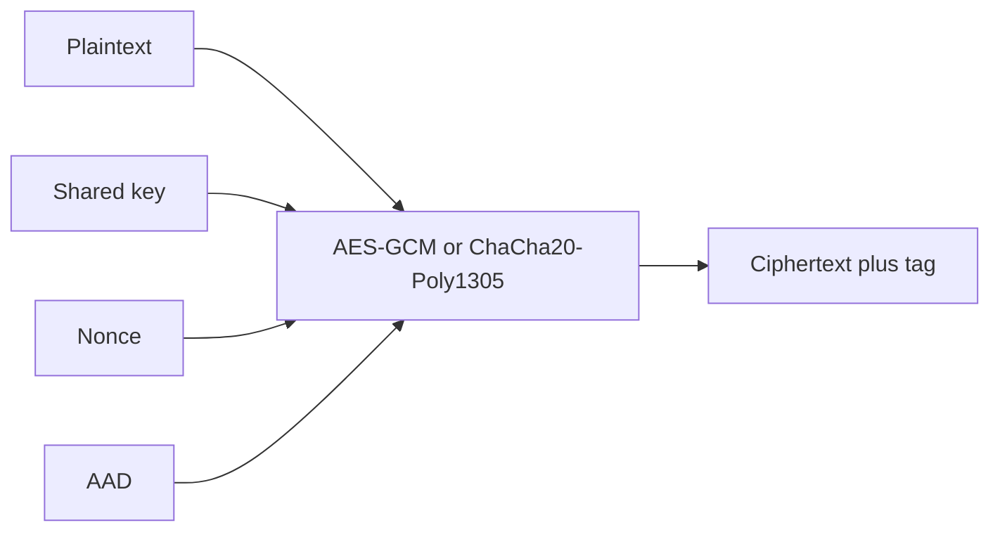

import { ConceptTemplate } from '@/features/kb/components/templates/ConceptTemplate'
import { Callout } from '@/features/kb/components/mdx/Callout'
import { ComparisonTable } from '@/features/kb/components/mdx/ComparisonTable'

export default function Layout({ children }) {
  return (
    <ConceptTemplate title="Symmetric Encryption">
      {children}
    </ConceptTemplate>
  )
}

**Symmetric encryption** uses one secret key for both directions. It is fast, suitable for gigabytes, and the workhorse under TLS, disks, and application envelopes. The modern unit is **AEAD**: a mode that outputs ciphertext plus an authentication tag and optionally binds extra associated data (AAD).

## 1. Deep Dive and Mechanics

A block cipher (AES) plus a mode (GCM, ChaCha20-Poly1305) produces a keystream or a permutation of blocks and a tag. You must supply a **unique nonce** per key. Decrypt verifies the tag before returning plaintext. If the tag fails, treat the message as hostile; do not "try to repair" it.

**Key distribution** is the historic pain. You either pre-share keys (API secrets, disk keys in KMS) or agree them with DH and then switch to symmetric for the session.

**Do not invent modes.** No custom XOR schemes, no ECB, no CBC without a MAC in the right order.

<Callout icon="warning" title="UnAuthenticated encryption is a bug">
CBC or CTR alone lets attackers flip bits in predictable ways. Always use AEAD or encrypt-then-MAC with independent keys.
</Callout>

## 2. Mathematical / Theoretical Foundation

IND-CPA asks that ciphertexts hide plaintext from an eavesdropper. IND-CCA / AEAD asks that they also resist chosen-ciphertext tampering. Nonce reuse in GCM fails both. Information-theoretically, a one-time pad is perfect if the key is random, as long as the message, and never reused — which is why it is impractical. Computational AEAD is the engineering substitute.

<ComparisonTable
  headers={['Primitive', 'Auth', 'Nonce rule', 'Use']}
  rows={[
    ['AES-GCM', 'Yes', 'Unique per key', 'TLS, storage'],
    ['ChaCha20-Poly1305', 'Yes', 'Unique per key', 'Mobile, software TLS'],
    ['AES-CBC', 'No', 'Random IV', 'Legacy only'],
    ['XOR with password', 'No', 'n/a', 'Never'],
  ]}
/>

## 3. Real-World Implementation

```python
from cryptography.hazmat.primitives.ciphers.aead import ChaCha20Poly1305
import os

key = os.urandom(32)
aead = ChaCha20Poly1305(key)
nonce = os.urandom(12)
ct = aead.encrypt(nonce, b'payload', b'route=/v1/orders')
pt = aead.decrypt(nonce, ct, b'route=/v1/orders')
```

AAD binds context (tenant id, path) so a ciphertext cannot be replayed onto a different operation.

## 4. Visualizations



## 5. Interview Prep

**Q: Symmetric vs asymmetric?**
**A:** Symmetric is fast and needs a shared secret. Asymmetric is slow and solves bootstrapping and signatures. Real systems use both.

**Q: Why is nonce uniqueness so important?**
**A:** Repeated GCM nonces leak the auth key and the XOR of plaintexts. Design a uniqueness scheme before you ship.

**Q: Can I use the same key for HMAC and AES?**
**A:** Derive two keys with HKDF. Key reuse across algorithms is a classic foot-gun.

## 6. Production Use Cases

- **TLS record layer** after the handshake.
- **Disk and backup** encryption.
- **Application field** encryption with KMS-wrapped data keys.

<Callout icon="tip" title="Prefer ChaCha20-Poly1305 on low-end CPUs without AES-NI">
Same security goal as AES-GCM, better software performance. On servers with AES-NI, GCM is usually faster.
</Callout>
