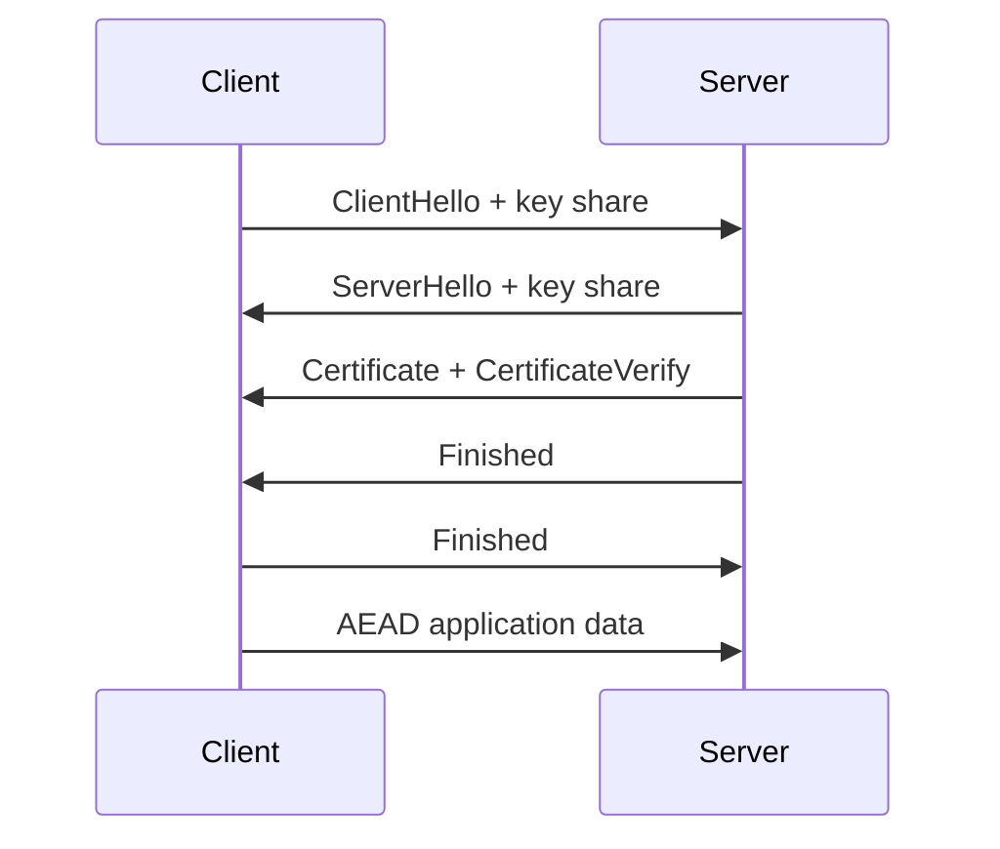

import { ConceptTemplate } from '@/features/kb/components/templates/ConceptTemplate'
import { Callout } from '@/features/kb/components/mdx/Callout'
import { ComparisonTable } from '@/features/kb/components/mdx/ComparisonTable'

export default function Layout({ children }) {
  return (
    <ConceptTemplate title="TLS Handshake">
      {children}
    </ConceptTemplate>
  )
}

The **TLS handshake** authenticates the server (and optionally the client), negotiates algorithms, and derives AEAD keys so the rest of the connection is confidential and tamper-evident. **TLS 1.3** is the version you should deploy: fewer messages, mandatory forward secrecy, old ciphers gone.

## 1. Deep Dive and Mechanics

ClientHello carries supported cipher suites, key shares (X25519 / P-256 / ML-KEM hybrids), and SNI. ServerHello picks the group, returns its key share, and sends the certificate plus a signature over the transcript. Both sides run HKDF to get handshake and application traffic secrets. Application data can start after that one round trip (1-RTT). Optional 0-RTT replayable early data exists and should stay off unless you understand idempotency.

**What the handshake must prevent.** Downgrade to weak suites, impersonation without a valid cert, and silent stripping of authentication. Finished messages MAC the transcript so an on-path attacker cannot tweak offers after keys are in play.

**Certificates.** The client validates the chain, time, hostname, and usage. Pinning and CT are extra policy.

<Callout icon="warning" title="TLS in front of HTTP is not optional seasoning">
Without a verified handshake you have no server identity. A cleartext or blindly accepted cert is a MITM waiting to happen.
</Callout>

## 2. Mathematical / Theoretical Foundation

TLS 1.3's key schedule is a sequence of HKDF-Extract/Expand steps bound to the transcript hash. Security proofs (in the computational model) argue that if the DH group, signatures, HKDF, and AEAD are sound, the record keys are secret from a network adversary. 0-RTT is outside that guarantee because those keys are replayable.

<ComparisonTable
  headers={['Version', 'Forward secrecy', 'Handshake RTTs', 'Deploy']}
  rows={[
    ['TLS 1.0 / 1.1', 'Optional', '2', 'Disable'],
    ['TLS 1.2', 'If DHE/ECDHE', '2', 'Only if 1.3 impossible'],
    ['TLS 1.3', 'Yes', '1', 'Default'],
    ['QUIC / HTTP3', 'Yes (TLS 1.3 crypto)', '0-1', 'Modern edge'],
  ]}
/>

## 3. Real-World Implementation

```python
import ssl
import socket

ctx = ssl.create_default_context()
ctx.minimum_version = ssl.TLSVersion.TLSv1_3
with socket.create_connection(('example.com', 443)) as sock:
    with ctx.wrap_socket(sock, server_hostname='example.com') as tls:
        cert = tls.getpeercert()
        tls.sendall(b'GET / HTTP/1.1\r\nHost: example.com\r\n\r\n')
```

Never set CERT_NONE in production. Always pass the hostname you intend.

## 4. Visualizations



## 5. Interview Prep

**Q: What does SNI leak?**
**A:** The target hostname in the first ClientHello is often still cleartext unless Encrypted Client Hello is deployed. Certs after ServerHello are encrypted in 1.3.

**Q: Why disable TLS 1.0?**
**A:** Old ciphers, BEAST-class history, no modern AEAD mandate, compliance requirements.

**Q: mTLS versus TLS?**
**A:** mTLS adds a client certificate so the server authenticates the caller with PKI, not only a password or bearer token.

## 6. Production Use Cases

- **HTTPS** for browsers and APIs.
- **Database and mesh** connections (don't run Postgres in cleartext across a VPC you do not fully trust).
- **Mail (STARTTLS)** with strict verification, not opportunistic.

<Callout icon="tip" title="Terminate TLS in one well-tested library">
Language defaults plus a modern version floor beat a custom handshake. Keep openssl / boringssl patched.
</Callout>
