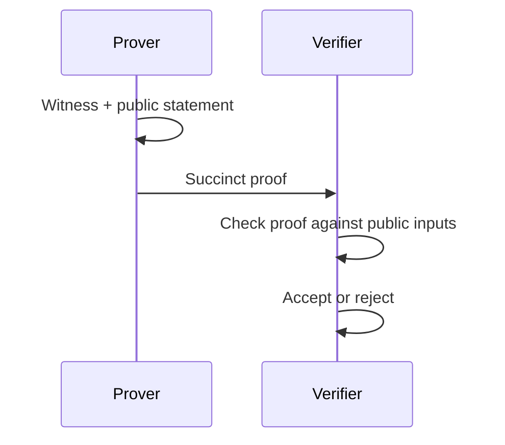

import { ConceptTemplate } from '@/features/kb/components/templates/ConceptTemplate'
import { Callout } from '@/features/kb/components/mdx/Callout'
import { ComparisonTable } from '@/features/kb/components/mdx/ComparisonTable'

export default function Layout({ children }) {
  return (
    <ConceptTemplate title="Zero-Knowledge Proofs">
      {children}
    </ConceptTemplate>
  )
}

A **zero-knowledge proof (ZKP)** lets a prover convince a verifier that a statement is true without handing over the witness. Classic example: prove you know a discrete log, or that a transaction is well-formed, without revealing the key or the amounts. SNARKs and STARKs made this practical enough for blockchains and some identity products.

## 1. Deep Dive and Mechanics

Properties: **completeness** (honest prover wins), **soundness** (cheater fails except with tiny probability), **zero knowledge** (the transcript could have been simulated without the witness). Interactive proofs use challenges. Fiat-Shamir turns them non-interactive with a hash.

**SNARK vs STARK.** SNARKs are small and fast to verify; many need a trusted setup. STARKs are larger, hash-based, and transparent. Both compile a program into a circuit or AIR and prove satisfiability.

**Not magic privacy.** The statement itself can leak (prove I am over 18 still reveals that fact). Public inputs are public. Side channels around proving time still exist.

<Callout icon="info" title="ZK proves a circuit, not your English claim">
If the circuit is wrong, the proof is a precise lie. Audit the gadget, not only the proving system brand.
</Callout>

## 2. Mathematical / Theoretical Foundation

Interactive ZK is a 1980s complexity-theory object (GMR). Modern succinct proofs use polynomial commitments (KZG, FRI), pairings or hashes, and argument systems that are computationally sound rather than statistically sound. Knowledge soundness (extraction) is what you want for "prover knows a witness", not just "statement is true".

<ComparisonTable
  headers={['Family', 'Trusted setup', 'Proof size', 'Typical use']}
  rows={[
    ['Sigma protocols', 'No', 'Small', 'Auth, identity'],
    ['Groth16 SNARK', 'Yes per circuit', 'Tiny', 'Many L2s'],
    ['PLONK / Halo-style', 'Universal or none', 'Small', 'General circuits'],
    ['STARKs', 'No', 'Larger', 'Scalable rollups'],
  ]}
/>

## 3. Real-World Implementation

```python
# Conceptual API: prove that age >= 18 given a signed credential, without sending the birthday.
def prove_over_18(credential, circuit) -> bytes:
    witness = {'dob': credential.dob, 'sig': credential.issuer_sig}
    public = {'issuer_pk': credential.issuer_pk, 'today': today()}
    return circuit.prove(witness, public)
```

Production systems use audited circuits (circom, Noir, Leo, Cairo) and carefully version the verifying key.

## 4. Visualizations



## 5. Interview Prep

**Q: ZK vs homomorphic encryption?**
**A:** HE lets a server compute on secrets. ZK lets you prove a property of secrets. Sometimes you combine them.

**Q: Why does trusted setup scare people?**
**A:** Toxic waste from the ceremony could forge proofs if not destroyed. Multi-party ceremonies reduce that risk. Transparent schemes avoid it.

**Q: Are ZK logins a replacement for passwords?**
**A:** They can prove possession of a credential. You still need issuance, revocation, and device binding.

## 6. Production Use Cases

- **Rollups** proving correct state transitions.
- **Anonymous credentials** and age checks.
- **Private solvency** or compliance attestations.

<Callout icon="tip" title="Keep public inputs minimal">
Every public input is a leak and a coupling. Put only what the verifier must bind.
</Callout>
