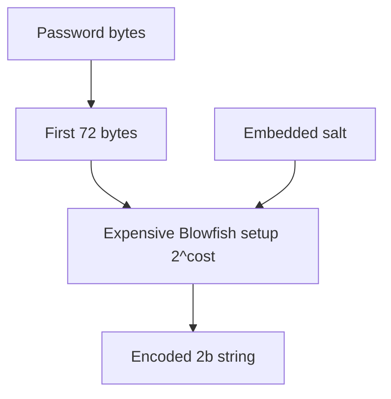

import { ConceptTemplate } from '@/features/kb/components/templates/ConceptTemplate'
import { Callout } from '@/features/kb/components/mdx/Callout'
import { ComparisonTable } from '@/features/kb/components/mdx/ComparisonTable'

export default function Layout({ children }) {
  return (
    <ConceptTemplate title="bcrypt">
      {children}
    </ConceptTemplate>
  )
}

**bcrypt** is a password KDF derived from the Blowfish cipher. It has been in production since the late 1990s, is widely supported, and is still acceptable for existing stores. New systems should prefer Argon2id, but you will inherit bcrypt for years. Know its cost parameter and its **72-byte password limit**.

## 1. Deep Dive and Mechanics

The encoded string looks like `$2b$12$salt....hash...`. The 12 is the cost: 2^12 expensive Blowfish setups. Raise cost as hardware improves. Salt is embedded. Verification uses the same string.

**72-byte cap.** bcrypt silently uses only the first 72 bytes of the password. Long passphrases and some language encodings can truncate. If you must keep bcrypt, pre-hash with SHA-256 only if you understand the double-hash ecosystem — many teams instead migrate to Argon2id.

**Cost 10-12** is a common starting band for interactive login in 2020s hardware; measure on your boxes.

<Callout icon="warning" title="Watch the 72-byte truncation">
Password managers can emit long secrets. Truncation makes two different secrets collide. Test with long inputs.
</Callout>

## 2. Mathematical / Theoretical Foundation

bcrypt's expensive key setup is not memory-hard in the Argon2 sense. GPUs still attack it better than they attack Argon2id at high memory. Its strength is the tunable 2^cost loop and the lack of embarrassing implementation history compared with rolling your own SHA loop. Blowfish's 32-bit nature also makes some ASIC stories different from SHA-256.

<ComparisonTable
  headers={['KDF', 'Memory-hard', 'Max password', 'Recommendation']}
  rows={[
    ['bcrypt', 'No', '72 bytes', 'Maintain, do not start new'],
    ['scrypt', 'Yes', 'Large', 'OK if already in use'],
    ['Argon2id', 'Yes', 'Large', 'New stores'],
    ['PBKDF2', 'No', 'Large', 'FIPS constraint only'],
  ]}
/>

## 3. Real-World Implementation

```python
import bcrypt

hashed = bcrypt.hashpw(b'secret', bcrypt.gensalt(rounds=12))
ok = bcrypt.checkpw(b'secret', hashed)
```

On success, if rounds is below your current policy, rehash and store the new string.

## 4. Visualizations



## 5. Interview Prep

**Q: Why is bcrypt still everywhere?**
**A:** It arrived early, is simple, and is "good enough" if cost is kept modern. Inertia plus compatibility.

**Q: bcrypt vs Argon2id in an interview?**
**A:** Say Argon2id for new work (memory-hard, no 72-byte cap). Say bcrypt is fine to keep with a cost bump and a migration plan.

**Q: What does a cost bump do to attackers?**
**A:** Each +1 doubles defender and attacker CPU time. Memory-hard KDFs also raise RAM cost.

## 6. Production Use Cases

- **Legacy user tables** in Rails, Django, Node apps.
- **On-login migration** from bcrypt to Argon2id.
- **Low-dependency** environments where bcrypt is the only audited binding.

<Callout icon="tip" title="Log the cost you verify, not the password">
Metrics on hash time and cost distribution tell you when to rotate parameters. Never log the secret.
</Callout>
