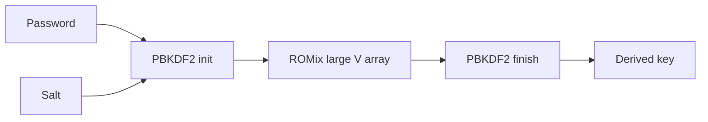

import { ConceptTemplate } from '@/features/kb/components/templates/ConceptTemplate'
import { Callout } from '@/features/kb/components/mdx/Callout'
import { ComparisonTable } from '@/features/kb/components/mdx/ComparisonTable'

export default function Layout({ children }) {
  return (
    <ConceptTemplate title="scrypt">
      {children}
    </ConceptTemplate>
  )
}

**scrypt** (Colin Percival, 2009) was designed so that cracking passwords needs lots of RAM, not just ASICs that grind SHA-256. It feeds PBKDF2-HMAC-SHA256 around a large ROMix memory array. You will meet it in older services and in cryptocurrency wallet encryption. New password stores should still prefer Argon2id, which won a later open competition.

## 1. Deep Dive and Mechanics

Parameters: **N** (CPU/memory cost, power of two), **r** (block size), **p** (parallelization), plus a salt. Memory use is roughly 128 * N * r bytes. Common interactive starting points look like N=2^14, r=8, p=1 (about 16 MiB) — measure before you copy numbers.

**DoS risk.** If you let clients pick N, they can exhaust your login workers. Server policy owns parameters. Store them in the encoded verifier.

**Wallets.** Bitcoin Core-style wallet encryption historically used scrypt. Those parameters are a different threat model (offline file, user-chosen passphrase) than a high-QPS web login.

<Callout icon="info" title="scrypt is still a real KDF">
It is not obsolete in the MD5 sense. It is simply no longer the default recommendation for greenfield password tables.
</Callout>

## 2. Mathematical / Theoretical Foundation

ROMix is sequentially memory-hard: the next block depends on a random-looking earlier block, so you cannot easily trade memory for cheap parallelism. The original paper targets the memory-time product. Argon2 later refined side-channel and GPU trade-off stories, which is why PHC picked it.

<ComparisonTable
  headers={['KDF', 'Year', 'Memory-hard', 'Default now']}
  rows={[
    ['PBKDF2', '2000', 'No', 'FIPS only'],
    ['scrypt', '2009', 'Yes', 'Legacy / wallets'],
    ['bcrypt', '1999', 'Limited', 'Legacy web'],
    ['Argon2id', '2015', 'Yes', 'New web'],
  ]}
/>

## 3. Real-World Implementation

```python
import os
from hashlib import scrypt

salt = os.urandom(16)
verifier = scrypt(b'correct-horse', salt=salt, n=2**14, r=8, p=1, dklen=32)
```

Use hmac.compare_digest when you store a raw digest. Prefer libraries that emit a single encoded string with parameters.

## 4. Visualizations



## 5. Interview Prep

**Q: Why memory-hard?**
**A:** Custom hashing chips have lots of compute and little RAM per core. Forcing large RAM per guess raises attacker capital cost.

**Q: scrypt vs Argon2id?**
**A:** Same goal. Argon2id is newer, better parameterized, and the current default. scrypt is fine to keep if already deployed.

**Q: What happens if N is not a power of two?**
**A:** The algorithm requires it. Libraries should reject bad N rather than silently rounding.

## 6. Production Use Cases

- **Wallet and backup** passphrase stretching.
- **Inherited web** password columns.
- **KDF for wrapping** a data key when Argon2 is unavailable.

<Callout icon="tip" title="Cap wall-clock time on the login path">
A huge N protects stolen dumps and wrecks your p99 latency. Split "interactive login" parameters from "offline archive" parameters.
</Callout>
