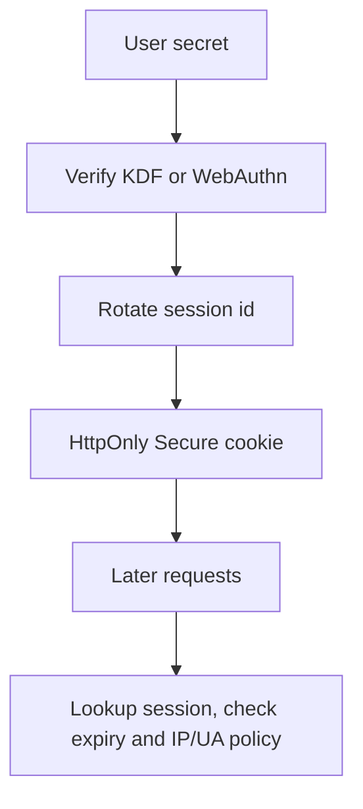

import { ConceptTemplate } from '@/features/kb/components/templates/ConceptTemplate'
import { Callout } from '@/features/kb/components/mdx/Callout'
import { ComparisonTable } from '@/features/kb/components/mdx/ComparisonTable'

export default function Layout({ children }) {
  return (
    <ConceptTemplate title="Authentication Flaws">
      {children}
    </ConceptTemplate>
  )
}

**Authentication** answers who you are. Flaws here skip, replay, or confuse that check. The result is account takeover. This is not the same as authorization (what you may do once signed in). Most incidents are boring: credential stuffing, reset-token leaks, session IDs in URLs, and "login" APIs that trust a client-supplied user id.

## 1. Deep Dive and Mechanics

A solid login issues a **new session** after verifying a secret (password KDF, WebAuthn, or a one-time code) and binds that session to a random, high-entropy identifier stored in an HttpOnly Secure cookie. Flaws appear when any piece is guessable, reusable, or confused with identity.

**Common failure classes.** Predictable session IDs. Session fixation (keeping a pre-login ID). Password reset tokens in referrer logs. Missing invalidation on logout or password change. User enumeration via distinct error texts. MFA that can be skipped on an alternate path. "Login with JWT" that accepts alg=none or a public key as HMAC secret.

**Defend in layers.** Rate-limit and lock out with care (do not create an account-lock DoS). Require phishing-resistant MFA for privileged roles. Treat every alternate login (magic link, SSO callback, legacy SOAP) as a first-class auth surface.

<Callout icon="warning" title="SSO does not erase your session bugs">
If the callback creates a session without checking state/nonce, or if you mint cookies on an open redirect, the IdP cannot save you.
</Callout>

## 2. Mathematical / Theoretical Foundation

Authentication is a protocol with a freshness requirement. Tokens must be unguessable (CSPRNG, 128+ bits) and **single-purpose**. Challenge-response (WebAuthn) beats shared passwords because the secret never leaves the authenticator. Formal models (BAN-style intuition, modern Tamarin proofs) keep asking: can an attacker who controls the network and some old tokens produce a new accepted session?

<ComparisonTable
  headers={['Check', 'Good', 'Flaw']}
  rows={[
    ['Credential', 'Argon2id + MFA', 'SHA-1 password, no rate limit'],
    ['Session id', 'New 256-bit cookie', 'User id in the cookie value'],
    ['Reset', 'Short TTL, single use', 'Token in query string forever'],
    ['Step-up', 'WebAuthn for admin', 'MFA skip on mobile API'],
  ]}
/>

## 3. Real-World Implementation

```python
import secrets
from hashlib import sha256

def new_session_id() -> str:
    return secrets.token_urlsafe(32)

def store_reset_token(db, user_id: str) -> str:
    raw = secrets.token_urlsafe(32)
    db.put_reset(user_id, sha256(raw.encode()).hexdigest(), ttl_s=900)
    return raw  # send via email; store only the hash
```

Rotate the session id after login and after privilege step-up. Invalidate the family of sessions on password change.

## 4. Visualizations



## 5. Interview Prep

**Q: Authentication vs authorization?**
**A:** Authn is identity. Authz is permission. Broken object-level authz often happens after a perfect login.

**Q: Why rotate the session at login?**
**A:** Stops session fixation: an attacker who planted a pre-auth cookie cannot keep that id after you authenticate.

**Q: Is JWT in localStorage fine?**
**A:** XSS can steal it. Prefer a short-lived access cookie plus a refresh story with rotation, or a BFF pattern.

## 6. Production Use Cases

- **Consumer login** with credential-stuffing defenses.
- **Workforce SSO** plus step-up for admin consoles.
- **Password reset and magic-link** pipelines treated as auth protocols.

<Callout icon="tip" title="Log auth events without logging secrets">
Record success/fail, method, and session rotation. Never record passwords, raw tokens, or full cookie headers.
</Callout>
