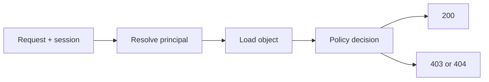

import { ConceptTemplate } from '@/features/kb/components/templates/ConceptTemplate'
import { Callout } from '@/features/kb/components/mdx/Callout'
import { ComparisonTable } from '@/features/kb/components/mdx/ComparisonTable'

export default function Layout({ children }) {
  return (
    <ConceptTemplate title="Broken Access Control">
      {children}
    </ConceptTemplate>
  )
}

**Broken access control** is the most common serious web bug. The UI hides a button; the API still performs the action. A user changes an id in a request and reads someone else's record (IDOR). An anonymous caller hits an admin route that only checked a cookie's presence, not a role. Defense is **server-side enforcement on every request**, deny-by-default.

## 1. Deep Dive and Mechanics

Every request names a principal and a resource. The policy must answer: is this principal allowed this verb on this object in this tenant? Enforcement belongs in a shared layer (middleware, gateway, or capability check), not in each React view.

**Object level.** Look up the object, then check ownership or ACL. Do not trust a client-supplied owner id. **Function level.** Admin RPCs need a role or permission bit. **Tenant level.** Cross-tenant ids are a frequent SaaS fail.

**Horizontal vs vertical.** Horizontal: same role, other user's object. Vertical: lesser role reaches a privileged function.

<Callout icon="error" title="Never trust the client for authorization">
Hidden fields, disabled buttons, and JWT claims the client sends back are not enforcement. Re-load the user and policy on the server.
</Callout>

## 2. Mathematical / Theoretical Foundation

Access control models: ACL, RBAC, ABAC, ReBAC (relationship graphs). Formal safety asks whether a given state can reach an unauthorized grant (Harrison-Ruzzo-Ullman is undecidable in general). In practice you pick a model, centralize the decision, and test it with adversarial ids. Capability tokens (signed, scoped, short-lived) reduce ambient authority.

<ComparisonTable
  headers={['Pattern', 'Question', 'Typical bug']}
  rows={[
    ['RBAC', 'Does this role include the verb?', 'Role in an unsigned cookie'],
    ['ABAC', 'Do attributes satisfy the rule?', 'Attribute supplied by client'],
    ['ReBAC', 'Is user related to object?', 'Forgot the relation check'],
    ['Capability', 'Does this token name this object?', 'Over-broad token reuse'],
  ]}
/>

## 3. Real-World Implementation

```python
def get_invoice(db, principal, invoice_id: str):
    inv = db.invoices.get(invoice_id)
    if inv is None:
        raise NotFound()
    if inv.tenant_id != principal.tenant_id or not principal.can('invoice:read', inv):
        raise Forbidden()
    return inv
```

Return the same 404 for "does not exist" and "exists but not yours" when enumeration is a risk.

## 4. Visualizations



## 5. Interview Prep

**Q: What is IDOR?**
**A:** Insecure Direct Object Reference: the API accepts an object id and forgets to check the caller may access it.

**Q: Why is this OWASP number one?**
**A:** It is easy to miss on every new endpoint, automated scanners are weak at it, and impact is direct data loss.

**Q: Deny by default or allow by default?**
**A:** Deny. New routes should 403 until a test asserts the grant.

## 6. Production Use Cases

- **Multi-tenant SaaS** object APIs.
- **Admin consoles** with extra function-level checks.
- **Export and bulk** endpoints that must re-apply the same filters as the UI.

<Callout icon="tip" title="Write authorization tests with two users">
For each resource route, call it as Alice on Bob's id and expect failure. One test per handler catches most IDORs.
</Callout>
