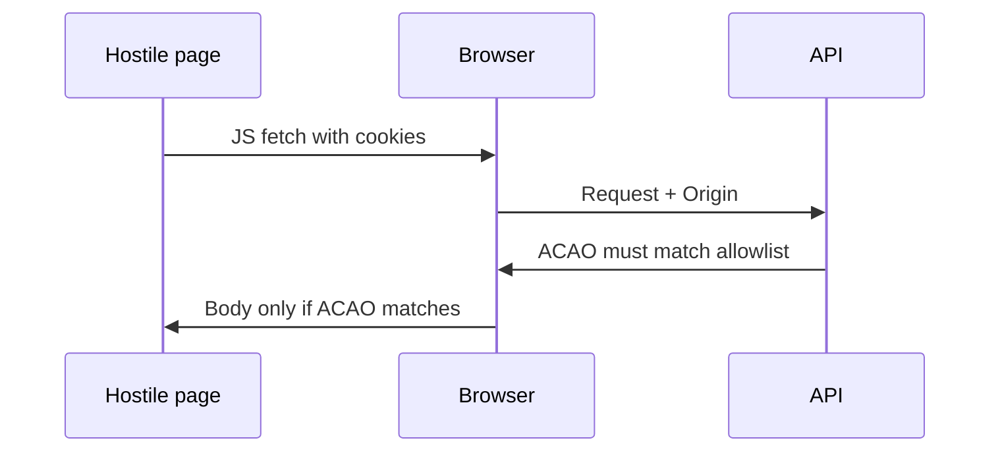

import { ConceptTemplate } from '@/features/kb/components/templates/ConceptTemplate'
import { Callout } from '@/features/kb/components/mdx/Callout'
import { ComparisonTable } from '@/features/kb/components/mdx/ComparisonTable'

export default function Layout({ children }) {
  return (
    <ConceptTemplate title="CORS Vulnerabilities">
      {children}
    </ConceptTemplate>
  )
}

**CORS** is a browser privilege the server opts into. By default, a page on evil.example cannot read the body of a response from api.yourbank.example even if the browser attached cookies. If your API reflects Access-Control-Allow-Origin: the request Origin and sets Allow-Credentials, you have given that page the keys to the user's session.

## 1. Deep Dive and Mechanics

Simple requests may be sent cross-origin (the old web). JavaScript may not read the response unless ACAO matches the requesting origin (or is a careful * without credentials). Preflight (OPTIONS) asks permission for custom headers or methods.

**Dangerous patterns.** Reflect any Origin. Allow-Origin: * plus cookies (browsers block this combo; people then "fix" it by reflecting). Trusting null. Trusting a regex that matches evilyourbank.example. CORS is not an access-control list for mobile apps or curl; those do not enforce it.

**CSRF vs CORS.** CORS mistakes leak responses. CSRF makes the browser send a state-changing request. You often need both a strict CORS allowlist and CSRF tokens.

<Callout icon="warning" title="CORS is a browser rule, not a network firewall">
A stolen cookie used from a script outside the browser ignores CORS entirely. Still enforce authz on the server.
</Callout>

## 2. Mathematical / Theoretical Foundation

The Same-Origin Policy is a tuple match (scheme, host, port). CORS is a structured exception: the server names which other tuples may read. Credentials change the algebra: * is forbidden with credentials, so implementations switch to reflection and accidentally become "any site". Treat the allowlist as an exact set, not a substring search.

<ComparisonTable
  headers={['Header combo', 'Browser effect', 'Safe?']}
  rows={[
    ['No CORS headers', 'JS cannot read cross-origin body', 'Default-safe'],
    ['ACAO * , no credentials', 'Public read', 'OK for public APIs'],
    ['Reflect Origin + credentials', 'That origin can read as the user', 'Only if allowlisted'],
    ['Allow-Origin null + creds', 'Sandbox / unique origins', 'Usually unsafe'],
  ]}
/>

## 3. Real-World Implementation

```python
ALLOWED = {'https://app.example.com', 'https://admin.example.com'}

def cors_headers(origin: str | None) -> dict:
    if origin in ALLOWED:
        return {
            'Access-Control-Allow-Origin': origin,
            'Access-Control-Allow-Credentials': 'true',
            'Vary': 'Origin',
        }
    return {}
```

Use an exact set. Do not endswith or contains.

## 4. Visualizations



## 5. Interview Prep

**Q: Does CORS stop CSRF?**
**A:** No. CSRF does not need to read the response. It needs a cookie to be sent. Use SameSite and tokens.

**Q: Why Vary: Origin?**
**A:** So caches do not store one user's ACAO and serve it to another origin.

**Q: Is ACAO * fine?**
**A:** For truly public, cookie-free APIs, yes. Never combine a wildcard mindset with credentialed session APIs.

## 6. Production Use Cases

- **SPA on a different origin** than its API.
- **Partner widgets** with a tiny explicit allowlist.
- **Public JSON** APIs that opt into * without cookies.

<Callout icon="tip" title="Prefer same-site deployments">
Host the SPA and API on one registrable domain with a reverse proxy. No CORS means no CORS bugs.
</Callout>
