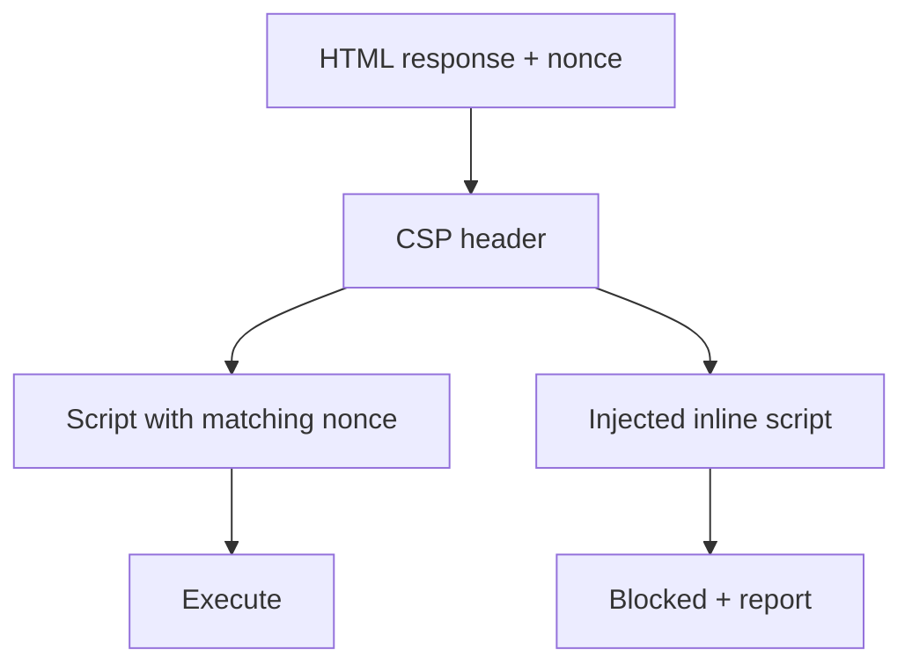

import { ConceptTemplate } from '@/features/kb/components/templates/ConceptTemplate'
import { Callout } from '@/features/kb/components/mdx/Callout'
import { ComparisonTable } from '@/features/kb/components/mdx/ComparisonTable'

export default function Layout({ children }) {
  return (
    <ConceptTemplate title="Content Security Policy (CSP)">
      {children}
    </ConceptTemplate>
  )
}

**Content Security Policy (CSP)** is a defense-in-depth header. It does not fix bad HTML encoding, but it can stop a stolen inline script from running, block unexpected script hosts, and restrict form targets and connections. A useful CSP is a deny-by-default allowlist plus **nonces or hashes** for the scripts you actually ship.

## 1. Deep Dive and Mechanics

The browser parses Content-Security-Policy and applies directives: default-src, script-src, style-src, img-src, connect-src, frame-ancestors, base-uri, form-action, object-src. The first matching source wins; 'none' is empty. **script-src 'nonce-...'** lets that exact script element run. 'unsafe-inline' undoes most XSS value.

**Report-Only** lets you collect violations before enforce. Start there on a legacy app, then flip to enforcing.

**Bypass reality.** JSONP, open redirects in script-src, and 'unsafe-eval' punch holes. CSP is necessary on modern apps, not sufficient.

<Callout icon="warning" title="unsafe-inline plus a rich page is a placebo">
If any script can run inline, a typical XSS gadget is enough. Use nonces or hashes and ban eval.
</Callout>

## 2. Mathematical / Theoretical Foundation

CSP is a whitelist policy language evaluated by the browser before running a resource. Nonces must be unique per response and unguessable; reuse turns them into a static allow. Hashes bind exact bytes of inline blocks. frame-ancestors replaces X-Frame-Options with a clearer embedding policy.

<ComparisonTable
  headers={['Directive', 'Job', 'Strict default']}
  rows={[
    ['script-src', 'Who may run JS', "nonce or hash, no unsafe-inline"],
    ['object-src', 'Plugins', "'none'"],
    ['base-uri', 'Stops base-tag hijack', "'self' or 'none'"],
    ['frame-ancestors', 'Who may embed you', "'none' or self"],
  ]}
/>

## 3. Real-World Implementation

```python
import secrets

def csp_header() -> tuple[str, str]:
    nonce = secrets.token_urlsafe(16)
    policy = (
        "default-src 'self'; "
        f"script-src 'nonce-{nonce}' 'strict-dynamic'; "
        "object-src 'none'; base-uri 'none'; frame-ancestors 'none'"
    )
    return nonce, policy
```

Put the nonce on each script tag you emit. Do not put it on user-controlled HTML.

## 4. Visualizations



## 5. Interview Prep

**Q: Does CSP replace output encoding?**
**A:** No. Encoding stops injection. CSP limits what runs if injection still happens.

**Q: What is strict-dynamic?**
**A:** Scripts trusted via nonce may load children, so you do not keep growing a host allowlist. Still requires a nonce on the root.

**Q: Why object-src none?**
**A:** Flash and plugin vectors. Easy win.

## 6. Production Use Cases

- **First-party SPAs** with nonce-based script loading.
- **Marketing sites** that slowly kill inline analytics tags.
- **Admin consoles** where XSS is catastrophic.

<Callout icon="tip" title="Ship Report-Only to a sink you actually read">
A policy nobody monitors will never become enforcing. Wire reports to your SOC or error pipeline.
</Callout>
