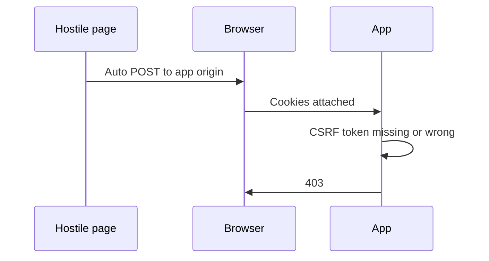

import { ConceptTemplate } from '@/features/kb/components/templates/ConceptTemplate'
import { Callout } from '@/features/kb/components/mdx/Callout'
import { ComparisonTable } from '@/features/kb/components/mdx/ComparisonTable'

export default function Layout({ children }) {
  return (
    <ConceptTemplate title="Cross-Site Request Forgery (CSRF)">
      {children}
    </ConceptTemplate>
  )
}

**CSRF** abuses the browser's habit of attaching cookies to a request the user did not mean to make. A hostile page can trigger a POST to your origin. If session cookies are enough to change email or transfer funds, the action runs as the victim. Defense is a **secret the hostile page cannot read**: a synchronizer token, or SameSite cookies plus careful method use.

## 1. Deep Dive and Mechanics

Conditions: a session cookie (or other ambient credential) is sent cross-site; the request changes state; there is no unguessable request token. GET that mutates state makes CSRF trivial via images and prefetch. JSON APIs with custom headers often require a preflight, which helps, but cookie-authenticated form posts do not.

**Synchronizer token.** Server stores a random value in the session, embeds it in forms, and rejects POSTs that omit it. **Double-submit** cookies are weaker if you lack SameSite and prefix cookies. **SameSite=Lax/Strict** stops many cross-site cookie sends; still use tokens for sensitive actions and for older browsers you claim to support.

<Callout icon="info" title="CORS will not save you from CSRF">
CSRF does not need to read the response. It only needs the side effect. Tokens and SameSite do the work.
</Callout>

## 2. Mathematical / Theoretical Foundation

CSRF is a confused-deputy problem: the browser is the deputy with the user's cookie jar. A capability (the CSRF token) should be unguessable and bound to the session. SameSite changes the cookie-sending rule from "every request to this host" to "same-site requests", which shrinks the deputy's automatic authority.

<ComparisonTable
  headers={['Defense', 'Stops classic form CSRF', 'Notes']}
  rows={[
    ['Synchronizer token', 'Yes', 'Best for cookie sessions'],
    ['SameSite=Lax', 'Most GET/POST from other sites', 'Not enough alone for all cases'],
    ['SameSite=Strict', 'Stronger', 'Breaks some inbound links'],
    ['Origin / Referer check', 'Helps', 'Combine, do not rely alone'],
  ]}
/>

## 3. Real-World Implementation

```python
import secrets

def issue_csrf(session: dict) -> str:
    token = secrets.token_urlsafe(32)
    session['csrf'] = token
    return token

def require_csrf(session: dict, posted: str) -> None:
    if not posted or posted != session.get('csrf'):
        raise Forbidden('csrf')
```

Embed the token as a hidden field or a custom header your own JS reads from a cookie that is not the session cookie.

## 4. Visualizations



## 5. Interview Prep

**Q: Why are GET mutations dangerous?**
**A:** Images, prefetch, and link prefetch become write operations. Use GET for reads only.

**Q: Does JWT in a header need CSRF tokens?**
**A:** If the browser does not auto-attach the JWT, CSRF is largely gone. If you put the JWT in a cookie, you are back in cookie-CSRF land.

**Q: SameSite=Lax vs Strict?**
**A:** Lax sends cookies on top-level GETs. Strict does not send them on any cross-site request, including clicks from email.

## 6. Production Use Cases

- **Cookie-session web apps** with forms.
- **Banking and settings** POSTs with extra re-auth.
- **Legacy** apps getting SameSite plus tokens as a retrofit.

<Callout icon="tip" title="Change-email and payout routes need step-up">
CSRF tokens stop forged clicks. They do not stop a stolen session. Re-auth for irreversible actions.
</Callout>
