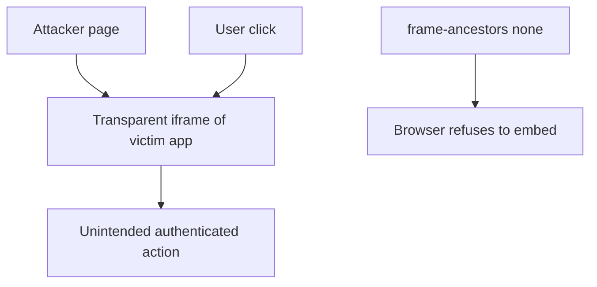

import { ConceptTemplate } from '@/features/kb/components/templates/ConceptTemplate'
import { Callout } from '@/features/kb/components/mdx/Callout'
import { ComparisonTable } from '@/features/kb/components/mdx/ComparisonTable'

export default function Layout({ children }) {
  return (
    <ConceptTemplate title="Clickjacking">
      {children}
    </ConceptTemplate>
  )
}

**Clickjacking** (UI redressing) places your authenticated page under a transparent iframe or next to a fake button so the user's click lands on "Transfer" or "Allow camera". The request is first-party and has a real CSRF token. Token defenses do not help. You must **stop other sites from embedding you**, or use Permissions-Policy and explicit user gestures for dangerous APIs.

## 1. Deep Dive and Mechanics

Classic attack: attacker page iframes https://app.example/settings, styles the iframe as opacity 0, and positions it under a decoy. The victim is logged into app.example. Defense: **Content-Security-Policy frame-ancestors 'none'** (or a tiny allowlist). **X-Frame-Options: DENY** is the older equivalent.

**When you must embed yourself.** Use frame-ancestors with exact origins for your help-center or partner console. Avoid * and avoid reflecting arbitrary parents.

**Not only frames.** Overlaps, pointer-events, and picture-in-picture tricks exist. Sensitive actions should require a typed confirmation or WebAuthn, not a single unmarked click.

<Callout icon="info" title="X-Frame-Options vs frame-ancestors">
If both are present, CSP frame-ancestors wins in modern browsers. Set both during migration.
</Callout>

## 2. Mathematical / Theoretical Foundation

Clickjacking is a composition problem: the OS and browser compose pixels from multiple origins, but the user mentally attributes the click to the top origin. Framing policies restore a 1:1 origin-to-pixel relationship for your document. They do not fix social engineering on your own origin.

<ComparisonTable
  headers={['Control', 'Effect', 'Use']}
  rows={[
    ["frame-ancestors 'none'", 'Nobody embeds you', 'Most apps'],
    ["frame-ancestors self", 'Only same origin', 'Your own frames'],
    ['X-Frame-Options DENY', 'Legacy deny', 'Old browsers'],
    ['Require re-auth', 'Click is not enough', 'Money / OAuth grant'],
  ]}
/>

## 3. Real-World Implementation

```http
Content-Security-Policy: frame-ancestors 'none';
X-Frame-Options: DENY
```

Add a tiny framebusting script only as a last resort for ancient browsers; headers are the real control.

## 4. Visualizations



## 5. Interview Prep

**Q: Why don't CSRF tokens stop clickjacking?**
**A:** The click is real and same-site. Tokens are present and valid. The user was misled about what they clicked.

**Q: When is embedding legitimate?**
**A:** Payment widgets, SSO, and design systems. Name those parents in frame-ancestors, never the open web.

**Q: What about your site embedding untrusted third parties?**
**A:** That is the inverse problem (clickjacking them, or being framed by their XSS). Use sandbox iframes and tight CSP.

## 6. Production Use Cases

- **Banking and admin** consoles that must never be framed.
- **OAuth consent** screens.
- **Embedded support** widgets with an explicit ancestor allowlist.

<Callout icon="tip" title="Test with a local HTML file that iframes prod">
If the iframe loads, your headers are wrong. This is a one-minute regression test.
</Callout>
