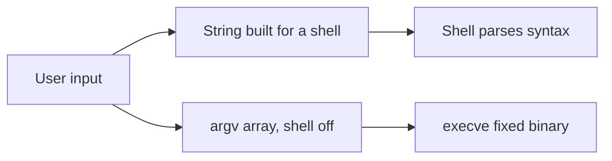

import { ConceptTemplate } from '@/features/kb/components/templates/ConceptTemplate'
import { Callout } from '@/features/kb/components/mdx/Callout'
import { ComparisonTable } from '@/features/kb/components/mdx/ComparisonTable'

export default function Layout({ children }) {
  return (
    <ConceptTemplate title="Command Injection">
      {children}
    </ConceptTemplate>
  )
}

**Command injection** happens when an application builds an OS command with string concatenation and a shell. The process launcher then interprets metacharacters as syntax, not data. The fix is structural: **do not invoke a shell**, pass arguments as an array, and prefer a library that does the job without exec.

## 1. Deep Dive and Mechanics

Dangerous pattern: interpolating user input into a string passed to a shell. Safe pattern: `subprocess.run(["convert", src, dest], check=True)` with a fixed executable and an argument list. The OS then cannot treat argument bytes as shell syntax.

**If you must call a binary.** Allowlist the executable path. Allowlist flags. Validate that file operands resolve inside an intended directory (see directory traversal). Drop privileges. Set timeouts. Never pass raw user strings as the command name.

**Language-specific traps.** eval, Template(user).substitute into a shell, SQL drivers that are not the issue here, and "helper" wrappers that still call sh -c.

<Callout icon="error" title="Escaping for the shell is a last resort">
Every engine has a different metacharacter set. Argument arrays plus no-shell is the reliable fix.
</Callout>

## 2. Mathematical / Theoretical Foundation

A shell is a language. Concatenation mixes program and data in one string, which is the same confusion as SQL injection. The secure API is a **separate channel** for argv. Capability reduction (seccomp, containers, least-privilege users) bounds leftover risk if a binary itself is buggy.

<ComparisonTable
  headers={['Approach', 'Shell', 'Safe for untrusted args']}
  rows={[
    ['String + shell=True', 'Yes', 'No'],
    ['argv list, no shell', 'No', 'Usually yes'],
    ['Native library', 'No', 'Best'],
    ['Manual escape', 'Yes', 'Fragile'],
  ]}
/>

## 3. Real-World Implementation

```python
import subprocess
from pathlib import Path

def thumbnail(src: Path, dest: Path) -> None:
    if not src.resolve().is_relative_to(Path('/data/uploads').resolve()):
        raise ValueError('path')
    subprocess.run(
        ['/usr/bin/convert', str(src), '-thumbnail', '128x128', str(dest)],
        check=True,
        timeout=10,
    )
```

No user-controlled flags. No shell.

## 4. Visualizations



## 5. Interview Prep

**Q: SQL injection vs command injection?**
**A:** Same class: mixing data into a language. Different sink (database vs OS). Same cure: parameterized APIs.

**Q: Is subprocess with a list always safe?**
**A:** Safer. The binary can still be abused if it interprets flags or writes arbitrary paths. Allowlist and path checks remain.

**Q: When is a shell required?**
**A:** Almost never in a web request path. If operators need pipelines, give them a reviewed job runner, not a web param.

## 6. Production Use Cases

- **Image and document** processors.
- **Legacy admin** "ping this host" tools that should die.
- **CI plugins** that wrap CLIs.

<Callout icon="tip" title="Delete the feature if a library exists">
An image resize package beats convert plus twenty years of argv bugs.
</Callout>
