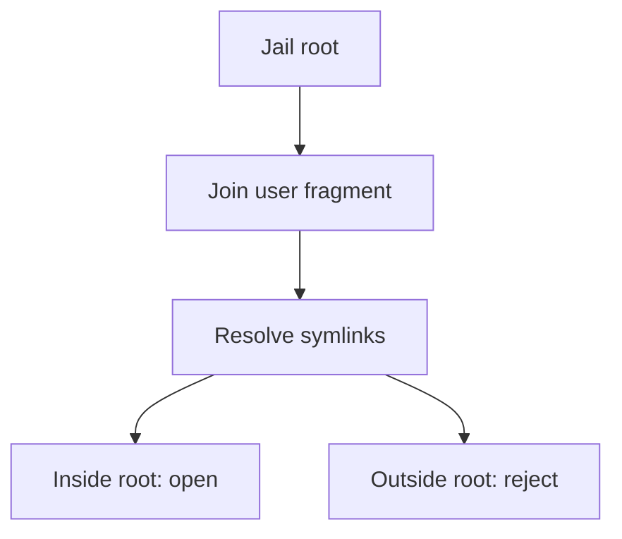

import { ConceptTemplate } from '@/features/kb/components/templates/ConceptTemplate'
import { Callout } from '@/features/kb/components/mdx/Callout'
import { ComparisonTable } from '@/features/kb/components/mdx/ComparisonTable'

export default function Layout({ children }) {
  return (
    <ConceptTemplate title="Directory Traversal">
      {children}
    </ConceptTemplate>
  )
}

**Directory traversal** (path traversal) occurs when you join a user-supplied filename onto a base directory and the result walks upward with `..` segments or absolute paths. The user then reads `/etc/passwd`-class files or overwrites config. The fix is to **resolve the path, then check it still lives under the root**.

## 1. Deep Dive and Mechanics

Unsafe: `root / request.args['file']` then open. Safe: resolve symlinks, then `resolved.is_relative_to(root)`. Reject absolute inputs. Do not strip `..` with regex; encodings and double-dots will win.

**Download and upload both matter.** Traversal on upload overwrites. Traversal on download leaks. Archives (zip slip) are the same bug inside a zip: entries with `..` must be checked the same way.

**Object storage** is not immune if you treat keys as paths on a local cache.

<Callout icon="warning" title="Canonicalize then allowlist">
String prefix checks fail on `/var/www-backup` versus `/var/www`. Use resolved relative-to, not startswith.
</Callout>

## 2. Mathematical / Theoretical Foundation

A filesystem path is not a string; it is a walk on a DAG with `.`, `..`, and symlinks. Security is a **containment predicate** after normalization: the resolved inode path must be a descendant of the jail root. Unicode, null bytes, and overlong UTF-8 are historical bypasses; use the language's path library, not homemade parsers.

<ComparisonTable
  headers={['Check', 'Works', 'Fails on']}
  rows={[
    ['Ban .. in the string', 'Sometimes', 'Encodings, nested zips'],
    ['startswith base', 'Sometimes', 'base-extra names, no resolve'],
    ['resolve + is_relative_to', 'Yes', 'TOCTOU if you later follow a new symlink'],
    ['Random object ids, no user paths', 'Best', 'If you still need filenames, map in a DB'],
  ]}
/>

## 3. Real-World Implementation

```python
from pathlib import Path

ROOT = Path('/var/app/uploads').resolve()

def open_upload(name: str):
    candidate = (ROOT / name).resolve()
    if not candidate.is_relative_to(ROOT):
        raise ValueError('path')
    return candidate.open('rb')
```

Prefer storing files under random ids and keeping the display name in the database.

## 4. Visualizations



## 5. Interview Prep

**Q: What is zip slip?**
**A:** Archive entries that unpack to parent directories. Apply the same resolve-and-contain check per entry.

**Q: Why not only reject dots?**
**A:** Absolute paths, symlink hops, and encodings bypass naive filters. Normalization is the invariant.

**Q: Does a CDN path parameter need this?**
**A:** If it maps to a filesystem or to an origin URL you fetch, yes. Treat it as untrusted.

## 6. Production Use Cases

- **User file download** endpoints.
- **Template or plugin** loaders.
- **Backup extract** jobs.

<Callout icon="tip" title="Give files random names on disk">
If the URL only has an opaque id, traversal strings have nowhere to go.
</Callout>
