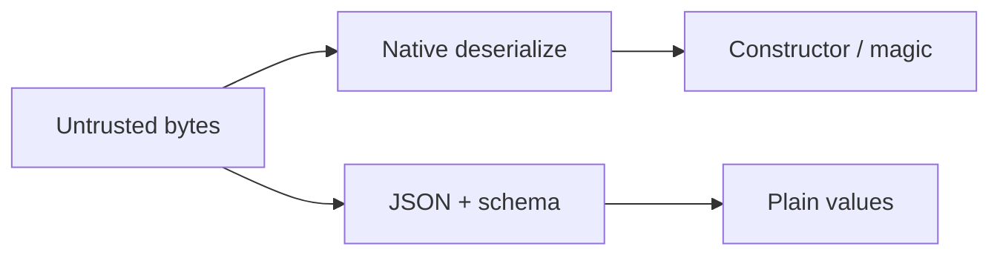

import { ConceptTemplate } from '@/features/kb/components/templates/ConceptTemplate'
import { Callout } from '@/features/kb/components/mdx/Callout'
import { ComparisonTable } from '@/features/kb/components/mdx/ComparisonTable'

export default function Layout({ children }) {
  return (
    <ConceptTemplate title="Insecure Deserialization">
      {children}
    </ConceptTemplate>
  )
}

**Insecure deserialization** is reconstructing objects from bytes you did not sign and trusting the result. Some formats can name classes to instantiate. During load, constructors and magic methods run. That is a remote code-execution class in several ecosystems. The safe default is **dumb data formats plus a schema**, or signed tokens you verify before parse.

## 1. Deep Dive and Mechanics

JSON with a schema is data. Language-native pickles, Java serialization, .NET BinaryFormatter, PHP unserialize, and YAML load (not safe_load) can become code. The attacker does not need a "payload tutorial" from you: they need you to stop calling those APIs on untrusted input.

**What to do.** Prefer JSON, protobuf, or CBOR with explicit types you allocate. If you must persist objects, encrypt-and-MAC them with a server key and a version field. Java and .NET teams should use serialization filters / allowlists if a legacy protocol cannot die yet.

**JWT and cookies.** Deserialize only after signature verify. Do not parse then verify.

<Callout icon="error" title="Never pickle untrusted data">
Python pickle is a bytecode loader. The same spirit applies to other native serializers. Delete the endpoint or switch to JSON.
</Callout>

## 2. Mathematical / Theoretical Foundation

A serializer is a programming language if it can name methods. Safe decoders implement a **total function from bytes to a closed value type**. Object graphs with dynamic dispatch are not that function. Signing (HMAC or public-key) reduces the source of bytes to "us", which is necessary but not sufficient if your own writer can be tricked to emit hostile graphs.

<ComparisonTable
  headers={['Format', 'Code during load', 'Untrusted data']}
  rows={[
    ['JSON + schema', 'No', 'OK'],
    ['protobuf', 'No', 'OK'],
    ['pickle / BinaryFormatter', 'Yes', 'Never'],
    ['YAML safe_load', 'No', 'OK if you stay on safe_load'],
  ]}
/>

## 3. Real-World Implementation

```python
import json
from pydantic import BaseModel, ValidationError

class Settings(BaseModel):
    theme: str
    page_size: int

def load_settings(raw: bytes) -> Settings:
    return Settings.model_validate(json.loads(raw))
```

Reject unknown fields if your threat model includes smuggling.

## 4. Visualizations



## 5. Interview Prep

**Q: Why is JSON usually safer?**
**A:** It describes numbers, strings, arrays, and objects — not class names and method calls.

**Q: Is a signed pickle safe?**
**A:** Safer against network attackers, still unsafe if any writer is compromised or confused. Prefer not to pickle.

**Q: How do you migrate a Java app?**
**A:** Enable serialization filters, stop exposing endpoints, move to JSON, monitor.

## 6. Production Use Cases

- **Session stores** that used to pickle user objects.
- **Job queues** with typed protobuf messages.
- **Legacy RMI / Java** services in retirement.

<Callout icon="tip" title="Treat deserialize as an interpreter">
If the API docs mention "object graph" or "class name", it is not a data parser.
</Callout>
