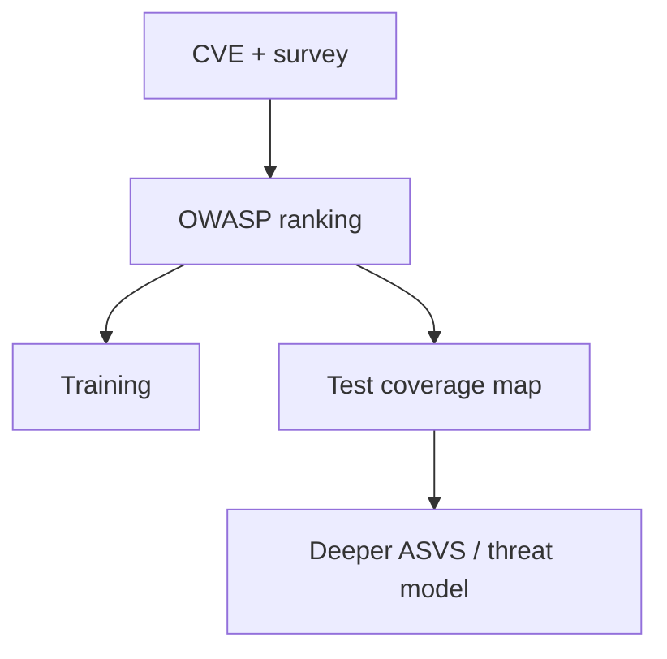

import { ConceptTemplate } from '@/features/kb/components/templates/ConceptTemplate'
import { Callout } from '@/features/kb/components/mdx/Callout'
import { ComparisonTable } from '@/features/kb/components/mdx/ComparisonTable'

export default function Layout({ children }) {
  return (
    <ConceptTemplate title="OWASP Top 10">
      {children}
    </ConceptTemplate>
  )
}

The **OWASP Top 10** is a periodically updated list of the most important web risk categories. The 2021 edition leads with **Broken Access Control**, then crypto failures, injection, insecure design, misconfiguration, vulnerable components, identification failures, software and data integrity, logging failures, and SSRF. Use it as a **coverage checklist**, not as the only thing you test.

## 1. Deep Dive and Mechanics

OWASP aggregates CVE data, survey input, and incident themes. Each item is a **class**, not a single CVE. Injection covers SQL, command, and template injection. Cryptographic failures cover TLS, hashing, and random numbers. Insecure design covers missing threat models, not just missing patches.

**How teams use it.** Map each product surface to the ten. Require at least one automated and one manual control per class. Pair with ASVS or a threat model for depth. Do not write "we are OWASP Top 10 compliant" as if it were ISO 27001.

**2021 shifts.** Access control rose to #1. SSRF became its own item. XSS folded into injection. Integrity (CI/CD, unsigned updates) arrived as its own theme.

<Callout icon="info" title="Top 10 is not a pentest scope">
A real review still includes business-logic abuse, race conditions, and your specific protocols. The list is the floor.
</Callout>

## 2. Mathematical / Theoretical Foundation

The Top 10 is a risk ranking: roughly frequency times impact, filtered by what the community can measure. It is not a formal taxonomy (CWE is closer). Treat it as a prior over where to spend verification effort. Coverage metrics (percent of routes with authz tests) beat "we trained on the slide deck".

<ComparisonTable
  headers={['2021 item', 'Example control', 'Common miss']}
  rows={[
    ['A01 Access control', 'Server-side policy tests', 'UI-only hiding'],
    ['A02 Crypto', 'TLS 1.3 + Argon2id', 'Home-rolled tokens'],
    ['A03 Injection', 'Parameterized APIs', 'String-built SQL'],
    ['A10 SSRF', 'Egress allowlist', 'Open URL fetch'],
  ]}
/>

## 3. Real-World Implementation

```python
# Tiny mapping used in a security review checklist
CONTROLS = {
    'A01': 'authz tests for every object route',
    'A02': 'TLS min version + KMS envelopes',
    'A03': 'no string-built SQL or shell',
    'A07': 'session rotation + MFA for admin',
}
```

Turn each line into a CI check or a quarterly audit question with an owner.

## 4. Visualizations



## 5. Interview Prep

**Q: Why is access control number one?**
**A:** High incidence, high impact, weak automation. Almost every new endpoint can get it wrong.

**Q: Top 10 vs SANS Top 25 vs CWE?**
**A:** Top 10 is outreach and coverage. CWE is the dictionary. SANS Top 25 is weakness types often seen in code.

**Q: Does passing a scanner mean you passed the Top 10?**
**A:** No. Scanners miss design and access control. You need tests and review.

## 6. Production Use Cases

- **Onboarding** engineers to AppSec.
- **Vendor questionnaires** as a shared vocabulary.
- **Quarterly** gap analysis against your actual bugs.

<Callout icon="tip" title="Track your own top 10">
Your last two years of tickets beat a global list. Use OWASP to notice blind spots, then prioritize local data.
</Callout>
