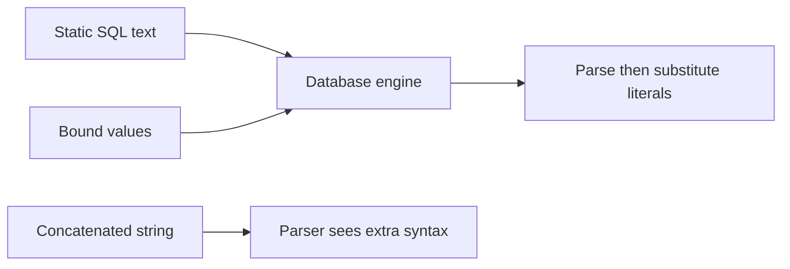

import { ConceptTemplate } from '@/features/kb/components/templates/ConceptTemplate'
import { Callout } from '@/features/kb/components/mdx/Callout'
import { ComparisonTable } from '@/features/kb/components/mdx/ComparisonTable'

export default function Layout({ children }) {
  return (
    <ConceptTemplate title="SQL Injection">
      {children}
    </ConceptTemplate>
  )
}

**SQL injection** is the database instance of mixing code and data. If a query string is built with concatenation, input can change the statement's structure. The reliable fix is **parameterized queries** (prepared statements): the SQL text is constant; values travel out of band. Query builders and ORMs are safe only when you stay on the parameter APIs and never interpolate raw fragments.

## 1. Deep Dive and Mechanics

The database engine parses SQL first, then binds parameters as typed literals. That split is the entire defense. Escaping quotes by hand fails on encodings, numeric contexts, and second-order storage. Dynamic identifiers (ORDER BY column names) cannot be bound as values; use an **allowlist** of column names, never the raw string.

**Stored procedures** are not automatically safe if they concatenate inside the procedure. **Least privilege** DB roles limit damage if a bug remains.

<Callout icon="error" title="String-built SQL is the bug">
If you can print the final query with user bytes inside it, you are one mistake away from injection. Keep the text static.
</Callout>

## 2. Mathematical / Theoretical Foundation

SQL is a language with a grammar. Concatenation is context-free mixing of nonterminals. Parameterization restores a **homomorphism**: values cannot jump to operator or identifier tokens. Formal work on "language-theoretic security" (Brumley, Su, etc.) is this idea generalized. Allowlists for identifiers are finite sets; that is the only sound approach when the grammar position is an identifier.

<ComparisonTable
  headers={['API', 'SQL text', 'Safe']}
  rows={[
    ['Concatenated string', 'Varies with input', 'No'],
    ['Prepared statement', 'Constant', 'Yes for values'],
    ['ORM filter API', 'Constant', 'Yes if no raw()'],
    ['Allowlisted identifier', 'Chosen from a set', 'Yes'],
  ]}
/>

## 3. Real-World Implementation

```python
def find_user(db, email: str):
    return db.execute(
        'SELECT id, email FROM users WHERE email = %s',
        (email,),
    ).fetchone()

SORTABLE = {'created_at', 'email'}

def list_users(db, sort: str):
    col = sort if sort in SORTABLE else 'created_at'
    return db.execute(f'SELECT id, email FROM users ORDER BY {col}').fetchall()
```

The ORDER BY fragment is interpolated only after an allowlist hit. Values stay parameterized.

## 4. Visualizations



## 5. Interview Prep

**Q: Why is escaping not enough?**
**A:** Different contexts (string, number, identifier, LIKE) need different rules, and drivers already implement the correct one via binds.

**Q: Does an ORM make injection impossible?**
**A:** No. Raw fragments, format strings, and extra() calls reintroduce it.

**Q: What is second-order SQLi?**
**A:** Malicious data stored earlier and later concatenated when some other feature uses it. Parameterize every query, not only login.

## 6. Production Use Cases

- **Every application SQL** path, including reports and migrations that take input.
- **Search** features that used to build WHERE clauses.
- **Multi-tenant** filters that must stay parameterized.

<Callout icon="tip" title="Lint for string-built queries">
A CI rule that bans interpolate-into-execute catches regressions faster than yearly pentests.
</Callout>
