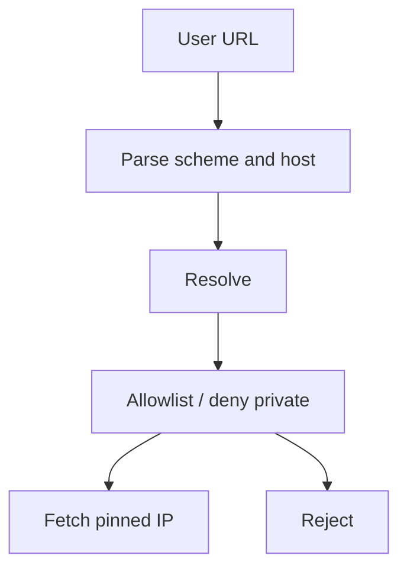

import { ConceptTemplate } from '@/features/kb/components/templates/ConceptTemplate'
import { Callout } from '@/features/kb/components/mdx/Callout'
import { ComparisonTable } from '@/features/kb/components/mdx/ComparisonTable'

export default function Layout({ children }) {
  return (
    <ConceptTemplate title="Server-Side Request Forgery (SSRF)">
      {children}
    </ConceptTemplate>
  )
}

**SSRF** is your server acting as a proxy because a feature takes a URL (preview, webhook test, import-from-link) and fetches it. The caller then aims that fetch at 169.254.169.254, localhost admin ports, or file URLs. Cloud metadata credentials are a frequent prize. Defense is **deny by default**: allowlist schemes and hosts, block link-local and private ranges after DNS resolve, and do not follow redirects off the allowlist.

## 1. Deep Dive and Mechanics

Unsafe: `requests.get(user_url)`. Safer: parse the URL, require https, resolve DNS yourself, check every A/AAAA against a deny list of private, loopback, link-local, and named metadata ranges, then connect to that IP with redirects disabled or re-validated.

**Blind SSRF** still matters: timing and error differences can map an internal network. **Protocol smuggling** (gopher, dict, file) is why scheme allowlists exist.

**Product design.** Prefer that the user upload a file rather than give you a URL. For webhooks, have the customer register a host you verify out of band.

<Callout icon="error" title="DNS rebinding beats a check-then-connect">
Resolve, check, then connect to the same IP you checked. Do not let the HTTP client resolve again. Re-check after every redirect.
</Callout>

## 2. Mathematical / Theoretical Foundation

SSRF is a confused deputy with network reachability. The deputy (your app) has a more powerful view of the network than the caller. Controls are a **policy on destinations** (allowlist) plus **identity isolation** (IMDSv2 hop limit, no cloud creds on the fetcher role). Formalize destinations as a set of (scheme, resolved IP, port) tuples; membership tests must happen on the resolved tuple, not the hostname string.

<ComparisonTable
  headers={['Control', 'Stops', 'Misses']}
  rows={[
    ['Scheme allowlist https', 'file and gopher', 'https to metadata'],
    ['Private-IP deny after resolve', 'Naive localhost', 'Open redirect to public then back'],
    ['Host allowlist', 'Most SSRF', 'Forgotten subdomain'],
    ['No user URLs', 'The class', 'If product insists on URLs'],
  ]}
/>

## 3. Real-World Implementation

```python
from ipaddress import ip_address
from urllib.parse import urlparse

BLOCKED = {'127.0.0.1', '169.254.169.254', '::1'}

def assert_public_https(url: str, resolved_ip: str) -> None:
    p = urlparse(url)
    if p.scheme != 'https' or not p.hostname:
        raise ValueError('url')
    ip = ip_address(resolved_ip)
    if ip.is_private or ip.is_loopback or ip.is_link_local or resolved_ip in BLOCKED:
        raise ValueError('dest')
```

Pin the socket to `resolved_ip` and set the Host header to the original hostname if you still need TLS SNI.

## 4. Visualizations



## 5. Interview Prep

**Q: Why is cloud metadata special?**
**A:** Link-local services hand out temporary credentials to whatever can reach them. IMDSv2 and hop limits reduce that, but the fetcher should not run with those creds at all if possible.

**Q: Allowlist vs denylist?**
**A:** Allowlist of hosts you intend to fetch. Denylists miss IPv6, new ranges, and redirect tricks.

**Q: Does a WAF replace SSRF controls?**
**A:** It may catch obvious IPs in parameters. It will not understand your redirector. Fix the fetcher.

## 6. Production Use Cases

- **Link unfurl and screenshot** workers in an isolated egress VPC.
- **Webhook delivery** testers.
- **Document import** from customer URLs.

<Callout icon="tip" title="Put URL fetchers in their own role and subnet">
No cloud metadata, no RFC1918 routes, dedicated DNS. Even a missed check then hits a wall.
</Callout>
